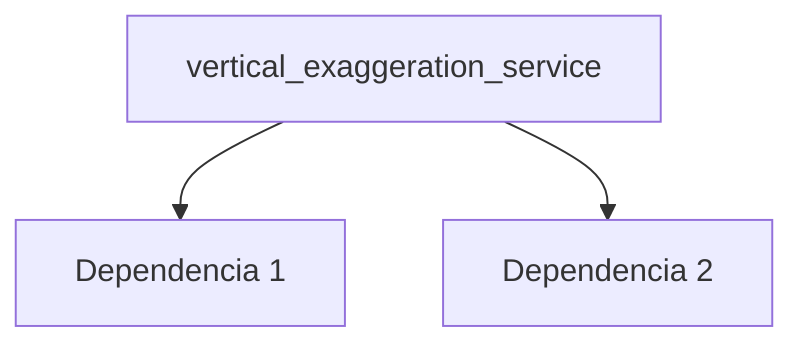

---
tags:
  - secinterp
  - code-walkthrough
  - core      # core | gui | exporters
  - services     # services | managers | renderers | adapters | validation | etc.
aliases:
  - vertical_exaggeration_service.py  # ej. path_resolver.py
  - vertical_exaggeration_service     # ej. resolve_export_path
cssclass: secinterp-note
# note_lines: 700      # opcional: tope > 500 para módulos de importancia alta (máx 700)
---

# `core/services/vertical_exaggeration_service.py`

> [!abstract] Resumen en una línea
> Adaptive Vertical Exaggeration Service. — qué hace este módulo en una frase, sin tocar QGIS si es core.

**Ruta**: `core/services/vertical_exaggeration_service.py` (186 líneas)
**Clase/Función principal**: `vertical_exaggeration_service`
**Capa**: core (QGIS-agnóstico / GUI · Tipo)
**Tags**: #secinterp #core #services

---

## 🎯 ¿Por qué existe este archivo?

| Problema | Solución |
|----------|----------|
| (pendiente) | (pendiente) |
| (pendiente) | (pendiente) |

> [!important] Nota arquitectónica
> QGIS-agnóstico (p. ej. "QGIS-agnóstico", "Adapter Extract", "Factory").

---

## 🧬 Diagrama de relaciones



> [!tip] Cómo leer
> Flecha sólida = importa/delega; punteada = callback/injectado.

---

## 📦 Imports — lectura arquitectónica

```python
# vertical_exaggeration_service.py
from __future__ import annotations
from sec_interp.core.domain import ProfileData, StructureData
from sec_interp.core.domain.dtos import PreviewResult
from sec_interp.logger_config import get_logger
```

| # | Observación |
|---|-------------|
| ① | (pendiente) |
| ② | (pendiente) |

---

## 🏗️ Inventario de estructura

**Clases:** `class VerticalExaggerationService` — 8 métodos
**Funciones/Métodos:**
- `VerticalExaggerationService.calculate(def calculate(self, topo: ProfileData | None, struct: StructureData | None) -> float:)`
- `VerticalExaggerationService.calculate_from_result(def calculate_from_result(self, result: PreviewResult) -> float:)`
- `VerticalExaggerationService._distance_range(def _distance_range(self, topo: ProfileData) -> float:)`
- `VerticalExaggerationService._elevation_range(def _elevation_range(self, topo: ProfileData, struct: StructureData | None) -> float:)`
- `VerticalExaggerationService._structural_density(def _structural_density(self, struct: StructureData | None, dist_range: float) -> float | None:)`
- `VerticalExaggerationService._aspect_base(def _aspect_base(self, aspect_ratio: float) -> float:)`
- `VerticalExaggerationService._density_multiplier(def _density_multiplier(self, density: float | None) -> float:)`
- `VerticalExaggerationService._clamp(def _clamp(self, value: float) -> float:)`

---

## 📁 Archivos del paquete

- `vertical_exaggeration_service.py` — nota individual de este archivo.

---

## 📖 Recorrido método por método

### `método_1`

```python
# (enriquecer)
```

_(enriquecer leyendo el fuente)_

### `método_2`

```python
# (enriquecer)
```

_(enriquecer leyendo el fuente)_

<!-- Añade una subsección por cada método público del módulo -->

---

## 🔄 Flujo de datos

| Fase | Entrada | Transformación | Salida |
|------|---------|----------------|--------|
| - | - | - | - |
| - | - | - | - |

---

## 🏛️ Patrones de diseño presentes

| Patrón | Dónde | Propósito |
|--------|-------|-----------|
| - | - | - |

---

## 🧾 Resumen de la API

| Símbolo | Firma / Hereda | Uso típico |
|---------|----------------|------------|
| (no symbols) | `-` | - |

---

## 🛡️ Manejo de errores

_(pendiente)_

---

## 🧪 Tests asociados

_(pendiente)_

---

## 👀 Observaciones y notas

> [!success] Fortalezas
> - (skeleton)

> [!warning] Puntos de atención
> - (skeleton)

> [!question] Preguntas abiertas
> - (skeleton)

---

## 🔗 Notas relacionadas

- [[Index]] — índice de la bóveda
- [[Index]] — índice
- [[controller]] — orquestador

---

*Nota de la bóveda SecInterp Code Walkthrough v2 — v3.8.0*
