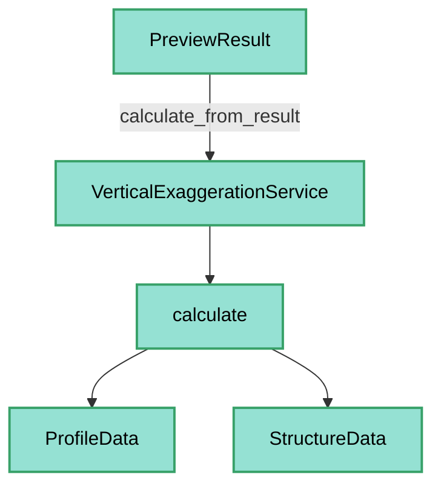
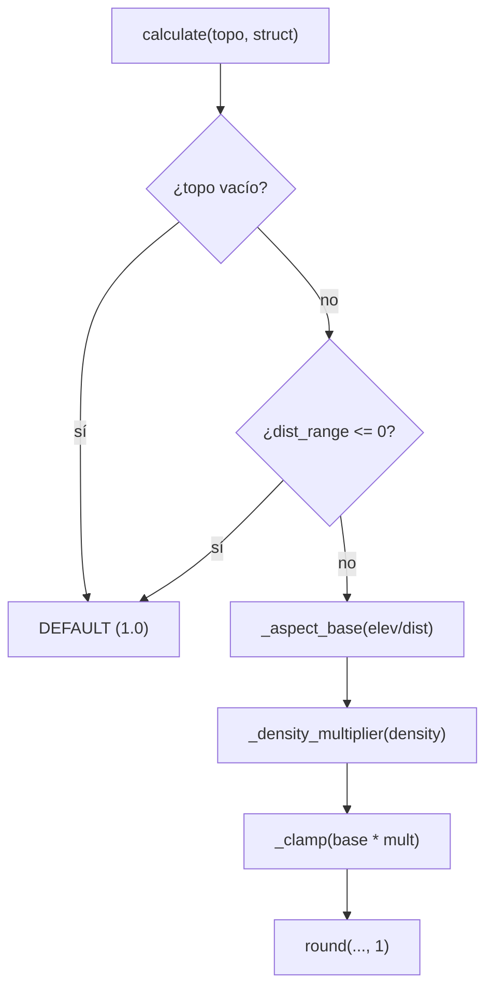

---
tags:
  - secinterp
  - code-walkthrough
  - core
  - services
aliases:
  - vertical_exaggeration_service.py
  - VerticalExaggerationService
cssclass: secinterp-note
---

# `core/services/vertical_exaggeration_service.py`

> [!abstract] Resumen en una línea
> Servicio **sin estado** que calcula la exageración vertical (VE) adaptativa de una sección a partir de su relación de aspecto (rango de elevación / rango de distancia) modulada por la densidad de estructuras.

**Ruta**: `core/services/vertical_exaggeration_service.py` (186 líneas)
**Clase principal**: `VerticalExaggerationService`
**Capa**: Core (QGIS-agnóstico)
**Tags**: #secinterp #core #services

---

## 🎯 ¿Por qué existe este archivo?

Una VE fija distorsiona secciones planas o recargadas. Este servicio la adapta
automáticamente al relieve y a la densidad de datos, de forma determinista y testeable:

| Problema | Solución |
|----------|----------|
| Perfiles planos invisibles con VE=1 | VE base creciente según la relación de aspecto |
| Secciones recargadas de estructuras | multiplicador de densidad (x0.7 / x1.0 / x1.3) |
| Valores extremos o inestables | clamp a `[0.5, 20.0]` + `round(..., 1)` |
| Estabilidad entre renders síncronos/asíncronos | solo topo + estructuras (excluye geología/sondajes) |

> [!important] Nota arquitectónica
> **QGIS-agnóstico y thread-safe**: entradas primitivas (`ProfileData`, `StructureData`),
> sin estado y con constantes de clase. Implementa el algoritmo del plan
> `docs/plans/implementation_plan_adaptive_ve_v3.8.0.md`.

---

## 🧬 Diagrama de relaciones



> [!tip] Cómo leer
> `calculate_from_result` es un adaptador delgado sobre `calculate`; ambos comparten las
> mismas helpers privadas (`_distance_range`, `_aspect_base`, etc.).

---

## 📦 Imports — lectura arquitectónica

```python
# core/services/vertical_exaggeration_service.py
from sec_interp.core.domain import ProfileData, StructureData
from sec_interp.core.domain.dtos import PreviewResult
from sec_interp.logger_config import get_logger
```

| # | Observación |
|---|-------------|
| ① | **Cero `qgis.*` y cero stdlib extra**: ni `math`, ni `typing`. |
| ② | `ProfileData`/`StructureData` son alias de listas de tuplas/entidades del dominio. |
| ③ | `PreviewResult` (DTO consolidado) es la entrada de `calculate_from_result`. |
| ④ | Solo `get_logger` para trazas de debug del cálculo. |

---

## 🏗️ Inventario de estructura

**Clases:** `class VerticalExaggerationService` — 8 métodos + 15 constantes de clase

**Constantes (umbrales y multiplicadores):**
- `DEFAULT_VERT_EXAG=1.0`, `MIN_VERT_EXAG=0.5`, `MAX_VERT_EXAG=20.0`
- Aspect: `ASPECT_EXPRESSIVE=0.5`, `ASPECT_MODERATE=0.1`, `ASPECT_FLAT=0.02`
- Base: `BASE_EXPRESSIVE=1.0`, `BASE_MODERATE=2.0`, `BASE_LOW=5.0`, `BASE_FLAT=10.0`
- Densidad: `DENSITY_DENSE=0.1`, `DENSITY_SPARSE=0.01`
- Multiplicadores: `MULT_DENSE=0.7`, `MULT_NEUTRAL=1.0`, `MULT_SPARSE=1.3`

**Métodos:**
- `calculate(topo, struct) -> float`
- `calculate_from_result(result) -> float`
- `_distance_range(topo)`, `_elevation_range(topo, struct)`, `_structural_density(struct, dist_range)`
- `_aspect_base(aspect_ratio)`, `_density_multiplier(density)`, `_clamp(value)`

---

## 📖 Recorrido método por método

### `calculate` — Algoritmo principal

```python
def calculate(self, topo: ProfileData | None, struct: StructureData | None) -> float:
    if not topo:
        logger.debug("Adaptive VE: empty topo, using default %.1f", self.DEFAULT_VERT_EXAG)
        return self.DEFAULT_VERT_EXAG

    dist_range = self._distance_range(topo)
    if dist_range <= 0:
        logger.debug("Adaptive VE: zero distance range, using default")
        return self.DEFAULT_VERT_EXAG

    elev_range = self._elevation_range(topo, struct)
    base = self._aspect_base(elev_range / dist_range)
    mult = self._density_multiplier(self._structural_density(struct, dist_range))

    ve = round(self._clamp(base * mult), 1)
    logger.debug("Adaptive VE: ... base=%.1f mult=%.1f -> %.1f", base, mult, ve)
    return ve
```

| Paso | Detalle |
|------|---------|
| **Guard** | `not topo` o `dist_range <= 0` → `DEFAULT_VERT_EXAG` (1.0) |
| **Aspect ratio** | `elev_range / dist_range` |
| **Base** | `_aspect_base` mapea el ratio a 1.0 / 2.0 / 5.0 / 10.0 |
| **Densidad** | `_structural_density` (mediciones / unidad de mapa) |
| **Multiplicador** | `_density_multiplier` (x0.7 / x1.0 / x1.3) |
| **Clamp + round** | `round(_clamp(base * mult), 1)` |

> [!important] Fórmula central
> `VE = clamp(base(aspect) × mult(density), 0.5, 20.0)`, redondeado a 1 decimal.

### `calculate_from_result` — Adaptador sobre `PreviewResult`

```python
def calculate_from_result(self, result: PreviewResult) -> float:
    return self.calculate(result.topo, result.struct)
```

Solo considera **capas síncronas** (topografía y estructuras); la geología y los
sondajes (asíncronos) se excluyen para que la VE sea estable entre re-renders.

### `_distance_range` — Rango horizontal

```python
def _distance_range(self, topo: ProfileData) -> float:
    return topo[-1][0] - topo[0][0]
```

Usa el primer y último punto muestreados como cotas autoritativas, coherente con
`PreviewResult.get_distance_range()`.

### `_elevation_range` — Rango vertical

```python
def _elevation_range(self, topo, struct) -> float:
    elevations = [p[1] for p in topo]
    if struct:
        elevations.extend(m.elevation for m in struct)
    return max(elevations) - min(elevations)
```

Incluye las elevaciones de las estructuras proyectadas, además del relieve.

### `_structural_density` — Densidad

```python
def _structural_density(self, struct, dist_range) -> float | None:
    if not struct:
        return None
    return len(struct) / dist_range
```

Mediciones por unidad de mapa; `None` si no hay estructuras.

### `_aspect_base` — Relación de aspecto → VE base

```python
def _aspect_base(self, aspect_ratio: float) -> float:
    if aspect_ratio > self.ASPECT_EXPRESSIVE:   # > 0.5
        return self.BASE_EXPRESSIVE              # 1.0
    if aspect_ratio > self.ASPECT_MODERATE:     # > 0.1
        return self.BASE_MODERATE                # 2.0
    if aspect_ratio > self.ASPECT_FLAT:         # > 0.02
        return self.BASE_LOW                     # 5.0
    return self.BASE_FLAT                        # 10.0
```

Un perfil casi plano (ratio ≤ 0.02) necesita VE alta (10); uno ya expresivo (ratio > 0.5)
no necesita exageración (1).

### `_density_multiplier` — Densidad → multiplicador

```python
def _density_multiplier(self, density: float | None) -> float:
    if density is None:
        return self.MULT_NEUTRAL
    if density > self.DENSITY_DENSE:
        return self.MULT_DENSE
    if density > self.DENSITY_SPARSE:
        return self.MULT_NEUTRAL
    return self.MULT_SPARSE
```

| Densidad | Multiplicador | Efecto |
|----------|---------------|--------|
| `None` (sin estructuras) | 1.0 | neutro |
| `> 0.1` (densa) | 0.7 | amortigua (evita clutter) |
| `0.01–0.1` (media) | 1.0 | neutro |
| `≤ 0.01` (dispersa) | 1.3 | refuerza (resalta detalles) |

### `_clamp` — Acotación

```python
def _clamp(self, value: float) -> float:
    return max(self.MIN_VERT_EXAG, min(self.MAX_VERT_EXAG, value))
```

Confina la VE a `[0.5, 20.0]`.

---

## 🔄 Flujo de datos

| Fase | Entrada | Transformación | Salida |
|------|---------|----------------|--------|
| Guard | `topo` | `not topo` / `dist_range <= 0` | `DEFAULT_VERT_EXAG` |
| Base | `elev_range / dist_range` | `_aspect_base` | 1.0 / 2.0 / 5.0 / 10.0 |
| Multiplicador | `len(struct) / dist_range` | `_density_multiplier` | 0.7 / 1.0 / 1.3 |
| Resultado | `base * mult` | `_clamp` + `round` | `float` (VE) |

---

## 🏛️ Patrones de diseño presentes

| Patrón | Dónde | Propósito |
|--------|-------|-----------|
| **Stateless service** | `VerticalExaggerationService` | Sin `__init__`, thread-safe |
| **Strategy por umbrales** | `_aspect_base`, `_density_multiplier` | Tabla de decisión por rangos |
| **Guard clause** | `calculate` | Fallback a default |
| **Adapter** | `calculate_from_result` | Adapta `PreviewResult` a `calculate` |

---

## 🧾 Resumen de la API

| Símbolo | Firma / Hereda | Uso típico |
|---------|----------------|------------|
| `VerticalExaggerationService` | — | Cálculo de VE adaptativa |
| `calculate` | `(topo, struct) -> float` | Algoritmo principal |
| `calculate_from_result` | `(result: PreviewResult) -> float` | Desde un resultado consolidado |
| `_distance_range` | `(topo) -> float` | Rango horizontal |
| `_elevation_range` | `(topo, struct) -> float` | Rango vertical |
| `_structural_density` | `(struct, dist_range) -> float | None` | Densidad |
| `_aspect_base` | `(aspect_ratio) -> float` | VE base |
| `_density_multiplier` | `(density) -> float` | Multiplicador |
| `_clamp` | `(value) -> float` | Acotación |

---

## 🛡️ Manejo de errores

| Situación | Comportamiento |
|-----------|----------------|
| `topo` vacío / `None` | `DEFAULT_VERT_EXAG` (1.0) |
| `dist_range <= 0` | `DEFAULT_VERT_EXAG` |
| `struct` vacío / `None` | multiplicador neutro (1.0) |

> [!tip] Sin excepciones
> No hay `try/except`: todos los casos degenerados se resuelven con fallbacks
> deterministas. Ideal para llamadas desde hilos de render.

---

## 🧪 Tests asociados

Mapeo a `tests/core/test_vertical_exaggeration_service.py` (mock-first, sin QGIS):

- Verifica el mapeo de la relación de aspecto (plano → VE alta).
- Verifica el multiplicador de densidad (densa → x0.7, dispersa → x1.3).
- Verifica el clamp a `[0.5, 20.0]` y el redondeo a 1 decimal.

---

## 👀 Observaciones y notas

> [!success] Fortalezas
> - **Cero QGIS**, sin estado y determinista: altamente testeable.
> - Constantes de clase legibles y bien agrupadas por dominio.
> - Fallbacks claros para datos vacíos.
> - Estabilidad entre renders (excluye capas asíncronas).

> [!warning] Puntos de atención
> - `calculate` mezcla 3 pasos de decisión en un solo método (sin descomponer en `_stepN_`).
> - `_aspect_base` usa comparaciones encadenadas en cascada (`if/elif`) sensibles al orden.
> - `_structural_density` devuelve `None` en lugar de un valor (contrato implícito).

> [!question] Preguntas abiertas
> - ¿Exponer el par `(base, mult)` para depurar/visualizar la decisión?
> - ¿Parametrizar los umbrales vía settings en lugar de constantes de clase?

---

## 📐 Algoritmo paso a paso

La decisión completa se puede leer como un árbol de umbrales:



## 🧮 Ejemplo de cálculo

| Caso | elev_range | dist_range | aspect | base | struct | density | mult | VE final |
|------|-----------|-----------|--------|------|--------|---------|------|----------|
| Sección plana | 2 m | 1000 m | 0.002 | 10.0 | 0 | None | 1.0 | **10.0** |
| Relieve moderado | 100 m | 1000 m | 0.1 | 5.0 | 30 | 0.03 | 1.0 | **5.0** |
| Relieve expresivo | 600 m | 1000 m | 0.6 | 1.0 | 120 | 0.12 | 0.7 | **0.7** |
| Disperso | 100 m | 1000 m | 0.1 | 5.0 | 8 | 0.008 | 1.3 | **6.5** |

> [!note] Regla de decisión por rangos
> El `_aspect_base` y `_density_multiplier` son **tablas de decisión**: el primer umbral
> que se supera define el valor. La cascada `if/elif` es sensible al orden (de mayor a
> menor umbral).

## 🗂️ Jerarquía de constantes

Las 15 constantes de clase definen el comportamiento sin `__init__`:

| Grupo | Constantes | Rol |
|-------|-----------|-----|
| Límites | `MIN`/`MAX`/`DEFAULT_VERT_EXAG` | Clamp y fallback |
| Aspecto | `ASPECT_*` + `BASE_*` | Mapeo ratio → VE base |
| Densidad | `DENSITY_*` + `MULT_*` | Mapeo densidad → multiplicador |

> [!tip] Fáciles de tunear
> Al estar como constantes de clase, un futuro settings podría exponerlas sin tocar la
> lógica (ver pregunta abierta en observaciones).

## 🔄 Logging y depuración

El servicio emite trazas `debug` en los puntos de decisión:

| Momento | Mensaje |
|---------|---------|
| `topo` vacío | `"Adaptive VE: empty topo, using default %.1f"` |
| `dist_range <= 0` | `"Adaptive VE: zero distance range, using default"` |
| Cálculo final | `"Adaptive VE: elev_range=... base=... mult=... -> ..."` |

> [!tip] Trazabilidad
> El último log imprime los valores intermedios (`elev_range`, `dist_range`, `base`,
> `mult`) antes del redondeo, lo que permite reconstruir *por qué* se eligió una VE sin
> debuggear el código.

## 📚 Referencia del algoritmo

El docstring cita el plan de implementación:
`docs/plans/implementation_plan_adaptive_ve_v3.8.0.md`. La sección §5.1 del plan fija la
regla de estabilidad: **solo capas síncronas** (topo + estructuras) determinan la VE, para
que los re-renders asíncronos no hagan saltar la escala vertical.

> [!note] v3.8.0
> El servicio se introdujo en la versión v3.8.0 como mejora adaptativa sobre la VE fija
> previa. Las constantes (`MIN/MAX`, umbrales) reflejan los valores acordados en el plan.

## 🔗 Notas relacionadas

- [[Index]] — índice de la bóveda
- [[preview_service]] — produce el `PreviewResult` (topo + struct) que consume
- [[dtos]] — `PreviewResult` y `get_distance_range` / `get_elevation_range`
- [[domain]] — `ProfileData`, `StructureData`
- [[entities]] — `StructureMeasurement` (usado en la densidad)
- [[structures]] — dominio estructural

---

*Nota de la bóveda SecInterp Code Walkthrough v2 — v3.9.1*
