# SecInterp - Detailed Project Architecture

> **Comprehensive Technical Documentation for the SecInterp QGIS Plugin**
> Version 2.2 | Last Updated: 2025-12-21

---

## 📑 Table of Contents

1. [Overview](#overview)
2. [Directory Structure](#directory-structure)
3. [System Architecture](#system-architecture)
4. [GUI Layer - User Interface](#gui-layer---user-interface)
5. [Core Layer - Business Logic](#core-layer---business-logic)
6. [Exporters Layer - Data Export](#exporters-layer---data-export)
7. [Main Data Flows](#main-data-flows)
8. [Design Patterns](#design-patterns)
9. [External Dependencies](#external-dependencies)
10. [Performance Optimizations](#performance-optimizations)
11. [Project Metrics](#project-metrics)

---

## 🎯 Overview

**SecInterp** (Section Interpreter) is a QGIS plugin designed for extracting and visualizing geological data in cross-sections. The plugin allows geologists to generate topographic profiles, project geological outcrops, and analyze structural data in a unified 2D view.

### Key Features

- ✅ **Interactive Preview System** with real-time rendering.
- ✅ **Parallel Processing** for complex geological intersections.
- ✅ **Adaptive LOD** (Level of Detail) based on zoom.
- ✅ **Measurement Tools** with automatic snapping.
- ✅ **Drillhole Support** with 3D→2D trajectory projection.
- ✅ **Multi-format Export** (SHP, CSV, PDF, SVG, PNG).

---

## 📂 Directory Structure

The project organization follows a clear modular structure to separate the interface, business logic, and utilities.

```
sec_interp/
├── __init__.py                 # Plugin entry point
├── sec_interp_plugin.py        # Root class (SecInterp)
├── metadata.txt                # QGIS Metadata
├── Makefile                    # Automation (deploy, docs)
│
├── core/                       # ⚙️ Business Logic (Core Layer)
│   ├── controller.py           # Orchestrator (ProfileController)
│   ├── algorithms.py           # Pure intersection logic
│   ├── services/               # Specialized Services
│   │   ├── profile_service.py  # Topography and sampling
│   │   ├── geology_service.py  # Geological intersections
│   │   ├── structure_service.py# Structural projection
│   │   ├── drillhole_service.py# Desurvey and 3D intervals
│   │   └── preview_service.py  # Preview orchestrator
│   ├── validation/             # Modular validation package
│   └── utils/                  # Utilities (Geometry, Spatial, etc.)
│
├── gui/                        # 🖥️ User Interface (GUI Layer)
│   ├── main_dialog.py          # Main Dialog (Simplified)
│   ├── preview_renderer.py     # Native PyQGIS rendering
│   ├── parallel_geology.py     # Parallel processing worker
│   ├── main_dialog_preview.py  # Preview Manager
│   ├── ui/                     # Components and Pages (Layouts)
│   └── tools/                  # Map Tools (Measure Tool)
│
├── exporters/                  # 📤 Export Layer
│   ├── base_exporter.py        # Export interface
│   ├── shp_exporter.py         # Generic Shapefile exporter
│   ├── profile_exporters.py    # Specific profile exporters
│   └── drillhole_exporters.py  # Drillhole exporters
│
├── docs/                       # 📚 Technical documentation and manuals
├── tests/                      # 🧪 Unit test suite
└── resources/                  # 🎨 Icons and Qt resources
```

---

## 🏗️ System Architecture

### Complete Architecture Diagram

```mermaid
graph TB
    %% ========== ENTRY POINT ==========
    QGIS[QGIS Application]
    INIT[__init__.py<br/>Entry Point]
    PLUGIN[sec_interp_plugin.py<br/>SecInterp Class<br/>Plugin Root]

    %% ========== GUI LAYER ==========
    subgraph GUI["🖥️ GUI Layer - User Interface"]
        direction TB

        MAIN[main_dialog.py<br/>SecInterpDialog]

        subgraph MANAGERS["Managers"]
            SIGNALS_MGR[main_dialog_signals.py<br/>SignalManager]
            DATA_MGR[main_dialog_data.py<br/>DataAggregator]
            PREVIEW_MGR[main_dialog_preview.py<br/>PreviewManager]
            EXPORT_MGR[main_dialog_export.py<br/>ExportManager]
            VALIDATION_MGR[main_dialog_validation.py<br/>DialogValidator]
            CONFIG_MGR[main_dialog_config.py<br/>DialogDefaults]
        end

        RENDERER[preview_renderer.py<br/>PreviewRenderer]
        LEGEND[legend_widget.py<br/>LegendWidget]

        subgraph TOOLS["🛠️ Tools"]
            MEASURE[measure_tool.py<br/>ProfileMeasureTool]
        end

        subgraph UI_WIDGETS["📦 UI Components"]
            UI_MAIN[main_window.py<br/>SecInterpMainWindow]
            UI_PAGES[Page Classes:<br/>DemPage, SectionPage,<br/>GeologyPage, StructPage,<br/>DrillholePage]
            UI_PREVIEW[PreviewWidget]
            UI_OUTPUT[OutputWidget]
        end
    end

    %% ========== CORE LAYER ==========
    subgraph CORE["⚙️ Core Layer - Business Logic"]
        direction TB

        CONTROLLER[controller.py<br/>ProfileController]

        subgraph SERVICES["🔧 Services"]
            PROFILE_SVC[profile_service.py<br/>ProfileService]
            GEOLOGY_SVC[geology_service.py<br/>GeologyService]
            STRUCTURE_SVC[structure_service.py<br/>StructureService]
            DRILLHOLE_SVC[drillhole_service.py<br/>DrillholeService]
            PARALLEL_GEO[parallel_geology.py<br/>ParallelGeologyService]
        end

        ALGORITHMS[core/algorithms.py<br/>Pure Pure Logic]

        subgraph VALIDATION_PKG["🛡️ Validation Package"]
            VALIDATION_INIT[core/validation/__init__.py<br/>Facade]
            FIELD_VAL[core/validation/field_validator.py]
            LAYER_VAL[core/validation/layer_validator.py]
            PATH_VAL[core/validation/path_validator.py]
            PROJ_VAL[core/validation/project_validator.py]
        end
        CACHE[data_cache.py<br/>DataCache]
        METRICS[performance_metrics.py<br/>PerformanceMetrics]
        TYPES[types.py<br/>Type Definitions]

        subgraph UTILS["🔨 Utilities"]
            GEOM_UTILS[geometry.py]
            DRILL_UTILS[drillhole.py]
            GEOLOGY_UTILS[geology.py]
            SPATIAL_UTILS[spatial.py]
            SAMPLING_UTILS[sampling.py]
            PARSING_UTILS[parsing.py]
            RENDERING_UTILS[rendering.py]
            IO_UTILS[io.py]
        end
    end

    %% ========== EXPORTERS LAYER ==========
    subgraph EXPORTERS["📤 Exporters Layer - Export"]
        direction TB

        ORCHESTRATOR[orchestrator.py<br/>DataExportOrchestrator]
        BASE_EXP[base_exporter.py<br/>BaseExporter]

        subgraph EXPORT_FORMATS["Export Formats"]
            SHP_EXP[shp_exporter.py]
            CSV_EXP[csv_exporter.py]
            PDF_EXP[pdf_exporter.py]
            SVG_EXP[svg_exporter.py]
            IMG_EXP[image_exporter.py]
            PROFILE_EXP[profile_exporters.py]
            DRILL_EXP[drillhole_exporters.py]
        end
    end

    %% ========== EXTERNAL DEPENDENCIES ==========
    subgraph EXTERNAL["🌐 External Dependencies"]
        QGIS_CORE[qgis.core]
        QGIS_GUI[qgis.gui]
        PYQT5[PyQt5]
    end

    %% ========== CONNECTIONS ==========
    QGIS -->|loads| INIT
    INIT -->|delegates| PLUGIN
    PLUGIN -->|initializes| MAIN

    MAIN -->|delegates signals| SIGNALS_MGR
    MAIN -->|uses data from| DATA_MGR
    MAIN -->|manages| PREVIEW_MGR
    MAIN -->|manages| EXPORT_MGR
    MAIN -->|manages| VALIDATION_MGR
    MAIN -->|manages| CONFIG_MGR
    MAIN -->|uses| UI_MAIN

    PREVIEW_MGR -->|renders with| RENDERER
    PREVIEW_MGR -->|updates| LEGEND
    PREVIEW_MGR -->|activates| MEASURE
    PREVIEW_MGR -->|requests data| CONTROLLER

    EXPORT_MGR -->|delegates to| ORCHESTRATOR
    VALIDATION_MGR -->|validates with| PROJ_VAL

    CONTROLLER -->|orchestrates| PROFILE_SVC
    CONTROLLER -->|orchestrates| GEOLOGY_SVC
    CONTROLLER -->|orchestrates| STRUCTURE_SVC
    CONTROLLER -->|orchestrates| DRILLHOLE_SVC
    CONTROLLER -->|uses| CACHE
    CONTROLLER -->|tracks with| METRICS

    GEOLOGY_SVC -->|offloads to| PARALLEL_GEO
    DRILLHOLE_SVC -->|uses| DRILL_UTILS
    PROFILE_SVC -->|uses| SAMPLING_UTILS

    ORCHESTRATOR -->|delegates to| EXPORT_FORMATS

    classDef entryPoint fill:#ff6b6b,stroke:#c92a2a,stroke-width:3px,color:#fff
    classDef guiLayer fill:#4ecdc4,stroke:#0a9396,stroke-width:2px,color:#000
    classDef coreLayer fill:#95e1d3,stroke:#38a169,stroke-width:2px,color:#000
    classDef exportLayer fill:#ffd93d,stroke:#f59e0b,stroke-width:2px,color:#000
    classDef externalLayer fill:#a8dadc,stroke:#457b9d,stroke-width:2px,color:#000

    class QGIS,PLUGIN entryPoint
    class MAIN,PREVIEW_MGR,EXPORT_MGR,VALIDATION_MGR,CONFIG_MGR,RENDERER,LEGEND,MEASURE guiLayer
    class CONTROLLER,ALGORITHMS,PROJ_VAL,CACHE,METRICS,TYPES coreLayer
    class PROFILE_SVC,GEOLOGY_SVC,STRUCTURE_SVC,DRILLHOLE_SVC,PARALLEL_GEO coreLayer
    class ORCHESTRATOR,BASE_EXP,SHP_EXP,CSV_EXP,PDF_EXP,SVG_EXP,IMG_EXP,PROFILE_EXP,DRILL_EXP exportLayer
    class QGIS_CORE,QGIS_GUI,PYQT5 externalLayer
```



---

## 🖥️ GUI Layer - User Interface

### 1. SecInterpDialog (main_dialog.py)

**Main Class**: `SecInterpDialog`
**Inherits from**: `SecInterpMainWindow`
**Responsibility**: Simplified main dialog that coordinates components via specialized Managers.

#### Key Components

```python
class SecInterpDialog(SecInterpMainWindow):
    """Dialog for the SecInterp QGIS plugin."""

    def __init__(self, iface=None, plugin_instance=None, parent=None):
        # Logic Managers
        self.signal_manager = DialogSignalManager(self)
        self.data_aggregator = DialogDataAggregator(self)

        # Operation Managers
        self.validator = DialogValidator(self)
        self.preview_manager = PreviewManager(self)
        self.export_manager = ExportManager(self)
        self.status_manager = DialogStatusManager(self)
        self.settings_manager = DialogSettingsManager(self)

        # Widgets
        self.legend_widget = LegendWidget(self.preview_widget.canvas)
        self.pan_tool = QgsMapToolPan(self.preview_widget.canvas)
        self.measure_tool = ProfileMeasureTool(self.preview_widget.canvas)
```

---

### 2. PreviewRenderer (preview_renderer.py)

**Responsibility**: Renders the preview canvas using native PyQGIS.

#### LOD Optimization Methods

| Method | Purpose | Algorithm |
|--------|---------|-----------|
| `_decimate_line_data()` | Line simplification | Douglas-Peucker |
| `_calculate_curvature()` | Local curvature calculation | Angle between segments |
| `_adaptive_sample()` | Adaptive sampling | Curvature-based |

---

## ⚙️ Core Layer - Business Logic

### 1. ProfileController (controller.py)

**Responsibility**: Orchestrates data generation services.

```python
class ProfileController:
    def __init__(self):
        self.profile_service = ProfileService()
        self.geology_service = GeologyService()
        self.structure_service = StructureService()
        self.drillhole_service = DrillholeService()
        self.data_cache = DataCache()
```

---

## 🎨 Design Principles

The SecInterp plugin is designed following robust software engineering principles to ensure quality and maintainability.

### SOLID Principles

- **SRP (Single Responsibility Principle)**: Each service (Profile, Geology, Structure, Drillhole) has a single, clear responsibility.
- **OCP (Open/Closed Principle)**: Exporters are easily extensible via an abstract base class without modifying the core logic.
- **LSP (Liskov Substitution Principle)**: All concrete exporters can substitute the `BaseExporter` interface.
- **ISP (Interface Segregation Principle)**: Service interfaces are focused on their specific domain.
- **DIP (Dependency Inversion Principle)**: The controller depends on abstractions (services), avoiding heavy concrete implementations in the GUI.

### Other Patterns and Principles
- **DRY (Don't Repeat Yourself)**: Heavy use of `utils` modules to centralize mathematical and spatial calculations.
- **Separation of Concerns**: Clear distinction between the GUI Layer (Managers), Core Layer (Services), and Data Layer (DataCache).

---

## 🚀 Extensibility

Quick guide for developers wishing to expand the plugin.

### Adding a New Service
1. Create a new file in `core/services/` (e.g., `seismic_service.py`).
2. Implement the service logic following the pattern of existing services.
3. Register the service in `controller.py` within the `ProfileController` constructor.
4. Add the orchestration method in the controller and connect it to the `PreviewManager`.

### Adding a New Export Format
1. Create a class in `exporters/` that inherits from `BaseExporter`.
2. Implement the mandatory `export()` method.
3. Register the new exporter in the factory in `orchestrator.py` or specific export modules.

---

## 📦 Deployment

The plugin uses a `Makefile`-based system to facilitate local deployment and packaging.

- **Main command**: `make deploy` (Copies files to the QGIS plugins directory).
- **Process**:
  - Cleans temporary files (`.pyc`, etc.).
  - Copies resources and translations.
  - Syncs with the local QGIS directory for immediate testing.

---

## 📊 Project Metrics (Estimates)

| Metric | Value |
|--------|-------|
| **Python Modules** | ~60 files |
| **Total Lines of Code** | ~15,000 LOC |
| **Core Layer** | ~53% |
| **GUI Layer** | ~33% |
| **Export Layer** | ~14% |

---

## 📝 Final Notes

This document provides a detailed overview of the SecInterp plugin architecture. For development information, please refer to [README_DEV.md](file:///home/jmbernales/qgispluginsdev/sec_interp/README_DEV.md).

**Last Updated**: 2025-12-21
**Plugin Version**: 2.2
**Author**: Juan M. Bernales
