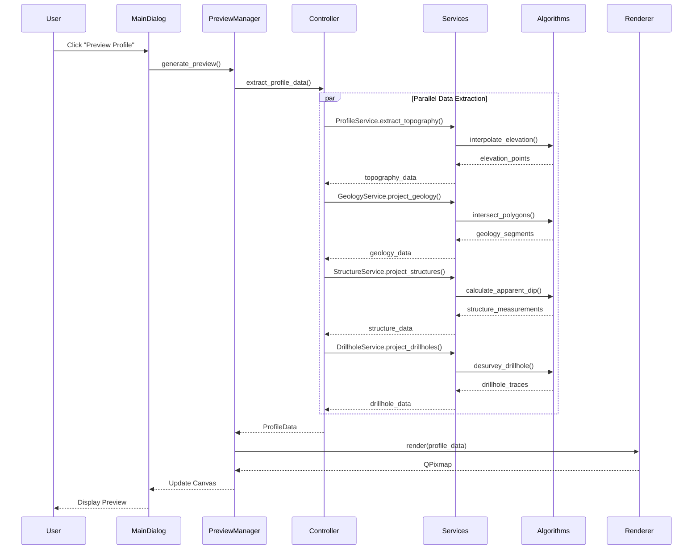
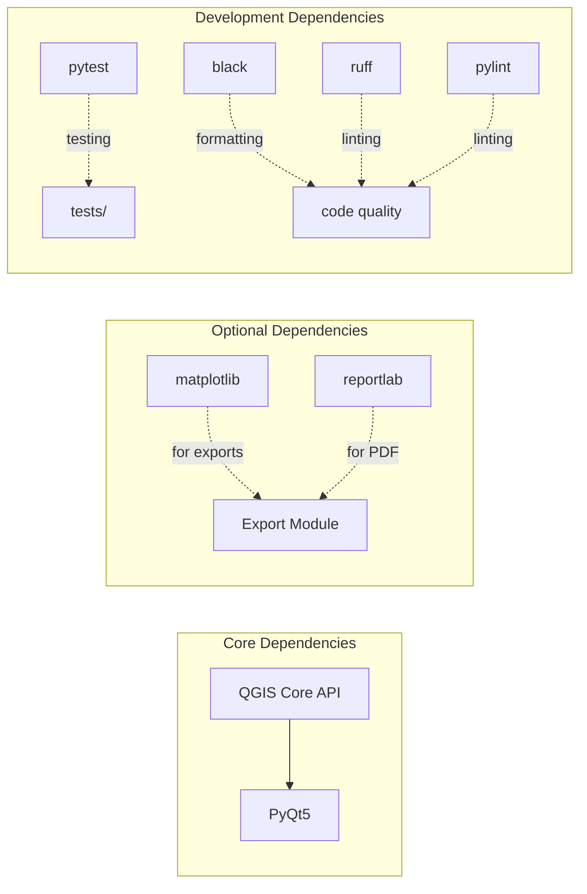

# SecInterp - Grafo de Arquitectura del Proyecto

Este documento presenta un grafo visual de las conexiones principales del plugin QGIS **SecInterp**, mostrando la arquitectura, dependencias y flujo de datos entre componentes.

---

## 📊 Grafo Principal de Arquitectura

```mermaid
graph TB
    %% ========== ENTRY POINT ==========
    QGIS[QGIS Application]
    PLUGIN[__init__.py<br/>Plugin Entry Point]

    %% ========== GUI LAYER ==========
    subgraph GUI["🖥️ GUI Layer"]
        MAIN[main_dialog.py<br/>Main Dialog]
        PREVIEW_MGR[main_dialog_preview.py<br/>Preview Manager]
        EXPORT_MGR[main_dialog_export.py<br/>Export Manager]
        VALIDATION_MGR[main_dialog_validation.py<br/>Validation Manager]
        CONFIG_MGR[main_dialog_config.py<br/>Config Manager]
        RENDERER[preview_renderer.py<br/>Preview Renderer]
        LEGEND[legend_widget.py<br/>Legend Widget]

        subgraph TOOLS["🛠️ Tools"]
            MEASURE[measure_tool.py<br/>Measure Tool]
        end

        subgraph UI_WIDGETS["📦 UI Widgets"]
            UI_MAIN[main_dialog_ui.py]
            UI_COMPONENTS[Various UI Components]
        end
    end

    %% ========== CORE LAYER ==========
    subgraph CORE["⚙️ Core Business Logic"]
        CONTROLLER[controller.py<br/>Profile Controller]
        ALGORITHMS[algorithms.py<br/>Geometric Algorithms]
        VALIDATION[validation.py<br/>Data Validation]
        CACHE[data_cache.py<br/>Data Cache]
        METRICS[performance_metrics.py<br/>Performance Metrics]
        TYPES[types.py<br/>Type Definitions]

        subgraph SERVICES["🔧 Services"]
            PROFILE_SVC[profile_service.py<br/>Profile Service]
            GEOLOGY_SVC[geology_service.py<br/>Geology Service]
            STRUCTURE_SVC[structure_service.py<br/>Structure Service]
            DRILLHOLE_SVC[drillhole_service.py<br/>Drillhole Service]
            PARALLEL_GEO[parallel_geology.py<br/>Parallel Geology]
        end

        subgraph UTILS["🔨 Utilities"]
            GEOM_UTILS[geometry_utils.py]
            COORD_UTILS[coordinate_utils.py]
            LAYER_UTILS[layer_utils.py]
            MATH_UTILS[math_utils.py]
            OTHER_UTILS[Other Utils...]
        end
    end

    %% ========== EXPORTERS LAYER ==========
    subgraph EXPORTERS["📤 Exporters"]
        ORCHESTRATOR[orchestrator.py<br/>Export Orchestrator]
        BASE_EXP[base_exporter.py<br/>Base Exporter]

        subgraph EXPORT_FORMATS["Export Formats"]
            SHP_EXP[shp_exporter.py<br/>Shapefile]
            CSV_EXP[csv_exporter.py<br/>CSV]
            PDF_EXP[pdf_exporter.py<br/>PDF]
            SVG_EXP[svg_exporter.py<br/>SVG]
            IMG_EXP[image_exporter.py<br/>PNG/JPG]
            PROFILE_EXP[profile_exporters.py<br/>Profile Data]
            DRILL_EXP[drillhole_exporters.py<br/>Drillhole Data]
        end
    end

    %% ========== EXTERNAL DEPENDENCIES ==========
    subgraph EXTERNAL["🌐 External Dependencies"]
        QGIS_CORE[qgis.core<br/>QgsVectorLayer, QgsRasterLayer,<br/>QgsGeometry, QgsProcessing]
        QGIS_GUI[qgis.gui<br/>QgsMapCanvas, QgsMapTool,<br/>QgsMapLayer]
        PYQT5[PyQt5<br/>Qt Widgets & Signals]
    end

    %% ========== CONNECTIONS: Entry Point ==========
    QGIS -->|loads| PLUGIN
    PLUGIN -->|initializes| MAIN

    %% ========== CONNECTIONS: GUI Internal ==========
    MAIN -->|manages| PREVIEW_MGR
    MAIN -->|manages| EXPORT_MGR
    MAIN -->|manages| VALIDATION_MGR
    MAIN -->|manages| CONFIG_MGR
    MAIN -->|uses| UI_MAIN

    PREVIEW_MGR -->|renders with| RENDERER
    PREVIEW_MGR -->|updates| LEGEND
    PREVIEW_MGR -->|activates| MEASURE

    RENDERER -->|uses| UI_COMPONENTS

    %% ========== CONNECTIONS: GUI to Core ==========
    PREVIEW_MGR -->|requests data| CONTROLLER
    EXPORT_MGR -->|requests export| ORCHESTRATOR
    VALIDATION_MGR -->|validates with| VALIDATION
    CONFIG_MGR -->|stores in| CACHE

    %% ========== CONNECTIONS: Core Internal ==========
    CONTROLLER -->|orchestrates| PROFILE_SVC
    CONTROLLER -->|orchestrates| GEOLOGY_SVC
    CONTROLLER -->|orchestrates| STRUCTURE_SVC
    CONTROLLER -->|orchestrates| DRILLHOLE_SVC
    CONTROLLER -->|uses| CACHE
    CONTROLLER -->|tracks with| METRICS

    PROFILE_SVC -->|uses| ALGORITHMS
    GEOLOGY_SVC -->|uses| ALGORITHMS
    GEOLOGY_SVC -->|offloads to| PARALLEL_GEO
    STRUCTURE_SVC -->|uses| ALGORITHMS
    DRILLHOLE_SVC -->|uses| ALGORITHMS

    ALGORITHMS -->|uses| GEOM_UTILS
    ALGORITHMS -->|uses| COORD_UTILS
    ALGORITHMS -->|uses| MATH_UTILS

    GEOM_UTILS -->|uses| QGIS_CORE

    VALIDATION -->|uses| TYPES
    VALIDATION -->|uses| LAYER_UTILS

    %% ========== CONNECTIONS: Exporters ==========
    ORCHESTRATOR -->|delegates to| SHP_EXP
    ORCHESTRATOR -->|delegates to| CSV_EXP
    ORCHESTRATOR -->|delegates to| PDF_EXP
    ORCHESTRATOR -->|delegates to| SVG_EXP
    ORCHESTRATOR -->|delegates to| IMG_EXP
    ORCHESTRATOR -->|delegates to| PROFILE_EXP
    ORCHESTRATOR -->|delegates to| DRILL_EXP

    SHP_EXP -.->|inherits| BASE_EXP
    CSV_EXP -.->|inherits| BASE_EXP
    PDF_EXP -.->|inherits| BASE_EXP
    SVG_EXP -.->|inherits| BASE_EXP
    IMG_EXP -.->|inherits| BASE_EXP
    PROFILE_EXP -.->|inherits| BASE_EXP
    DRILL_EXP -.->|inherits| BASE_EXP

    %% ========== CONNECTIONS: External Dependencies ==========
    MAIN -->|uses| PYQT5
    MAIN -->|uses| QGIS_GUI
    RENDERER -->|uses| QGIS_GUI
    MEASURE -->|uses| QGIS_GUI

    CONTROLLER -->|uses| QGIS_CORE
    PROFILE_SVC -->|uses| QGIS_CORE
    GEOLOGY_SVC -->|uses| QGIS_CORE
    STRUCTURE_SVC -->|uses| QGIS_CORE
    DRILLHOLE_SVC -->|uses| QGIS_CORE

    ALGORITHMS -->|uses| QGIS_CORE

    SHP_EXP -->|uses| QGIS_CORE

    %% ========== STYLING ==========
    classDef entryPoint fill:#ff6b6b,stroke:#c92a2a,stroke-width:3px,color:#fff
    classDef guiLayer fill:#4ecdc4,stroke:#0a9396,stroke-width:2px,color:#000
    classDef coreLayer fill:#95e1d3,stroke:#38a169,stroke-width:2px,color:#000
    classDef exportLayer fill:#ffd93d,stroke:#f59e0b,stroke-width:2px,color:#000
    classDef externalLayer fill:#a8dadc,stroke:#457b9d,stroke-width:2px,color:#000

    class QGIS,PLUGIN entryPoint
    class MAIN,PREVIEW_MGR,EXPORT_MGR,VALIDATION_MGR,CONFIG_MGR,RENDERER,LEGEND,MEASURE guiLayer
    class CONTROLLER,ALGORITHMS,VALIDATION,CACHE,METRICS,TYPES coreLayer
    class PROFILE_SVC,GEOLOGY_SVC,STRUCTURE_SVC,DRILLHOLE_SVC,PARALLEL_GEO coreLayer
    class ORCHESTRATOR,BASE_EXP,SHP_EXP,CSV_EXP,PDF_EXP,SVG_EXP,IMG_EXP,PROFILE_EXP,DRILL_EXP exportLayer
    class QGIS_CORE,QGIS_GUI,PYQT5 externalLayer
```

---

## 🔄 Flujo de Datos Principal

---

## 📦 Dependencias por Módulo

---

## 🎯 Componentes Clave y Responsabilidades

### 1. **GUI Layer** (Interfaz de Usuario)
- **main_dialog.py**: Diálogo principal, coordina todos los managers
- **preview_renderer.py**: Renderiza el canvas de preview con QgsMapCanvas
- **main_dialog_preview.py**: Gestiona la lógica de preview y actualización
- **main_dialog_export.py**: Maneja las exportaciones de datos
- **measure_tool.py**: Herramienta de medición con snapping

### 2. **Core Layer** (Lógica de Negocio)
- **controller.py**: Orquesta la extracción de datos del perfil
- **algorithms.py**: Algoritmos geométricos usando QGIS Core API (intersecciones, proyecciones, buffers)
- **validation.py**: Validación de datos de entrada
- **utils/geometry.py**: Operaciones geométricas con `QgsGeometry`, `QgsProcessing`, índices espaciales
- **Services**:
  - `profile_service.py`: Extracción de topografía
  - `geology_service.py`: Proyección de geología (con procesamiento paralelo)
  - `structure_service.py`: Proyección de estructuras
  - `drillhole_service.py`: Proyección de sondajes

### 3. **Exporters Layer** (Exportación)
- **orchestrator.py**: Coordina las exportaciones
- **Exportadores específicos**: SHP, CSV, PDF, SVG, PNG, etc.

### 4. **External Dependencies** (Dependencias Externas)
- **QGIS Core API**: `QgsGeometry`, `QgsProcessing`, `QgsVectorLayer`, `QgsRasterLayer`, `QgsSpatialIndex`
- **QGIS GUI API**: `QgsMapCanvas`, `QgsMapTool`, `QgsMapLayer`
- **PyQt5**: Framework de UI (widgets, signals/slots)

---

## 🔍 Patrones de Diseño Identificados

### 1. **MVC (Model-View-Controller)**
- **Model**: Services + Algorithms
- **View**: GUI widgets + Renderer
- **Controller**: ProfileController

### 2. **Strategy Pattern**
- Diferentes exportadores implementan la misma interfaz base

### 3. **Observer Pattern**
- Signals/Slots de PyQt5 para comunicación entre componentes

### 4. **Facade Pattern**
- Controller actúa como fachada para los servicios

### 5. **Parallel Processing**
- `parallel_geology.py` usa QThread para procesamiento asíncrono

---

## 📈 Métricas del Proyecto

| Métrica | Valor |
|---------|-------|
| **Módulos Python** | ~60+ archivos |
| **Líneas de Código** | ~15,000+ LOC |
| **Servicios Core** | 4 servicios principales |
| **Exportadores** | 7 formatos de exportación |
| **Dependencias Externas** | QGIS Core API, QGIS GUI API, PyQt5 |
| **Arquitectura** | 3 capas (GUI, Core, Exporters) |
| **Operaciones Geométricas** | 100% QGIS nativo (sin shapely/numpy) |

---

## 🚀 Flujo de Ejecución Típico

1. **Inicialización**: QGIS carga `__init__.py` → inicializa `main_dialog.py`
2. **Configuración**: Usuario selecciona capas y parámetros
3. **Validación**: `validation.py` verifica datos de entrada
4. **Preview**:
   - `PreviewManager` solicita datos a `Controller`
   - `Controller` orquesta `Services` en paralelo
   - `Services` usan `Algorithms` para cálculos
   - `Renderer` dibuja resultados en canvas
5. **Exportación**:
   - Usuario selecciona formato
   - `ExportManager` delega a `Orchestrator`
   - `Orchestrator` usa exportador específico
   - Archivo generado

---

## 🔗 Referencias

- [Código Fuente](file:///home/jmbernales/qgispluginsdev/sec_interp)
- [README Principal](file:///home/jmbernales/qgispluginsdev/sec_interp/README.md)
- [Documentación Técnica](file:///home/jmbernales/qgispluginsdev/sec_interp/docs)
