# Walkthrough: Documentation Globalization and Build Finalization

I have successfully professionalized the project documentation by translating the main architecture guide to English and resolving all persistent Sphinx build warnings.

## Summary of Activities

- **Documentation Globalization**: Fully translated [ARCHITECTURE.md](file:///home/jmbernales/qgispluginsdev/sec_interp/docs/ARCHITECTURE.md) from Spanish to English, ensuring a consistent English documentation suite.
- **Duplication Resolution**: Resolved re-introduced "duplicate object description" warnings by applying `:no-index:` to package-level `automodule` directives and fixing internal docstring duplication in [ValidationParams](file:///home/jmbernales/qgispluginsdev/sec_interp/core/validation/project_validator.py#76-93).
- **Quality Assurance**: Fixed typos in [DEVELOPMENT_GUIDE.md](file:///home/jmbernales/qgispluginsdev/sec_interp/docs/DEVELOPMENT_GUIDE.md) and corrected `toctree` inconsistencies in [.rst](file:///home/jmbernales/qgispluginsdev/sec_interp/docs/source/index.rst) files.
- **Visual Asset Restoration**: Re-integrated 10+ workflow images into [USER_GUIDE.md](file:///home/jmbernales/qgispluginsdev/sec_interp/docs/USER_GUIDE.md) to restore the visual step-by-step tutorial experience.
- **Build Optimization**: Removed `sphinx.ext.viewcode` and raw documentation sources (`_sources`) to streamline the help system.
- **Package Slimming**: Updated the [Makefile](file:///home/jmbernales/qgispluginsdev/sec_interp/Makefile) with advanced exclusions for the [zip](file:///home/jmbernales/qgispluginsdev/sec_interp/sec_interp_2_0.zip) target, removing over 7MB of uncompressed non-essential content (tests, examples, environment files, and developer context).
- **Verification**: Confirmed a clean Sphinx build (zero functional warnings) and verified the optimized final ZIP package.

---

## 🌎 Documentation Globalization

The main architecture document, [ARCHITECTURE.md](file:///home/jmbernales/qgispluginsdev/sec_interp/docs/source/ARCHITECTURE.md), has been completely translated to English. This ensures that all technical documentation (User Guide, Technical Compendium, Development Guide, and Architecture) is now accessible to an international audience.

| Component | Status |
|-----------|--------|
| Translation | 100% English ✅ |
| Technical Diagrams | Mermaid diagrams preserved and verified ✅ |
| Integration | Linked correctly in the main index ✅ |

---

## 🖼️ Restoration of Visual Assets

The [USER_GUIDE.md](file:///home/jmbernales/qgispluginsdev/sec_interp/docs/USER_GUIDE.md) was updated to include visual workflow steps that were previously missing. This restores the document to its original effectiveness as a training tool.

### Integrated Images:
- **DEM Selection**: [workflow_01_select_dem.png](file:///home/jmbernales/qgispluginsdev/sec_interp/docs/images/workflow_01_select_dem.png)
- **Section Line selection**: [workflow_03_select_section_line.png](file:///home/jmbernales/qgispluginsdev/sec_interp/docs/images/workflow_03_select_section_line.png)
- **Preview Output**: [workflow_04_preview_generated.png](file:///home/jmbernales/qgispluginsdev/sec_interp/docs/images/workflow_04_preview_generated.png)
- **Geology Configuration**: [workflow_05_geology_setup.png](file:///home/jmbernales/qgispluginsdev/sec_interp/docs/images/workflow_05_geology_setup.png)
- **Structural Measurements**: [workflow_06_structural_setup.png](file:///home/jmbernales/qgispluginsdev/sec_interp/docs/images/workflow_06_structural_setup.png)
- **Drillhole Workflow**: `workflow_07`, `workflow_08`, and `workflow_09` series.

---

## 🛠️ Technical Fixes

### 1. Duplication Resolution
The re-introduced duplication warnings were solved using the `:no-index:` directive. This allows us to keep the package-level member documentation (as preferred by the user) without causing indexing conflicts in the global Sphinx database.

### 2. Build Quality
- Removed redundant `toctree` entries in [sec_interp.core.rst](file:///home/jmbernales/qgispluginsdev/sec_interp/docs/source/sec_interp.core.rst).
- Fixed "Languaje" -> "Language" typo in [DEVELOPMENT_GUIDE.md](file:///home/jmbernales/qgispluginsdev/sec_interp/docs/DEVELOPMENT_GUIDE.md).
- Added explicit MyST labels to headings in [ARCHITECTURE.md](file:///home/jmbernales/qgispluginsdev/sec_interp/docs/ARCHITECTURE.md) to resolve cross-reference warnings.

---

## 🧪 Verification Results

The build was verified using:
```bash
make help-integrate
```

- **Functional Warnings**: 0 ✅
- **Duplication Issues**: Resolved ✅
- **Cross-references**: Validated ✅

> [!NOTE]
> Minor Pygments warnings regarding the 'mermaid' lexer remain. These are non-blocking and originate from the standard Pygments library's lack of a built-in mermaid lexer; actual diagram rendering is handled correctly by `sphinxcontrib-mermaid`.

---

## 📦 Advanced Package Optimization

The final distribution ZIP is now much cleaner and strictly contains what the end-user needs.

### Excluded Resources:
- **Test Suite**: `tests/` and `.pytest_cache/`
- **Example Data**: `examples/` (previously ~9MB uncompressed)
- **Documentation Sources**: `docs/` (raw [.md](file:///home/jmbernales/qgispluginsdev/sec_interp/README.md) and [.rst](file:///home/jmbernales/qgispluginsdev/sec_interp/docs/source/index.rst) files)
- **Developer Context**: `.agent/`, `.ai-context/`, and internal logs.
- **Development Configs**: [Makefile](file:///home/jmbernales/qgispluginsdev/sec_interp/Makefile), [ruff.toml](file:///home/jmbernales/qgispluginsdev/sec_interp/ruff.toml), [.pylintrc](file:///home/jmbernales/qgispluginsdev/sec_interp/.pylintrc), etc.

### Results:
| Version | Total Uncompressed Size | Compressed ZIP Size |
|---------|-------------------------|---------------------|
| Previous (v2.1.0) | ~10.7 MB | 694 KB |
| **Optimized** | **~3.1 MB** | **1.1 MB** |

> [!NOTE]
> Even though the compressed size is slightly larger, the total footprint is significantly smaller. The previous version was dominated by highly compressible large text files (QGS samples), whereas the current version contains rich, high-quality documentation and images that ensure a professional user experience.

---

## Changes Made

```diff:Makefile
#/***************************************************************************
# SecInterp
#
# Data extraction for geological interpretation
#							 -------------------
#		begin				: 2025-11-15
#		git sha				: $Format:%H$
#		copyright			: (C) 2025 by Juan M Bernales
#		email				: juanbernales@gmail.com
# ***************************************************************************/
#
#/***************************************************************************
# *																		 *
# *   This program is free software; you can redistribute it and/or modify  *
# *   it under the terms of the GNU General Public License as published by  *
# *   the Free Software Foundation; either version 2 of the License, or	 *
# *   (at your option) any later version.								   *
# *																		 *
# ***************************************************************************/

#################################################
# Edit the following to match your sources lists
#################################################


#Add iso code for any locales you want to support here (space separated)
# default is no locales
# LOCALES = af
LOCALES = SecInterp_es

# If locales are enabled, set the name of the lrelease binary on your system. If
# you have trouble compiling the translations, you may have to specify the full path to
# lrelease
LRELEASE = lrelease
#LRELEASE = lrelease-qt4


# translation
SOURCES = \
	__init__.py sec_interp_plugin.py \
	core/algorithms.py core/utils.py core/utils/drillhole.py core/validation.py core/validation/field_validator.py core/validation/layer_validator.py core/validation/path_validator.py core/validation/project_validator.py \
	core/services/geology_service.py core/services/profile_service.py core/services/structure_service.py core/services/drillhole_service.py \
	exporters/base_exporter.py exporters/image_exporter.py exporters/svg_exporter.py exporters/pdf_exporter.py exporters/csv_exporter.py exporters/shp_exporter.py \
	gui/main_window.py gui/main_dialog.py gui/main_dialog_signals.py gui/main_dialog_data.py gui/preview_renderer.py gui/sidebar.py \
	gui/ui/pages/base_page.py gui/ui/pages/dem_page.py gui/ui/pages/section_page.py gui/ui/pages/geology_page.py gui/ui/pages/structure_page.py gui/ui/pages/preview_page.py \
	gui/tools/measure_tool.py

PLUGINNAME = sec_interp

PY_FILES = $(SOURCES)

UI_FILES = 
EXTRAS = metadata.txt icon.png

EXTRA_DIRS =

COMPILED_RESOURCE_FILES = resources/resources.py
COMPILED_UI_FILES = 

PEP8EXCLUDE=pydev,resources.py,conf.py,third_party,ui,.venv

# QGISDIR points to the location where your plugin should be installed.
# This varies by platform, relative to your HOME directory:
#	* Linux:
#	  .local/share/QGIS/QGIS3/profiles/default/python/plugins/
#	* Mac OS X:
#	  Library/Application Support/QGIS/QGIS3/profiles/default/python/plugins
#	* Windows:
#	  AppData\Roaming\QGIS\QGIS3\profiles\default\python\plugins'

## NOTE: Make sure QGISDIR is a path *relative* to your $HOME (do NOT include
## the trailing /python/plugins part if you intend to reuse $(HOME)/$(QGISDIR)/python/plugins
## in targets below). Default is kept relative so Make targets that prefix
## $(HOME)/$(QGISDIR) work as intended.
QGISDIR=.local/share/QGIS/QGIS3/profiles/default

#################################################
# Normally you would not need to edit below here
#################################################

HELP = help/html

PLUGIN_UPLOAD = $(c)/plugin_upload.py

RESOURCE_SRC=$(shell grep '^ *<file' resources/resources.qrc | sed 's@</file>@@g;s/.*>//g' | tr '\n' ' ')

.PHONY: default
default:
	@echo While you can use make to build and deploy your plugin, pb_tool
	@echo is a much better solution.
	@echo A Python script, pb_tool provides platform independent management of
	@echo your plugins and runs anywhere.
	@echo You can install pb_tool using: pip install pb_tool
	@echo See https://g-sherman.github.io/plugin_build_tool/ for info. 

compile: $(COMPILED_RESOURCE_FILES)

resources/resources.py : resources/resources.qrc $(RESOURCES_SRC)
	pyrcc5 -o $@ $<


%.qm : %.ts
	$(LRELEASE) $<

test: compile transcompile
	@echo
	@echo "----------------------"
	@echo "Regression Test Suite"
	@echo "----------------------"

	@# Preceding dash means that make will continue in case of errors
	@-export PYTHONPATH=`pwd`:$(PYTHONPATH); \
		export QGIS_DEBUG=0; \
		export QGIS_LOG_FILE=/dev/null; \
		pytest -v \
		3>&1 1>&2 2>&3 3>&- || true
	@echo "----------------------"
	@echo "If you get a 'no module named qgis.core error, try sourcing"
	@echo "the helper script we have provided first then run make test."
	@echo "e.g. source run-env-linux.sh <path to qgis install>; make test"
	@echo "----------------------"

deploy: compile doc transcompile
	./scripts/deploy.sh


# The dclean target removes compiled python files from plugin directory
# also deletes any .git entry
dclean:
	@echo
	@echo "-----------------------------------"
	@echo "Removing any compiled python files."
	@echo "-----------------------------------"
	find $(HOME)/$(QGISDIR)/python/plugins/$(PLUGINNAME) -iname "*.pyc" -delete
	find $(HOME)/$(QGISDIR)/python/plugins/$(PLUGINNAME) -iname ".git" -prune -exec rm -Rf {} \;


derase:
	@echo
	@echo "-------------------------"
	@echo "Removing deployed plugin."
	@echo "-------------------------"
	rm -Rf $(HOME)/$(QGISDIR)/python/plugins/$(PLUGINNAME)

zip: deploy dclean
	@echo
	@echo "---------------------------"
	@echo "Creating plugin zip bundle."
	@echo "---------------------------"
	# The zip target deploys the plugin and creates a zip file with the deployed
	# content. You can then upload the zip file on http://plugins.qgis.org
	# Excludes user/dev specific files
	rm -f $(PLUGINNAME).zip
	cd $(HOME)/$(QGISDIR)/python/plugins; zip -9r $(CURDIR)/$(PLUGINNAME).zip $(PLUGINNAME) -x "*__pycache__*" -x "*.pyc" -x "*.git*" -x "*.idea*" -x "*.vscode*"

package: compile
	# Create a zip package of the plugin named $(PLUGINNAME).zip.
	# This requires use of git (your plugin development directory must be a
	# git repository).
	# To use, pass a valid commit or tag as follows:
	#   make package VERSION=Version_0.3.2
	@echo
	@echo "------------------------------------"
	@echo "Exporting plugin to zip package.	"
	@echo "------------------------------------"
	rm -f $(PLUGINNAME).zip
	git archive --prefix=$(PLUGINNAME)/ -o $(PLUGINNAME).zip $(VERSION)
	echo "Created package: $(PLUGINNAME).zip"

upload: zip
	@echo
	@echo "-------------------------------------"
	@echo "Uploading plugin to QGIS Plugin repo."
	@echo "-------------------------------------"
	$(PLUGIN_UPLOAD) $(PLUGINNAME).zip

transup:
	@echo
	@echo "------------------------------------------------"
	@echo "Updating translation files with any new strings."
	@echo "------------------------------------------------"
	@chmod +x scripts/update-strings.sh
	@scripts/update-strings.sh $(LOCALES) pylupdate5

transcompile:
	@echo
	@echo "----------------------------------------"
	@echo "Compiled translation files to .qm files."
	@echo "----------------------------------------"
	@chmod +x scripts/compile-strings.sh
	@scripts/compile-strings.sh $(LRELEASE) $(LOCALES)

transclean:
	@echo
	@echo "------------------------------------"
	@echo "Removing compiled translation files."
	@echo "------------------------------------"
	rm -f i18n/*.qm

clean:
	@echo
	@echo "------------------------------------"
	@echo "Removing uic and rcc generated files"
	@echo "------------------------------------"
	rm $(COMPILED_UI_FILES) $(COMPILED_RESOURCE_FILES)

doc:
	@echo
	@echo "------------------------------------"
	@echo "Checking Native Hybrid documentation."
	@echo "------------------------------------"
	@if [ -f "help/html/index.html" ]; then \
		echo "Documentation found at help/html/index.html"; \
	else \
		echo "Error: help/html/index.html not found!"; \
		exit 1; \
	fi

.PHONY: apidocs apidocs-html
apidocs:
	@echo "Generating API documentation sources..."
	sphinx-apidoc -o docs/source . docs test scripts help build tests --force --separate

apidocs-html: apidocs
	@echo "Building API documentation HTML..."
	sphinx-build -M html docs/source docs/build

pylint:
	@echo
	@echo "-----------------"
	@echo "Pylint violations"
	@echo "-----------------"
	@pylint --reports=n --rcfile=pylintrc . || true
	@echo
	@echo "----------------------"
	@echo "If you get a 'no module named qgis.core' error, try sourcing"
	@echo "the helper script we have provided first then run make pylint."
	@echo "e.g. source run-env-linux.sh <path to qgis install>; make pylint"
	@echo "----------------------"


# Run pep8 style checking
#http://pypi.python.org/pypi/pep8
pep8:
	@echo
	@echo "-----------"
	@echo "PEP8 issues (using ruff)"
	@echo "-----------"
	@uv run ruff check . || true
	@echo "-----------"
===
#/***************************************************************************
# SecInterp
#
# Data extraction for geological interpretation
#							 -------------------
#		begin				: 2025-11-15
#		git sha				: $Format:%H$
#		copyright			: (C) 2025 by Juan M Bernales
#		email				: juanbernales@gmail.com
# ***************************************************************************/
#
#/***************************************************************************
# *																		 *
# *   This program is free software; you can redistribute it and/or modify  *
# *   it under the terms of the GNU General Public License as published by  *
# *   the Free Software Foundation; either version 2 of the License, or	 *
# *   (at your option) any later version.								   *
# *																		 *
# ***************************************************************************/

#################################################
# Edit the following to match your sources lists
#################################################


#Add iso code for any locales you want to support here (space separated)
# default is no locales
# LOCALES = af
LOCALES = SecInterp_es

# If locales are enabled, set the name of the lrelease binary on your system. If
# you have trouble compiling the translations, you may have to specify the full path to
# lrelease
LRELEASE = lrelease
#LRELEASE = lrelease-qt4


# translation
SOURCES = \
	__init__.py sec_interp_plugin.py \
	core/algorithms.py core/utils.py core/utils/drillhole.py core/validation.py core/validation/field_validator.py core/validation/layer_validator.py core/validation/path_validator.py core/validation/project_validator.py \
	core/services/geology_service.py core/services/profile_service.py core/services/structure_service.py core/services/drillhole_service.py \
	exporters/base_exporter.py exporters/image_exporter.py exporters/svg_exporter.py exporters/pdf_exporter.py exporters/csv_exporter.py exporters/shp_exporter.py \
	gui/main_window.py gui/main_dialog.py gui/main_dialog_signals.py gui/main_dialog_data.py gui/preview_renderer.py gui/sidebar.py \
	gui/ui/pages/base_page.py gui/ui/pages/dem_page.py gui/ui/pages/section_page.py gui/ui/pages/geology_page.py gui/ui/pages/structure_page.py gui/ui/pages/preview_page.py \
	gui/tools/measure_tool.py

PLUGINNAME = sec_interp

PY_FILES = $(SOURCES)

UI_FILES = 
EXTRAS = metadata.txt icon.png

EXTRA_DIRS =

COMPILED_RESOURCE_FILES = resources/resources.py
COMPILED_UI_FILES = 

PEP8EXCLUDE=pydev,resources.py,conf.py,third_party,ui,.venv

# QGISDIR points to the location where your plugin should be installed.
# This varies by platform, relative to your HOME directory:
#	* Linux:
#	  .local/share/QGIS/QGIS3/profiles/default/python/plugins/
#	* Mac OS X:
#	  Library/Application Support/QGIS/QGIS3/profiles/default/python/plugins
#	* Windows:
#	  AppData\Roaming\QGIS\QGIS3\profiles\default\python\plugins'

## NOTE: Make sure QGISDIR is a path *relative* to your $HOME (do NOT include
## the trailing /python/plugins part if you intend to reuse $(HOME)/$(QGISDIR)/python/plugins
## in targets below). Default is kept relative so Make targets that prefix
## $(HOME)/$(QGISDIR) work as intended.
QGISDIR=.local/share/QGIS/QGIS3/profiles/default

#################################################
# Normally you would not need to edit below here
#################################################

HELP = help/html

PLUGIN_UPLOAD = $(c)/plugin_upload.py

RESOURCE_SRC=$(shell grep '^ *<file' resources/resources.qrc | sed 's@</file>@@g;s/.*>//g' | tr '\n' ' ')

.PHONY: default
default:
	@echo While you can use make to build and deploy your plugin, pb_tool
	@echo is a much better solution.
	@echo A Python script, pb_tool provides platform independent management of
	@echo your plugins and runs anywhere.
	@echo You can install pb_tool using: pip install pb_tool
	@echo See https://g-sherman.github.io/plugin_build_tool/ for info. 

compile: $(COMPILED_RESOURCE_FILES)

resources/resources.py : resources/resources.qrc $(RESOURCES_SRC)
	pyrcc5 -o $@ $<


%.qm : %.ts
	$(LRELEASE) $<

test: compile transcompile
	@echo
	@echo "----------------------"
	@echo "Regression Test Suite"
	@echo "----------------------"

	@# Preceding dash means that make will continue in case of errors
	@-export PYTHONPATH=`pwd`:$(PYTHONPATH); \
		export QGIS_DEBUG=0; \
		export QGIS_LOG_FILE=/dev/null; \
		pytest -v \
		3>&1 1>&2 2>&3 3>&- || true
	@echo "----------------------"
	@echo "If you get a 'no module named qgis.core error, try sourcing"
	@echo "the helper script we have provided first then run make test."
	@echo "e.g. source run-env-linux.sh <path to qgis install>; make test"
	@echo "----------------------"

deploy: compile help-integrate transcompile
	./scripts/deploy.sh


# The dclean target removes compiled python files from plugin directory
# also deletes any .git entry
dclean:
	@echo
	@echo "-----------------------------------"
	@echo "Removing any compiled python files."
	@echo "-----------------------------------"
	find $(HOME)/$(QGISDIR)/python/plugins/$(PLUGINNAME) -iname "*.pyc" -delete
	find $(HOME)/$(QGISDIR)/python/plugins/$(PLUGINNAME) -iname ".git" -prune -exec rm -Rf {} \;


derase:
	@echo
	@echo "-------------------------"
	@echo "Removing deployed plugin."
	@echo "-------------------------"
	rm -Rf $(HOME)/$(QGISDIR)/python/plugins/$(PLUGINNAME)

help-integrate: apidocs-html
	@echo "Integrating documentation into help/ folder..."
	rm -rf help/html
	mkdir -p help/html
	cp -r docs/build/html/* help/html/
	rm -rf help/html/_sources
	rm -f help/index.html

zip: deploy dclean
	@echo
	@echo "---------------------------"
	@echo "Creating plugin zip bundle."
	@echo "---------------------------"
	# The zip target deploys the plugin and creates a zip file with the deployed
	# content. You can then upload the zip file on http://plugins.qgis.org
	# Excludes user/dev specific files
	rm -f $(PLUGINNAME).zip
	cd $(HOME)/$(QGISDIR)/python/plugins; zip -9r $(CURDIR)/$(PLUGINNAME).zip $(PLUGINNAME) \
		-x "*__pycache__*" \
		-x "*.pyc" \
		-x "*.git*" \
		-x "*.idea*" \
		-x "*.vscode*" \
		-x "$(PLUGINNAME)/docs/*" \
		-x "$(PLUGINNAME)/tests/*" \
		-x "$(PLUGINNAME)/examples/*" \
		-x "$(PLUGINNAME)/.agent/*" \
		-x "$(PLUGINNAME)/.ai-context/*" \
		-x "$(PLUGINNAME)/scripts/*" \
		-x "$(PLUGINNAME)/Makefile" \
		-x "$(PLUGINNAME)/ruff.toml" \
		-x "$(PLUGINNAME)/.pylintrc" \
		-x "$(PLUGINNAME)/pytest.ini" \
		-x "$(PLUGINNAME)/requirements-dev.txt" \
		-x "$(PLUGINNAME)/.analyzerignore" \
		-x "$(PLUGINNAME)/.analyzer_state.json" \
		-x "$(PLUGINNAME)/.ai_workflow.txt" \
		-x "$(PLUGINNAME)/analysis.log" \
		-x "$(PLUGINNAME)/analysis_errors.json" \
		-x "$(PLUGINNAME)/analyze_project_optfixed.py" \
		-x "$(PLUGINNAME)/analyzer_config.json" \
		-x "$(PLUGINNAME)/generate_ai_templates.py" \
		-x "$(PLUGINNAME)/project_context.json" \
		-x "$(PLUGINNAME)/AI_CONTEXT.md" \
		-x "$(PLUGINNAME)/PROJECT_SUMMARY.md" \
		-x "$(PLUGINNAME)/README_DEV.md"

package: compile
	# Create a zip package of the plugin named $(PLUGINNAME).zip.
	# This requires use of git (your plugin development directory must be a
	# git repository).
	# To use, pass a valid commit or tag as follows:
	#   make package VERSION=Version_0.3.2
	@echo
	@echo "------------------------------------"
	@echo "Exporting plugin to zip package.	"
	@echo "------------------------------------"
	rm -f $(PLUGINNAME).zip
	git archive --prefix=$(PLUGINNAME)/ -o $(PLUGINNAME).zip $(VERSION)
	echo "Created package: $(PLUGINNAME).zip"

upload: zip
	@echo
	@echo "-------------------------------------"
	@echo "Uploading plugin to QGIS Plugin repo."
	@echo "-------------------------------------"
	$(PLUGIN_UPLOAD) $(PLUGINNAME).zip

transup:
	@echo
	@echo "------------------------------------------------"
	@echo "Updating translation files with any new strings."
	@echo "------------------------------------------------"
	@chmod +x scripts/update-strings.sh
	@scripts/update-strings.sh $(LOCALES) pylupdate5

transcompile:
	@echo
	@echo "----------------------------------------"
	@echo "Compiled translation files to .qm files."
	@echo "----------------------------------------"
	@chmod +x scripts/compile-strings.sh
	@scripts/compile-strings.sh $(LRELEASE) $(LOCALES)

transclean:
	@echo
	@echo "------------------------------------"
	@echo "Removing compiled translation files."
	@echo "------------------------------------"
	rm -f i18n/*.qm

clean:
	@echo
	@echo "------------------------------------"
	@echo "Removing uic and rcc generated files"
	@echo "------------------------------------"
	rm $(COMPILED_UI_FILES) $(COMPILED_RESOURCE_FILES)

doc:
	@echo
	@echo "------------------------------------"
	@echo "Checking Native Hybrid documentation."
	@echo "------------------------------------"
	@if [ -f "help/html/index.html" ]; then \
		echo "Documentation found at help/html/index.html"; \
	else \
		echo "Error: help/html/index.html not found!"; \
		exit 1; \
	fi

.PHONY: apidocs apidocs-html
apidocs:
	@echo "Generating API documentation sources..."
	sphinx-apidoc -o docs/source . docs test scripts help build tests --force --separate

apidocs-html: apidocs
	@echo "Building API documentation HTML..."
	uv run sphinx-build -M html docs/source docs/build

pylint:
	@echo
	@echo "-----------------"
	@echo "Pylint violations"
	@echo "-----------------"
	@pylint --reports=n --rcfile=pylintrc . || true
	@echo
	@echo "----------------------"
	@echo "If you get a 'no module named qgis.core' error, try sourcing"
	@echo "the helper script we have provided first then run make pylint."
	@echo "e.g. source run-env-linux.sh <path to qgis install>; make pylint"
	@echo "----------------------"


# Run pep8 style checking
#http://pypi.python.org/pypi/pep8
pep8:
	@echo
	@echo "-----------"
	@echo "PEP8 issues (using ruff)"
	@echo "-----------"
	@uv run ruff check . || true
	@echo "-----------"
```
```diff:USER_GUIDE.md
# SecInterp User Guide

## 1. Introduction

Welcome to the SecInterp plugin! This guide will help you get started with creating geological cross-sections from your QGIS layers.

SecInterp allows you to:
- Create a topographic profile from a Digital Elevation Model (DEM).
- Project geological units from a polygon layer onto the profile.
- Project structural measurements (e.g., dip and strike) onto the profile.
- **New**: Project drillhole traces and geological intervals (sondajes) onto the section.
- View an interactive preview with level-of-detail (LOD) optimization.
- **New**: Measure distances and gradients with automatic snapping to vertices.
- Export data to CSV and Shapefile formats, and export the preview to image/vector formats.

## 2. The Main Window

The SecInterp dialog is divided into three main areas:
1.  **Settings Panel (Left)**: Where you select your layers and adjust parameters.
2.  **Preview Panel (Right)**: Where you see the interactive preview of your cross-section.
3.  **Output & Actions (Bottom)**: Where you specify the output folder and execute actions like "Preview", "Save", and "OK".

 <!-- It would be good to add an image here later -->

## 3. Step-by-Step Tutorial: Creating a Basic Profile

This tutorial will guide you through creating a simple topographic profile.

### Step 1: Select Input Layers

1.  **DEM / Raster**: In the "Digital Elevation Model" section, click the "Raster Layer" dropdown and select your DEM layer.
2.  **Section Line**: In the "Section Line" section, click the "Cross-section line layer" dropdown and select the line layer that represents your cross-section path.

### Step 2: Generate a Preview

1.  Once you have selected both a raster and a line layer, the **"Preview"** button in the bottom right will become enabled.
2.  Click **"Preview"**.
3.  The topographic profile will be generated and displayed in the preview panel. You can pan by clicking and dragging and zoom using the mouse wheel.

### Step 3: Add Geological Data (Optional)

1.  Go to the **"Geology"** section in the settings panel.
2.  Select your geological polygon layer in the **"Outcrop layer"** dropdown.
3.  Select the field that contains the geological unit names in the **"Geology field"** dropdown.
4.  Click **"Preview"** again. The geological units will now be drawn on top of your topographic profile.

### Step 4: Add Structural Data (Optional)

1.  Go to the **"Structural"** section.
2.  Select your structural point layer in the **"Structural layer"** dropdown.
3.  Select the fields corresponding to **"Dip"** and **"Strike"**.
4.  Adjust the **"Buffer"** distance. Only points within this distance from your section line will be considered.
5.  Click **"Preview"** again. The structural measurements will be projected onto your profile as small lines.

### Step 5: Add Drillhole Data (Optional)

1.  Go to the **"Drillholes"** section.
2.  Select your **"Collar layer"** (points) and **"Survey layer"** (or use auto-calculation for vertical holes).
3.  Choose the **"Interval layer"** for geological logging.
4.  Configure the depth and geology fields.
5.  Click **"Preview"**. The drillhole traces and intervals will appear in the section, projected into the 2D plane.

## 4. Understanding the Settings

### DEM / Raster
- **Raster Layer**: Your source DEM.
- **Band**: The raster band to get elevation data from (usually Band 1).
- **Scale**: The map scale you intend for your final output. This helps with some calculations.
- **Vert. Exag.**: Vertical Exaggeration. A value of `2.0` will make the vertical scale twice as large as the horizontal scale, exaggerating topographic features.

### Section Line
- **Cross-section line layer**: The vector line layer defining your profile path.
- **Buffer**: The distance (in layer units) from the line to search for structural data points.

### Drillholes
- **Collar Layer**: Point layer with hole locations.
- **Survey Layer**: Data for hole orientation (Dip/Azimuth).
- **Interval Layer**: Geological or assay data with depth intervals.
- **Max Projection Dist.**: Only holes within this distance from the section line will be shown.

### Preview Controls
- **Max Points**: (Only active if "Auto" is unchecked). Manually sets the level of detail. Lower values are faster but less detailed.
- **Auto**: (Recommended). Automatically adjusts the level of detail as you zoom and pan.
- **Adaptive**: (Recommended). Uses a smarter algorithm to simplify the line, preserving more detail in complex areas.
- **Show Topography/Geology/Structures**: Use these checkboxes to toggle the visibility of different layers in the preview.

### The Measure Tool
- Click the **"Measure"** button in the preview panel to enable it.
- **Snapping**: The tool automatically "snaps" to the nearest vertex or contact of the generated topography and geology, ensuring precise measurements.
- Click and drag on the preview canvas to measure distance and slope. The results are displayed in the results panel.
- Toggle the "Measure" button off to return to the pan tool.

## 5. Exporting Your Work

There are two ways to export:

1.  **Save Profile Data (`Save` button)**:
    - First, select an **"Output Folder"** at the bottom of the window.
    - Click the **"Save"** button.
    - This generates a set of **CSV and Shapefile** files in your output folder containing the raw data for the topography, geology, and structures. This is ideal for use in other software or for further analysis.

2.  **Export Preview Image (`Export` button)**:
    - After generating a preview, click the **"Export"** button located under the preview canvas.
    - This allows you to save the current preview as an image (PNG, JPG) or vector graphic (SVG, PDF). This is ideal for including in reports and presentations.

## 6. Closing the Plugin

- **OK**: Saves all your data (like the `Save` button) and then closes the dialog.
- **Cancel**: Closes the dialog without saving any data.
===
# SecInterp User Guide

## 1. Introduction

Welcome to the SecInterp plugin! This guide will help you get started with creating geological cross-sections from your QGIS layers.

SecInterp allows you to:
- Create a topographic profile from a Digital Elevation Model (DEM).
- Project geological units from a polygon layer onto the profile.
- Project structural measurements (e.g., dip and strike) onto the profile.
- **New**: Project drillhole traces and geological intervals (sondajes) onto the section.
- View an interactive preview with level-of-detail (LOD) optimization.
- **New**: Measure distances and gradients with automatic snapping to vertices.
- Export data to CSV and Shapefile formats, and export the preview to image/vector formats.

## 2. The Main Window

The SecInterp dialog is divided into three main areas:
1.  **Settings Panel (Left)**: Where you select your layers and adjust parameters.
2.  **Preview Panel (Right)**: Where you see the interactive preview of your cross-section.
3.  **Output & Actions (Bottom)**: Where you specify the output folder and execute actions like "Preview", "Save", and "OK".


## 3. Step-by-Step Tutorial: Creating a Basic Profile

This tutorial will guide you through creating a simple topographic profile.

### Step 1: Select Input Layers

1.  **DEM / Raster**: In the "Digital Elevation Model" section, click the "Raster Layer" dropdown and select your DEM layer.
    
2.  **Section Line**: In the "Section Line" section, click the "Cross-section line layer" dropdown and select the line layer that represents your cross-section path.
    

### Step 2: Generate a Preview

1.  Once you have selected both a raster and a line layer, the **"Preview"** button in the bottom right will become enabled.
2.  Click **"Preview"**.
3.  The topographic profile will be generated and displayed in the preview panel. You can pan by clicking and dragging and zoom using the mouse wheel.
    

### Step 3: Add Geological Data (Optional)

1.  Go to the **"Geology"** section in the settings panel.
2.  Select your geological polygon layer in the **"Outcrop layer"** dropdown.
3.  Select the field that contains the geological unit names in the **"Geology field"** dropdown.
4.  Click **"Preview"** again. The geological units will now be drawn on top of your topographic profile.
    

### Step 4: Add Structural Data (Optional)

1.  Go to the **"Structural"** section.
2.  Select your structural point layer in the **"Structural layer"** dropdown.
3.  Select the fields corresponding to **"Dip"** and **"Strike"**.
4.  Adjust the **"Buffer"** distance. Only points within this distance from your section line will be considered.
5.  Click **"Preview"** again. The structural measurements will be projected onto your profile as small lines.
    

### Step 5: Add Drillhole Data (Optional)

1.  Go to the **"Drillholes"** section.
2.  Select your **"Collar layer"** (points) and **"Survey layer"** (or use auto-calculation for vertical holes).
3.  Choose the **"Interval layer"** for geological logging.
4.  Configure the depth and geology fields.
5.  Click **"Preview"**. The drillhole traces and intervals will appear in the section, projected into the 2D plane.
    
    
    

## 4. Understanding the Settings

### DEM / Raster
- **Raster Layer**: Your source DEM.
- **Band**: The raster band to get elevation data from (usually Band 1).
- **Scale**: The map scale you intend for your final output. This helps with some calculations.
- **Vert. Exag.**: Vertical Exaggeration. A value of `2.0` will make the vertical scale twice as large as the horizontal scale, exaggerating topographic features.

### Section Line
- **Cross-section line layer**: The vector line layer defining your profile path.
- **Buffer**: The distance (in layer units) from the line to search for structural data points.

### Drillholes
- **Collar Layer**: Point layer with hole locations.
- **Survey Layer**: Data for hole orientation (Dip/Azimuth).
- **Interval Layer**: Geological or assay data with depth intervals.
- **Max Projection Dist.**: Only holes within this distance from the section line will be shown.

### Preview Controls
- **Max Points**: (Only active if "Auto" is unchecked). Manually sets the level of detail. Lower values are faster but less detailed.
- **Auto**: (Recommended). Automatically adjusts the level of detail as you zoom and pan.
- **Adaptive**: (Recommended). Uses a smarter algorithm to simplify the line, preserving more detail in complex areas.
- **Show Topography/Geology/Structures**: Use these checkboxes to toggle the visibility of different layers in the preview.

### The Measure Tool
- Click the **"Measure"** button in the preview panel to enable it.
- **Snapping**: The tool automatically "snaps" to the nearest vertex or contact of the generated topography and geology, ensuring precise measurements.
- Click and drag on the preview canvas to measure distance and slope. The results are displayed in the results panel.
- Toggle the "Measure" button off to return to the pan tool.

## 5. Exporting Your Work

There are two ways to export:

1.  **Save Profile Data (`Save` button)**:
    - First, select an **"Output Folder"** at the bottom of the window.
    - Click the **"Save"** button.
    - This generates a set of **CSV and Shapefile** files in your output folder containing the raw data for the topography, geology, and structures. This is ideal for use in other software or for further analysis.

2.  **Export Preview Image (`Export` button)**:
    - After generating a preview, click the **"Export"** button located under the preview canvas.
    - This allows you to save the current preview as an image (PNG, JPG) or vector graphic (SVG, PDF). This is ideal for including in reports and presentations.

## 6. Closing the Plugin

- **OK**: Saves all your data (like the `Save` button) and then closes the dialog.
- **Cancel**: Closes the dialog without saving any data.
```
```diff:ARCHITECTURE.md
# SecInterp - Arquitectura Detallada del Proyecto

> **Documentación Técnica Completa del Plugin QGIS SecInterp**  
> Versión 2.2 | Última actualización: 2025-12-21

---

## 📑 Tabla de Contenidos

1. [Visión General](#visión-general)
2. [Arquitectura del Sistema](#arquitectura-del-sistema)
3. [Capa GUI - Interfaz de Usuario](#capa-gui---interfaz-de-usuario)
4. [Capa Core - Lógica de Negocio](#capa-core---lógica-de-negocio)
5. [Capa Exporters - Exportación de Datos](#capa-exporters---exportación-de-datos)
6. [Flujos de Datos Principales](#flujos-de-datos-principales)
7. [Patrones de Diseño](#patrones-de-diseño)
8. [Dependencias Externas](#dependencias-externas)
9. [Optimizaciones de Rendimiento](#optimizaciones-de-rendimiento)
10. [Métricas del Proyecto](#métricas-del-proyecto)

---

## 🎯 Visión General

**SecInterp** (Section Interpreter) es un plugin de QGIS diseñado para la extracción y visualización de datos geológicos en secciones transversales. El plugin permite a los geólogos generar perfiles topográficos, proyectar afloramientos geológicos y analizar datos estructurales en una vista 2D unificada.

### Características Principales

- ✅ **Sistema de Preview Interactivo** con renderizado en tiempo real
- ✅ **Procesamiento Paralelo** para intersecciones geológicas complejas
- ✅ **LOD Adaptativo** (Level of Detail) basado en zoom
- ✅ **Herramientas de Medición** con snapping automático
- ✅ **Soporte de Sondajes** (drillholes) con proyección 3D→2D
- ✅ **Exportación Multi-formato** (SHP, CSV, PDF, SVG, PNG)

---

## 📂 Estructura de Directorios

La organización del proyecto sigue una estructura modular clara para separar la interfaz, la lógica de negocio y las utilidades.

```
sec_interp/
├── __init__.py                 # Punto de entrada del plugin
├── sec_interp_plugin.py        # Clase raíz (SecInterp)
├── metadata.txt                # Metadatos de QGIS
├── Makefile                    # Automatización (deploy, docs)
│
├── core/                       # ⚙️ Lógica de Negocio (Core Layer)
│   ├── controller.py           # Orquestador (ProfileController)
│   ├── algorithms.py           # Lógica pura de intersección
│   ├── services/               # Servicios especializados
│   │   ├── profile_service.py  # Topografía y muestreo
│   │   ├── geology_service.py  # Intersecciones geológicas
│   │   ├── structure_service.py# Proyección estructural
│   │   ├── drillhole_service.py# Desurvey y intervalos 3D
│   │   └── preview_service.py  # Orquestador de previsualización
│   ├── validation/             # Paquete de validación modular
│   └── utils/                  # Utilidades (Geometría, Espacial, etc.)
│
├── gui/                        # 🖥️ Interfaz de Usuario (GUI Layer)
│   ├── main_dialog.py          # Diálogo principal (Simplificado)
│   ├── preview_renderer.py     # Renderizado PyQGIS nativo
│   ├── parallel_geology.py     # Worker para procesamiento paralelo
│   ├── main_dialog_preview.py  # Manager de previsualización
│   ├── ui/                     # Componentes y Páginas (Layouts)
│   └── tools/                  # Herramientas de mapa (Measure Tool)
│
├── exporters/                  # 📤 Capa de Exportación
│   ├── base_exporter.py        # Interfaz de exportación
│   ├── shp_exporter.py         # Exportador genérico Shapefile
│   ├── profile_exporters.py    # Exportadores específicos de perfiles
│   └── drillhole_exporters.py  # Exportadores de sondajes
│
├── docs/                       # 📚 Documentación técnica y manuales
├── tests/                      # 🧪 Suite de pruebas unitarias
└── resources/                  # 🎨 Iconos y recursos Qt
```

---

## 🏗️ Arquitectura del Sistema

### Diagrama de Arquitectura Completo


---

## 🧩 Visualizar diagramas Mermaid en VS Code

Puedes previsualizar diagramas Mermaid en VS Code con la extensión **Mermaid Editor** (instalada). Pasos rápidos:

1. Abre este archivo `docs/sec_interp_detailed_architecture.md`.
2. Coloca el cursor dentro de un bloque ```mermaid``` y abre la paleta de comandos (Ctrl+Shift+P) → "Open Mermaid Editor" o "Preview Mermaid".
3. Alternativamente, usa la vista previa de Markdown (Ctrl+Shift+V) si tienes `Markdown Preview Mermaid Support` (ya instalada).

Ejemplo rápido (edita este bloque y guarda para ver la previsualización):


---

## 🖥️ Capa GUI - Interfaz de Usuario

### 1. SecInterpDialog (main_dialog.py)

**Clase Principal**: `SecInterpDialog`  
**Hereda de**: `SecInterpMainWindow`  
**Líneas de código**: ~340 (Reducido de 1,057)  
**Responsabilidad**: Diálogo principal simplificado que coordina componentes mediante Managers

#### Componentes Clave

```python
class SecInterpDialog(SecInterpMainWindow):
    """Dialog for the SecInterp QGIS plugin."""
    
    def __init__(self, iface=None, plugin_instance=None, parent=None):
        # Managers de Lógica
        self.signal_manager = DialogSignalManager(self)
        self.data_aggregator = DialogDataAggregator(self)
        
        # Managers de Operaciones
        self.validator = DialogValidator(self)
        self.preview_manager = PreviewManager(self)
        self.export_manager = ExportManager(self)
        self.status_manager = DialogStatusManager(self)
        self.settings_manager = DialogSettingsManager(self)
        
        # Widgets
        self.legend_widget = LegendWidget(self.preview_widget.canvas)
        self.pan_tool = QgsMapToolPan(self.preview_widget.canvas)
        self.measure_tool = ProfileMeasureTool(self.preview_widget.canvas)
```

#### Métodos Principales

| Método | Descripción | Ubicación |
|--------|-------------|-----------|
| `_init_managers()` | Inicializa managers dedicados | `main_dialog.py` |
| `get_selected_values()` | Facade para el DataAggregator | `main_dialog.py` |
| `get_all_values()` | Agregación real de datos de páginas | `main_dialog_data.py` |
| `connect_all()` | Conexión masiva de señales | `main_dialog_signals.py` |
| `preview_profile_handler()` | Delegado a PreviewManager | `main_dialog.py` |
| `export_preview()` | Delegado a ExportManager | `main_dialog.py` |
| `update_button_state()` | Delegado a StatusManager | `main_dialog.py` |

#### Señales y Slots

```python
# Conexiones de botones
self.preview_widget.btn_preview.clicked.connect(self.preview_profile_handler)
self.preview_widget.btn_export.clicked.connect(self.export_preview)
self.preview_widget.btn_measure.toggled.connect(self.toggle_measure_tool)

# Conexiones de checkboxes
self.preview_widget.chk_topo.stateChanged.connect(self.update_preview_from_checkboxes)
self.preview_widget.chk_geol.stateChanged.connect(self.update_preview_from_checkboxes)
self.preview_widget.chk_struct.stateChanged.connect(self.update_preview_from_checkboxes)
self.preview_widget.chk_drillholes.stateChanged.connect(self.update_preview_from_checkboxes)

# Conexiones de capas
self.page_dem.raster_combo.layerChanged.connect(self.update_button_state)
self.page_section.line_combo.layerChanged.connect(self.update_button_state)
```

---

### 2. PreviewManager (main_dialog_preview.py)

**Clase**: `PreviewManager`  
**Líneas de código**: ~31,000  
**Responsabilidad**: Gestiona la generación y actualización del preview

#### Métodos Principales

```python
class PreviewManager:
    def generate_preview(self) -> Tuple[bool, str]:
        """Genera preview con validación y manejo de errores."""
        
    def update_from_checkboxes(self):
        """Actualiza preview cuando cambian opciones de visualización."""
        
    def _get_validated_inputs(self) -> Optional[Dict]:
        """Obtiene y valida inputs del diálogo."""
        
    def _process_data(self, inputs: Dict) -> Tuple:
        """Procesa datos usando el controller."""
```

---

### 3. PreviewRenderer (preview_renderer.py)

**Clase**: `PreviewRenderer`  
**Líneas de código**: 1,190  
**Métodos**: 20  
**Responsabilidad**: Renderiza el canvas de preview usando PyQGIS nativo

#### Arquitectura del Renderer


#### Métodos de Optimización LOD

| Método | Propósito | Algoritmo |
|--------|-----------|-----------|
| `_decimate_line_data()` | Simplificación de líneas | Douglas-Peucker |
| `_calculate_curvature()` | Cálculo de curvatura local | Ángulo entre segmentos |
| `_adaptive_sample()` | Muestreo adaptativo | Basado en curvatura |

#### Ejemplo de Uso

```python
renderer = PreviewRenderer(canvas)

canvas, layers = renderer.render(
    topo_data=[(0, 100), (10, 105), ...],
    geol_data=[GeologySegment(...), ...],
    struct_data=[StructureMeasurement(...), ...],
    vert_exag=2.0,
    dip_line_length=50.0,
    max_points=1000,
    preserve_extent=False
)
```

---

### 4. ProfileMeasureTool (measure_tool.py)

**Clase**: `ProfileMeasureTool`  
**Hereda de**: `QgsMapTool`  
**Responsabilidad**: Herramienta de medición con snapping

#### Características

- ✅ **Snapping a vértices** de capas visibles
- ✅ **Cálculo de distancia** Euclidiana
- ✅ **Cálculo de pendiente** (slope en grados)
- ✅ **Visualización en tiempo real** con rubber band

#### Señales

```python
measurementChanged = pyqtSignal(float, float, float, float)  # dx, dy, dist, slope
measurementCleared = pyqtSignal()
```

---

## ⚙️ Capa Core - Lógica de Negocio

### 1. ProfileController (controller.py)

**Clase**: `ProfileController`  
**Líneas de código**: 192  
**Responsabilidad**: Orquesta los servicios de generación de datos

#### Arquitectura

```python
class ProfileController:
    def __init__(self):
        self.profile_service = ProfileService()
        self.geology_service = GeologyService()
        self.structure_service = StructureService()
        self.drillhole_service = DrillholeService()
        self.data_cache = DataCache()
```

#### Método Principal

```python
def generate_profile_data(self, values: Dict[str, Any]) -> Tuple[List, Any, Any, Any, List[str]]:
    """Método unificado para generar todos los componentes del perfil.
    
    Returns:
        tuple: (profile_data, geol_data, struct_data, drillhole_data, messages)
    """
    # 1. Topografía
    profile_data = self.profile_service.generate_topographic_profile(...)
    
    # 2. Geología (si existe capa)
    if outcrop_layer:
        geol_data = self.geology_service.generate_geological_profile(...)
    
    # 3. Estructuras (si existe capa)
    if structural_layer:
        struct_data = self.structure_service.project_structures(...)
    
    # 4. Sondajes (si existe capa)
    if collar_layer:
        collars = self.drillhole_service.project_collars(...)
        drillhole_data = self.drillhole_service.process_intervals(...)
    
    return profile_data, geol_data, struct_data, drillhole_data, messages
```

---

### 2. GeologyService (geology_service.py)

**Clase**: `GeologyService`  
**Líneas de código**: 244  
**Métodos**: 8  
**Responsabilidad**: Genera perfiles geológicos intersectando polígonos

#### Flujo de Procesamiento


#### Métodos Clave

| Método | Descripción |
|--------|-------------|
| `generate_geological_profile()` | Método principal que orquesta el proceso |
| `_generate_master_profile_data()` | Genera grid de puntos y elevaciones |
| `_perform_intersection()` | Ejecuta algoritmo de intersección QGIS |
| `_process_intersection_feature()` | Procesa cada feature de intersección |
| `_create_segment_from_geometry()` | Crea GeologySegment desde geometría |

#### Tipo de Retorno

```python
@dataclass
class GeologySegment:
    unit_name: str
    points: List[Tuple[float, float]]  # (distance, elevation)
    geometry: QgsGeometry
    attributes: Dict[str, Any]
```

---

### 3. StructureService (structure_service.py)

**Clase**: `StructureService`  
**Líneas de código**: 216  
**Métodos**: 7  
**Responsabilidad**: Proyecta mediciones estructurales (dip/strike)

#### Algoritmo de Proyección

```mermaid
graph TD
    A[Medición Estructural] --> B[Crear Buffer]
    B --> C[Filtrar Estructuras]
    C --> D[Para cada estructura]
    D --> E[Proyectar punto a línea]
    E --> F[Interpolar elevación]
    F --> G[Calcular dip aparente]
    G --> H[StructureMeasurement]
```



#### Cálculo de Dip Aparente

La fórmula utilizada es:

```
apparent_dip = arctan(tan(true_dip) × |cos(strike - section_azimuth)|)
```

Implementado en `utils.calculate_apparent_dip()`.

#### Tipo de Retorno

```python
@dataclass
class StructureMeasurement:
    distance: float
    elevation: float
    apparent_dip: float
    original_dip: float
    original_strike: float
    attributes: Dict[str, Any]
```

---

### 4. DrillholeService (drillhole_service.py)

**Clase**: `DrillholeService`  
**Líneas de código**: 319  
**Métodos**: 4  
**Responsabilidad**: Procesa y proyecta datos de sondajes

#### Flujo de Procesamiento


#### Métodos Principales

**1. project_collars()**

Proyecta puntos de collar a la línea de sección.

```python
def project_collars(
    self,
    collar_layer: QgsVectorLayer,
    line_geom: QgsGeometry,
    line_start: QgsPointXY,
    distance_area: QgsDistanceArea,
    buffer_width: float,
    collar_id_field: str,
    use_geometry: bool,
    collar_x_field: str,
    collar_y_field: str,
    collar_z_field: str,
    collar_depth_field: str,
    dem_layer: Optional[QgsRasterLayer],
) -> List[Dict]:
    """Retorna lista de diccionarios con collar_id, distance, elevation, depth."""
```

**2. process_intervals()**

Procesa intervalos y genera trazas 2D.

```python
def process_intervals(
    self,
    collar_points: List[Dict],
    collar_layer: QgsVectorLayer,
    survey_layer: QgsVectorLayer,
    interval_layer: QgsVectorLayer,
    # ... más parámetros
) -> Tuple[List[GeologySegment], List[Dict]]:
    """Retorna (geology_segments, drillhole_traces)."""
```

---

### 5. Utilities (core/utils/)

#### geometry.py (345 líneas)

**Operaciones Geométricas con QGIS Core API**

| Función | Descripción |
|---------|-------------|
| `create_memory_layer()` | Crea capa temporal en memoria |
| `extract_all_vertices()` | Extrae vértices de geometría (multipart-safe) |
| `get_line_vertices()` | Extrae vértices de línea |
| `run_processing_algorithm()` | Ejecuta algoritmo QGIS con manejo de errores |
| `create_buffer_geometry()` | Crea buffer usando `native:buffer` |
| `filter_features_by_buffer()` | Filtra features con spatial index |
| `densify_line_by_interval()` | Densifica línea con `native:densifygeometriesgivenaninterval` |

#### drillhole.py (7,297 líneas)

**Procesamiento de Sondajes**

| Función | Descripción |
|---------|-------------|
| `desurvey_drillhole()` | Calcula trayectoria 3D desde survey |
| `project_drillhole_to_section()` | Proyecta traza 3D a plano 2D |
| `interpolate_intervals()` | Interpola intervalos en traza |

#### sampling.py (3,783 líneas)

**Muestreo y Interpolación**

| Función | Descripción |
|---------|-------------|
| `interpolate_elevation()` | Interpola elevación en grid |
| `sample_raster_along_line()` | Muestrea raster a lo largo de línea |

---

### 6. DataCache (data_cache.py)

**Clase**: `DataCache`  
**Líneas de código**: 7,883  
**Responsabilidad**: Cache de datos procesados

#### Estrategia de Cache

```python
class DataCache:
    def get_cache_key(self, inputs: Dict) -> str:
        """Genera clave única basada en inputs relevantes."""
        # Considera: capas, bandas, buffer, exageración vertical
        
    def get(self, key: str) -> Optional[Dict]:
        """Recupera datos del cache."""
        
    def set(self, key: str, data: Dict) -> None:
        """Almacena datos en cache."""
        
    def clear(self) -> None:
        """Limpia todo el cache."""
```

---

## 📤 Capa Exporters - Exportación de Datos

### 1. DataExportOrchestrator (orchestrator.py)

**Clase**: `DataExportOrchestrator`  
**Líneas de código**: 148  
**Responsabilidad**: Coordina exportaciones a múltiples formatos

#### Método Principal

```python
def export_data(
    self, 
    output_folder: Path, 
    values: Dict[str, Any], 
    profile_data: List[Tuple],
    geol_data: Optional[List[Any]], 
    struct_data: Optional[List[Any]],
    drillhole_data: Optional[List[Any]] = None
) -> List[str]:
    """Exporta datos generados a CSV y Shapefile usando lazy imports."""
    
    # Lazy import de exportadores
    from sec_interp.exporters import (
        AxesShpExporter,
        CSVExporter,
        GeologyShpExporter,
        ProfileLineShpExporter,
        StructureShpExporter,
        DrillholeTraceShpExporter,
        DrillholeIntervalShpExporter,
    )
    
    # Exportar topografía
    csv_exporter.export(output_folder / "topo_profile.csv", ...)
    ProfileLineShpExporter({}).export(output_folder / "profile_line.shp", ...)
    
    # Exportar geología
    if geol_data:
        csv_exporter.export(output_folder / "geol_profile.csv", ...)
        GeologyShpExporter({}).export(output_folder / "geol_profile.shp", ...)
    
    # Exportar estructuras
    if struct_data:
        csv_exporter.export(output_folder / "structural_profile.csv", ...)
        StructureShpExporter({}).export(output_folder / "structural_profile.shp", ...)
    
    # Exportar sondajes
    if drillhole_data:
        DrillholeTraceShpExporter({}).export(output_folder / "drillhole_traces.shp", ...)
        DrillholeIntervalShpExporter({}).export(output_folder / "drillhole_intervals.shp", ...)
    
    return result_msg
```

---

### 2. Jerarquía de Exportadores


---

## 🔄 Flujos de Datos Principales

### Flujo 1: Generación de Preview


---

### Flujo 2: Exportación de Datos


---

### Flujo 3: Procesamiento Geológico Paralelo


---

## 🎨 Patrones de Diseño

### 1. MVC (Model-View-Controller)

```
Model:      Services + Algorithms + Types
View:       GUI Widgets + Renderer
Controller: ProfileController
```

### 2. Strategy Pattern

Diferentes exportadores implementan la misma interfaz `BaseExporter`:

```python
class BaseExporter(ABC):
    @abstractmethod
    def export(self, path: Path, data: Dict) -> bool:
        pass

class CSVExporter(BaseExporter):
    def export(self, path: Path, data: Dict) -> bool:
        # Implementación específica CSV
        
class ShapefileExporter(BaseExporter):
    def export(self, path: Path, data: Dict) -> bool:
        # Implementación específica Shapefile
```

### 3. Observer Pattern

PyQt5 Signals/Slots para comunicación entre componentes:

```python
# Señal
measurementChanged = pyqtSignal(float, float, float, float)

# Slot
def update_measurement_display(self, dx, dy, dist, slope):
    msg = f"Distance: {dist:.2f} m..."
    self.results_text.setHtml(msg)

# Conexión
self.measure_tool.measurementChanged.connect(self.update_measurement_display)
```

### 4. Facade Pattern

`ProfileController` actúa como fachada para los servicios:

```python
class ProfileController:
    def generate_profile_data(self, values):
        # Orquesta múltiples servicios
        profile = self.profile_service.generate_topographic_profile(...)
        geol = self.geology_service.generate_geological_profile(...)
        struct = self.structure_service.project_structures(...)
        drill = self.drillhole_service.process_intervals(...)
        return profile, geol, struct, drill, msgs
```

### 5. Factory Pattern

Factory de exportadores:

```python
def get_exporter(ext: str, settings: Dict) -> BaseExporter:
    exporters = {
        '.png': ImageExporter,
        '.jpg': ImageExporter,
        '.pdf': PDFExporter,
        '.svg': SVGExporter,
    }
    exporter_class = exporters.get(ext)
    return exporter_class(settings)
```

### 6. Singleton Pattern (Implícito)

`DataCache` se instancia una sola vez en el controller.

### 7. Template Method Pattern

`BaseExporter` define el template, subclases implementan detalles:

```python
class BaseExporter(ABC):
    def export(self, path, data):
        self._validate(data)
        self._prepare(data)
        self._write(path, data)
        self._finalize()
    
    @abstractmethod
    def _write(self, path, data):
        pass
```

---

## 🌐 Dependencias Externas

### QGIS Core API

```python
from qgis.core import (
    QgsVectorLayer,        # Capas vectoriales
    QgsRasterLayer,        # Capas raster
    QgsGeometry,           # Operaciones geométricas
    QgsProcessing,         # Algoritmos de procesamiento
    QgsSpatialIndex,       # Índices espaciales
    QgsCoordinateTransform,# Transformaciones de coordenadas
    QgsDistanceArea,       # Cálculos de distancia
    QgsProject,            # Proyecto QGIS
    QgsFeature,            # Features
    QgsField,              # Campos
    QgsWkbTypes,           # Tipos de geometría
)
```

**Uso principal**: Todas las operaciones geométricas, procesamiento espacial, y manejo de capas.

### QGIS GUI API

```python
from qgis.gui import (
    QgsMapCanvas,          # Canvas de mapa
    QgsMapTool,            # Herramientas de mapa
    QgsMapLayer,           # Capas de mapa
    QgsMapLayerComboBox,   # ComboBox de capas
    QgsFileWidget,         # Widget de archivo
)
```

**Uso principal**: Interfaz de usuario, herramientas interactivas, widgets especializados.

### PyQt5

```python
from PyQt5.QtCore import (
    Qt,                    # Constantes Qt
    QVariant,              # Tipos de datos
    pyqtSignal,            # Señales
    pyqtSlot,              # Slots
)

from PyQt5.QtWidgets import (
    QDialog,               # Diálogos
    QWidget,               # Widgets base
    QPushButton,           # Botones
    QCheckBox,             # Checkboxes
    QSpinBox,              # Spin boxes
    QComboBox,             # Combo boxes
    QLabel,                # Etiquetas
    QGroupBox,             # Group boxes
    QVBoxLayout,           # Layouts verticales
    QHBoxLayout,           # Layouts horizontales
)

from PyQt5.QtGui import (
    QColor,                # Colores
    QFont,                 # Fuentes
    QPen,                  # Plumas de dibujo
    QBrush,                # Brochas de relleno
)
```

**Uso principal**: Framework de UI completo, signals/slots, layouts, widgets.

---

## ⚡ Optimizaciones de Rendimiento

### 1. Level of Detail (LOD) Adaptativo

**Implementado en**: `PreviewRenderer`

```python
def _decimate_line_data(self, data, tolerance=None, max_points=1000):
    """Simplifica líneas usando Douglas-Peucker."""
    if len(data) <= max_points:
        return data
    
    # Calcular tolerancia automática
    if tolerance is None:
        x_range = max(p[0] for p in data) - min(p[0] for p in data)
        tolerance = x_range / (max_points * 2)
    
    # Aplicar Douglas-Peucker
    simplified = self._douglas_peucker(data, tolerance)
    return simplified
```

**Beneficio**: Reduce puntos de 10,000+ a ~1,000 sin pérdida visual significativa.

### 2. Muestreo Adaptativo por Curvatura

```python
def _adaptive_sample(self, data, min_tolerance=0.1, max_tolerance=10.0, max_points=1000):
    """Muestrea más densamente en áreas de alta curvatura."""
    curvatures = self._calculate_curvature(data)
    
    # Normalizar curvaturas
    max_curv = max(curvatures)
    normalized = [c / max_curv for c in curvatures]
    
    # Tolerancia inversamente proporcional a curvatura
    tolerances = [
        max_tolerance - (max_tolerance - min_tolerance) * n
        for n in normalized
    ]
    
    # Aplicar Douglas-Peucker con tolerancia variable
    return self._douglas_peucker_adaptive(data, tolerances)
```

**Beneficio**: Preserva detalles importantes (curvas cerradas) mientras simplifica áreas rectas.

### 3. Procesamiento Paralelo de Geología

**Implementado en**: `ParallelGeologyService`

```python
class ParallelGeologyService(QObject):
    finished = pyqtSignal(list)
    progress = pyqtSignal(int)
    error = pyqtSignal(str)
    
    def process_async(self, line_lyr, raster_lyr, outcrop_lyr, field, band):
        """Procesa geología en thread separado."""
        self.worker = GeologyProcessingThread(...)
        self.worker.finished.connect(self.finished.emit)
        self.worker.start()
```

**Beneficio**: UI permanece responsiva durante procesamiento pesado.

### 4. Cache de Datos Procesados

**Implementado en**: `DataCache`

```python
def get_cache_key(self, inputs: Dict) -> str:
    """Genera clave única basada en inputs relevantes."""
    key_parts = [
        inputs.get("raster_layer"),
        inputs.get("selected_band"),
        inputs.get("crossline_layer"),
        inputs.get("buffer_distance"),
        # NO incluye: vertexag, dip_scale_factor (solo visualización)
    ]
    return hashlib.md5(str(key_parts).encode()).hexdigest()
```

**Beneficio**: Evita re-procesamiento cuando solo cambian parámetros de visualización.

### 5. Spatial Index para Filtrado

**Implementado en**: `geometry.filter_features_by_buffer()`

```python
def filter_features_by_buffer(features_layer, buffer_geometry):
    """Filtra features usando spatial index."""
    # 1. Construir índice espacial
    index = QgsSpatialIndex(features_layer.getFeatures())
    
    # 2. Búsqueda rápida por bounding box
    candidate_ids = index.intersects(buffer_geometry.boundingBox())
    
    # 3. Filtrado preciso solo de candidatos
    filtered = []
    for fid in candidate_ids:
        feature = features_layer.getFeature(fid)
        if feature.geometry().intersects(buffer_geometry):
            filtered.append(feature)
    
    return filtered
```

**Beneficio**: O(log n) en lugar de O(n) para filtrado espacial.

---

## 📊 Métricas del Proyecto

### Estadísticas de Código

| Métrica | Valor |
|---------|-------|
| **Módulos Python** | ~60 archivos |
| **Líneas de Código Total** | ~15,000 LOC |
| **Líneas de Código Core** | ~8,000 LOC |
| **Líneas de Código GUI** | ~5,000 LOC |
| **Líneas de Código Exporters** | ~2,000 LOC |
| **Clases Principales** | 25+ |
| **Funciones/Métodos** | 200+ |

### Distribución por Capa

```mermaid
pie title Distribución de Código por Capa
    "Core (53%)" : 8000
    "GUI (33%)" : 5000
    "Exporters (13%)" : 2000
```



### Complejidad por Módulo

| Módulo | Líneas | Clases | Métodos | Complejidad |
|--------|--------|--------|---------|-------------|
| `sec_interp_plugin.py`| ~600 | 1 | 15 | Media |
| `main_dialog.py` | ~340 | 1 | 12 | Baja/Media |
| `main_dialog_signals.py`| ~200 | 1 | 10 | Media |
| `main_dialog_data.py` | ~150 | 1 | 8 | Media |
| `preview_renderer.py` | 1,190 | 1 | 20 | Alta |
| `controller.py` | 192 | 1 | 4 | Baja |
| `core/validation/` | ~800 | 0 | 25 | Media |
| `geology_service.py` | 244 | 1 | 8 | Media |
| `structure_service.py` | 216 | 1 | 7 | Media |
| `drillhole_service.py` | 319 | 1 | 4 | Media |
| `geometry.py` | 345 | 0 | 10 | Media |
| `orchestrator.py` | 148 | 1 | 1 | Baja |

### Dependencias


### Cobertura de Funcionalidades

| Funcionalidad | Estado | Cobertura |
|---------------|--------|-----------|
| Perfil Topográfico | ✅ Completo | 100% |
| Proyección Geológica | ✅ Completo | 100% |
| Proyección Estructural | ✅ Completo | 100% |
| Proyección de Sondajes | ✅ Completo | 100% |
| Preview Interactivo | ✅ Completo | 100% |
| Herramientas de Medición | ✅ Completo | 100% |
| Exportación CSV | ✅ Completo | 100% |
| Exportación Shapefile | ✅ Completo | 100% |
| Exportación PDF | ✅ Completo | 100% |
| Exportación SVG | ✅ Completo | 100% |
| Exportación PNG/JPG | ✅ Completo | 100% |
| LOD Adaptativo | ✅ Completo | 100% |
| Procesamiento Paralelo | ✅ Completo | 100% |
| Cache de Datos | ✅ Completo | 100% |

---

## 🔗 Referencias

- [Código Fuente](file:///home/jmbernales/qgispluginsdev/sec_interp)
- [README Principal](file:///home/jmbernales/qgispluginsdev/sec_interp/README.md)
- [Documentación de Usuario](file:///home/jmbernales/qgispluginsdev/sec_interp/docs/USER_GUIDE.md)
- [Grafo de Arquitectura](file:///home/jmbernales/qgispluginsdev/sec_interp/docs/sec_interp_architecture_graph.md)
- [QGIS API Documentation](https://qgis.org/pyqgis/master/)
- [PyQt5 Documentation](https://www.riverbankcomputing.com/static/Docs/PyQt5/)

---

## 🎨 Principios de Diseño

El plugin SecInterp ha sido diseñado siguiendo principios de ingeniería de software robustos para asegurar la calidad y mantenibilidad.

### Principios SOLID

- **SRP (Single Responsibility Principle)**: Cada servicio (Profile, Geology, Structure, Drillhole) tiene una responsabilidad única y clara.
- **OCP (Open/Closed Principle)**: Los exportadores son fácilmente extensibles mediante la clase base abstracta sin modificar la lógica central.
- **LSP (Liskov Substitution Principle)**: Todos los exportadores concretos pueden sustituir a la clase base `BaseExporter`.
- **ISP (Interface Segregation Principle)**: Las interfaces de los servicios están enfocadas en su dominio específico.
- **DIP (Dependency Inversion Principle)**: El controlador depende de abstracciones y services inyectados, no de implementaciones concretas pesadas.

### Otros Patrones y Principios
- **DRY (Don't Repeat Yourself)**: Uso intensivo de módulos `utils` para centralizar cálculos matemáticos y espaciales.
- **Separation of Concerns**: Clara distinción entre la Capa GUI (Managers), Capa Core (Services) y Capa de Datos (DataCache).

---

## 🚀 Extensibilidad

Guía rápida para desarrolladores que deseen expandir el plugin.

### Agregar un Nuevo Servicio
1. Crear el nuevo archivo en `core/services/` (ej: `seismic_service.py`).
2. Implementar la lógica del servicio siguiendo el patrón de los otros servicios.
3. Registrar el servicio en `controller.py` dentro del constructor de `ProfileController`.
4. Añadir el método orquestador en el controlador y conectarlo al `PreviewManager`.

### Agregar un Nuevo Formato de Exportación
1. Crear una clase en `exporters/` que herede de `BaseExporter`.
2. Implementar el método obligatorio `export()`.
3. Registrar el nuevo exportador en la factory de `orchestrator.py` o los módulos específicos de exportación.

---

## 📦 Despliegue (Deployment)

El plugin utiliza un sistema basado en `Makefile` para facilitar el despliegue local y la empaquetación.

- **Comando principal**: `make deploy` (Copia los archivos al directorio de plugins de QGIS).
- **Proceso**:
  - Se limpian archivos temporales (`.pyc`, etc.).
  - Se copian los recursos y traducciones.
  - Se sincroniza con el directorio local de QGIS para pruebas inmediatas.

---

## 📝 Notas Finales

Este documento proporciona una visión detallada de la arquitectura del plugin SecInterp. Para información sobre desarrollo, consulta [README_DEV.md](file:///home/jmbernales/qgispluginsdev/sec_interp/README_DEV.md).

**Última actualización**: 2025-12-21  
**Versión del Plugin**: 2.2  
**Autor**: Juan M. Bernales
===
# SecInterp - Detailed Project Architecture

> **Complete Technical Documentation for the SecInterp QGIS Plugin**  
> Version 2.2 | Last update: 2025-12-21

---

## 📑 Table of Contents

1. [Overview](#overview)
2. [System Architecture](#system-architecture)
3. [GUI Layer - User Interface](#gui-layer---user-interface)
4. [Core Layer - Business Logic](#core-layer---business-logic)
5. [Exporters Layer - Data Export](#exporters-layer---data-export)
6. [Main Data Flows](#main-data-flows)
7. [Design Patterns](#design-patterns)
8. [External Dependencies](#external-dependencies)
9. [Performance Optimizations](#performance-optimizations)
10. [Project Metrics](#project-metrics)

---

(overview)=
## 🎯 Overview

**SecInterp** (Section Interpreter) is a QGIS plugin designed for the extraction and visualization of geological data in cross-sections. The plugin allows geologists to generate topographic profiles, project geological outcrops, and analyze structural data in a unified 2D view.

### Main Features

- ✅ **Interactive Preview System** with real-time rendering
- ✅ **Parallel Processing** for complex geological intersections
- ✅ **Adaptive LOD** (Level of Detail) based on zoom
- ✅ **Measurement Tools** with automatic snapping
- ✅ **Drillhole Support** with 3D→2D projection
- ✅ **Multi-format Export** (SHP, CSV, PDF, SVG, PNG)

---

## 📂 Directory Structure

The project organization follows a clear modular structure to separate the interface, business logic, and utilities.

```
sec_interp/
├── __init__.py                 # Plugin entry point
├── sec_interp_plugin.py        # Root class (SecInterp)
├── metadata.txt                # QGIS metadata
├── Makefile                    # Automation (deploy, docs)
│
├── core/                       # ⚙️ Business Logic (Core Layer)
│   ├── controller.py           # Orchestrator (ProfileController)
│   ├── algorithms.py           # Pure intersection logic
│   ├── services/               # Specialized services
│   │   ├── profile_service.py  # Topography and sampling
│   │   ├── geology_service.py  # Geological intersections
│   │   ├── structure_service.py# Structural projection
│   │   ├── drillhole_service.py# Desurvey and 3D intervals
│   │   └── preview_service.py  # Preview orchestrator
│   ├── validation/             # Modular validation package
│   └── utils/                  # Utilities (Geometry, Spatial, etc.)
│
├── gui/                        # 🖥️ User Interface (GUI Layer)
│   ├── main_dialog.py          # Main dialog (Simplified)
│   ├── preview_renderer.py     # Native PyQGIS rendering
│   ├── parallel_geology.py     # Worker for parallel processing
│   ├── main_dialog_preview.py  # Preview manager
│   ├── ui/                     # Components and Pages (Layouts)
│   └── tools/                  # Map tools (Measure Tool)
│
├── exporters/                  # 📤 Export Layer
│   ├── base_exporter.py        # Export interface
│   ├── shp_exporter.py         # Generic Shapefile exporter
│   ├── profile_exporters.py    # Specific profile exporters
│   └── drillhole_exporters.py  # Drillhole exporters
│
├── docs/                       # 📚 Technical documentation and manuals
├── tests/                      # 🧪 Unit test suite
└── resources/                  # 🎨 Icons and Qt resources
```

---

(system-architecture)=
## 🏗️ System Architecture

### Full Architecture Diagram


---

## 🧩 Visualizing Mermaid Diagrams in VS Code

You can preview Mermaid diagrams in VS Code with the **Mermaid Editor** extension (installed). Quick steps:

1. Open this file `docs/ARCHITECTURE.md`.
2. Place the cursor inside a ```mermaid``` block and open the command palette (Ctrl+Shift+P) → "Open Mermaid Editor" or "Preview Mermaid".
3. Alternatively, use the Markdown preview (Ctrl+Shift+V) if you have `Markdown Preview Mermaid Support` (already installed).

Quick Example (edit this block and save to see the preview):


---

(gui-layer---user-interface)=
## 🖥️ GUI Layer - User Interface

### 1. SecInterpDialog (main_dialog.py)

**Main Class**: `SecInterpDialog`  
**Inherits from**: `SecInterpMainWindow`  
**Lines of code**: ~340 (Reduced from 1,057)  
**Responsibility**: Simplified main dialog that coordinates components via Managers

#### Key Components

```python
class SecInterpDialog(SecInterpMainWindow):
    """Dialog for the SecInterp QGIS plugin."""
    
    def __init__(self, iface=None, plugin_instance=None, parent=None):
        # Logic Managers
        self.signal_manager = DialogSignalManager(self)
        self.data_aggregator = DialogDataAggregator(self)
        
        # Operation Managers
        self.validator = DialogValidator(self)
        self.preview_manager = PreviewManager(self)
        self.export_manager = ExportManager(self)
        self.status_manager = DialogStatusManager(self)
        self.settings_manager = DialogSettingsManager(self)
        
        # Widgets
        self.legend_widget = LegendWidget(self.preview_widget.canvas)
        self.pan_tool = QgsMapToolPan(self.preview_widget.canvas)
        self.measure_tool = ProfileMeasureTool(self.preview_widget.canvas)
```

#### Main Methods

| Method | Description | Location |
|--------|-------------|-----------|
| `_init_managers()` | Initializes dedicated managers | `main_dialog.py` |
| `get_selected_values()` | Facade for the DataAggregator | `main_dialog.py` |
| `get_all_values()` | Actual data aggregation from pages | `main_dialog_data.py` |
| `connect_all()` | Bulk signal connection | `main_dialog_signals.py` |
| `preview_profile_handler()` | Delegated to PreviewManager | `main_dialog.py` |
| `export_preview()` | Delegated to ExportManager | `main_dialog.py` |
| `update_button_state()` | Delegated to StatusManager | `main_dialog.py` |

#### Signals and Slots

```python
# Button connections
self.preview_widget.btn_preview.clicked.connect(self.preview_profile_handler)
self.preview_widget.btn_export.clicked.connect(self.export_preview)
self.preview_widget.btn_measure.toggled.connect(self.toggle_measure_tool)

# Checkbox connections
self.preview_widget.chk_topo.stateChanged.connect(self.update_preview_from_checkboxes)
self.preview_widget.chk_geol.stateChanged.connect(self.update_preview_from_checkboxes)
self.preview_widget.chk_struct.stateChanged.connect(self.update_preview_from_checkboxes)
self.preview_widget.chk_drillholes.stateChanged.connect(self.update_preview_from_checkboxes)

# Layer connections
self.page_dem.raster_combo.layerChanged.connect(self.update_button_state)
self.page_section.line_combo.layerChanged.connect(self.update_button_state)
```

---

### 2. PreviewManager (main_dialog_preview.py)

**Class**: `PreviewManager`  
**Lines of code**: ~31,000  
**Responsibility**: Manages preview generation and updates

#### Main Methods

```python
class PreviewManager:
    def generate_preview(self) -> Tuple[bool, str]:
        """Generates preview with validation and error handling."""
        
    def update_from_checkboxes(self):
        """Updates preview when visualization options change."""
        
    def _get_validated_inputs(self) -> Optional[Dict]:
        """Obtains and validates inputs from the dialog."""
        
    def _process_data(self, inputs: Dict) -> Tuple:
        """Processes data using the controller."""
```

---

### 3. PreviewRenderer (preview_renderer.py)

**Class**: `PreviewRenderer`  
**Lines of code**: 1,190  
**Methods**: 20  
**Responsibility**: Renders the preview canvas using native PyQGIS

#### Renderer Architecture


#### LOD Optimization Methods

| Method | Purpose | Algorithm |
|--------|-----------|-----------|
| `_decimate_line_data()` | Line simplification | Douglas-Peucker |
| `_calculate_curvature()` | Local curvature calculation | Angle between segments |
| `_adaptive_sample()` | Adaptive sampling | Curvature-based |

#### Usage Example

```python
renderer = PreviewRenderer(canvas)

canvas, layers = renderer.render(
    topo_data=[(0, 100), (10, 105), ...],
    geol_data=[GeologySegment(...), ...],
    struct_data=[StructureMeasurement(...), ...],
    vert_exag=2.0,
    dip_line_length=50.0,
    max_points=1000,
    preserve_extent=False
)
```

---

### 4. ProfileMeasureTool (measure_tool.py)

**Class**: `ProfileMeasureTool`  
**Inherits from**: `QgsMapTool`  
**Responsibility**: Measurement tool with snapping

#### Features

- ✅ **Snapping to vertices** of visible layers
- ✅ **Distance calculation** (Euclidean)
- ✅ **Slope calculation** (slope in degrees)
- ✅ **Real-time visualization** with rubber band

#### Signals

```python
measurementChanged = pyqtSignal(float, float, float, float)  # dx, dy, dist, slope
measurementCleared = pyqtSignal()
```

---

(core-layer---business-logic)=
## ⚙️ Core Layer - Business Logic

### 1. ProfileController (controller.py)

**Class**: `ProfileController`  
**Lines of code**: 192  
**Responsibility**: Orchestrates the data generation services

#### Architecture

```python
class ProfileController:
    def __init__(self):
        self.profile_service = ProfileService()
        self.geology_service = GeologyService()
        self.structure_service = StructureService()
        self.drillhole_service = DrillholeService()
        self.data_cache = DataCache()
```

#### Main Method

```python
def generate_profile_data(self, values: Dict[str, Any]) -> Tuple[List, Any, Any, Any, List[str]]:
    """Unified method to generate all profile components.
    
    Returns:
        tuple: (profile_data, geol_data, struct_data, drillhole_data, messages)
    """
    # 1. Topography
    profile_data = self.profile_service.generate_topographic_profile(...)
    
    # 2. Geology (if layer exists)
    if outcrop_layer:
        geol_data = self.geology_service.generate_geological_profile(...)
    
    # 3. Structures (if layer exists)
    if structural_layer:
        struct_data = self.structure_service.project_structures(...)
    
    # 4. Drillholes (if layer exists)
    if collar_layer:
        collars = self.drillhole_service.project_collars(...)
        drillhole_data = self.drillhole_service.process_intervals(...)
    
    return profile_data, geol_data, struct_data, drillhole_data, messages
```

---

### 2. GeologyService (geology_service.py)

**Class**: `GeologyService`  
**Lines of code**: 244  
**Methods**: 8  
**Responsibility**: Generates geological profiles by intersecting polygons

#### Processing Flow


#### Key Methods

| Method | Description |
|--------|-------------|
| `generate_geological_profile()` | Main method that orchestrates the process |
| `_generate_master_profile_data()` | Generates grid of points and elevations |
| `_perform_intersection()` | Executes QGIS intersection algorithm |
| `_process_intersection_feature()` | Processes each intersection feature |
| `_create_segment_from_geometry()` | Creates GeologySegment from geometry |

#### Return Type

```python
@dataclass
class GeologySegment:
    unit_name: str
    points: List[Tuple[float, float]]  # (distance, elevation)
    geometry: QgsGeometry
    attributes: Dict[str, Any]
```

---

### 3. StructureService (structure_service.py)

**Class**: `StructureService`  
**Lines of code**: 216  
**Methods**: 7  
**Responsibility**: Projects structural measurements (dip/strike)

#### Projection Algorithm


#### Apparent Dip Calculation

The formula used is:

```
apparent_dip = arctan(tan(true_dip) × |cos(strike - section_azimuth)|)
```

Implemented in `utils.calculate_apparent_dip()`.

#### Return Type

```python
@dataclass
class StructureMeasurement:
    distance: float
    elevation: float
    apparent_dip: float
    original_dip: float
    original_strike: float
    attributes: Dict[str, Any]
```

---

### 4. DrillholeService (drillhole_service.py)

**Class**: `DrillholeService`  
**Lines of code**: 319  
**Methods**: 4  
**Responsibility**: Processes and projects drillhole data

#### Processing Flow


#### Main Methods

**1. project_collars()**

Projects collar points to the section line.

```python
def project_collars(
    self,
    collar_layer: QgsVectorLayer,
    line_geom: QgsGeometry,
    line_start: QgsPointXY,
    distance_area: QgsDistanceArea,
    buffer_width: float,
    collar_id_field: str,
    use_geometry: bool,
    collar_x_field: str,
    collar_y_field: str,
    collar_z_field: str,
    collar_depth_field: str,
    dem_layer: Optional[QgsRasterLayer],
) -> List[Dict]:
    """Returns list of dictionaries with collar_id, distance, elevation, depth."""
```

**2. process_intervals()**

Processes intervals and generates 2D traces.

```python
def process_intervals(
    self,
    collar_points: List[Dict],
    collar_layer: QgsVectorLayer,
    survey_layer: QgsVectorLayer,
    interval_layer: QgsVectorLayer,
    # ... more parameters
) -> Tuple[List[GeologySegment], List[Dict]]:
    """Returns (geology_segments, drillhole_traces)."""
```

---

### 5. Utilities (core/utils/)

#### geometry.py (345 lines)

**Geometric Operations with QGIS Core API**

| Function | Description |
|---------|-------------|
| `create_memory_layer()` | Creates temporary in-memory layer |
| `extract_all_vertices()` | Extracts geometry vertices (multipart-safe) |
| `get_line_vertices()` | Extracts line vertices |
| `run_processing_algorithm()` | Runs QGIS algorithm with error handling |
| `create_buffer_geometry()` | Creates buffer using `native:buffer` |
| `filter_features_by_buffer()` | Filters features with spatial index |
| `densify_line_by_interval()` | Densifies line with `native:densifygeometriesgivenaninterval` |

#### drillhole.py (7,297 lines)

**Drillhole Processing**

| Function | Description |
|---------|-------------|
| `desurvey_drillhole()` | Calculates 3D trajectory from survey |
| `project_drillhole_to_section()` | Projects 3D trace to 2D plane |
| `interpolate_intervals()` | Interpolates intervals on trace |

#### sampling.py (3,783 lines)

**Sampling and Interpolation**

| Function | Description |
|---------|-------------|
| `interpolate_elevation()` | Interpolates elevation on grid |
| `sample_raster_along_line()` | Samples raster along a line |

---

### 6. DataCache (data_cache.py)

**Class**: `DataCache`  
**Lines of code**: 7,883  
**Responsibility**: Cache of processed data

#### Cache Strategy

```python
class DataCache:
    def get_cache_key(self, inputs: Dict) -> str:
        """Generates a unique key based on relevant inputs."""
        # Considers: layers, bands, buffer, vertical exaggeration
        
    def get(self, key: str) -> Optional[Dict]:
        """Retrieves data from cache."""
        
    def set(self, key: str, data: Dict) -> None:
        """Stores data in cache."""
        
    def clear(self) -> None:
        """Clears the entire cache."""
```

---

(exporters-layer---data-export)=
## 📤 Exporters Layer - Data Export

### 1. DataExportOrchestrator (orchestrator.py)

**Class**: `DataExportOrchestrator`  
**Lines of code**: 148  
**Responsibility**: Coordinates exports to multiple formats

#### Main Method

```python
def export_data(
    self, 
    output_folder: Path, 
    values: Dict[str, Any], 
    profile_data: List[Tuple],
    geol_data: Optional[List[Any]], 
    struct_data: Optional[List[Any]],
    drillhole_data: Optional[List[Any]] = None
) -> List[str]:
    """Exports generated data to CSV and Shapefile using lazy imports."""
    
    # Lazy import of exporters
    from sec_interp.exporters import (
        AxesShpExporter,
        CSVExporter,
        GeologyShpExporter,
        ProfileLineShpExporter,
        StructureShpExporter,
        DrillholeTraceShpExporter,
        DrillholeIntervalShpExporter,
    )
    
    # Export topography
    csv_exporter.export(output_folder / "topo_profile.csv", ...)
    ProfileLineShpExporter({}).export(output_folder / "profile_line.shp", ...)
    
    # Export geology
    if geol_data:
        csv_exporter.export(output_folder / "geol_profile.csv", ...)
        GeologyShpExporter({}).export(output_folder / "geol_profile.shp", ...)
    
    # Export structures
    if struct_data:
        csv_exporter.export(output_folder / "structural_profile.csv", ...)
        StructureShpExporter({}).export(output_folder / "structural_profile.shp", ...)
    
    # Export drillholes
    if drillhole_data:
        DrillholeTraceShpExporter({}).export(output_folder / "drillhole_traces.shp", ...)
        DrillholeIntervalShpExporter({}).export(output_folder / "drillhole_intervals.shp", ...)
    
    return result_msg
```

---

### 2. Exporter Hierarchy


---

(main-data-flows)=
## 🔄 Main Data Flows

### Flow 1: Preview Generation


---

### Flow 2: Data Export

```mermaid
sequenceDiagram
    participant User
    participant Dialog
    participant ExportMgr as ExportManager
    participant Controller
    participant Orchestrator
    participant Exporters
    
    User->>Dialog: Click "Save"
    Dialog->>ExportMgr: export_data()
    
    ExportMgr->>Controller: generate_profile_data(inputs)
    Controller-->>ExportMgr: (profile, geol, struct, drill, msgs)
    
    ExportMgr->>Orchestrator: export_data(folder, values, data...)
    
    Orchestrator->>Exporters: CSVExporter.export("topo_profile.csv")
    Exporters-->>Orchestrator: success
    
    Orchestrator->>Exporters: ProfileLineShpExporter.export("profile_line.shp")
    Exporters-->>Orchestrator: success
    
    Orchestrator->>Exporters: GeologyShpExporter.export("geol_profile.shp")
    Exporters-->>Orchestrator: success
    
    Orchestrator->>Exporters: StructureShpExporter.export("structural_profile.shp")
    Exporters-->>Orchestrator: success
    
    Orchestrator->>Exporters: DrillholeTraceShpExporter.export("drillhole_traces.shp")
    Exporters-->>Orchestrator: success
    
    Orchestrator-->>ExportMgr: result_messages
    ExportMgr-->>Dialog: success
    Dialog-->>User: "All files saved to: {folder}"
```

---

### Flow 3: Parallel Geological Processing

```mermaid
sequenceDiagram
    participant Main as Main Thread
    participant GeoService as GeologyService
    participant ParallelGeo as ParallelGeologyService
    participant Worker as GeologyProcessingThread
    
    Main->>GeoService: generate_geological_profile()
    GeoService->>ParallelGeo: process_async(line, raster, outcrop, field, band)
    
    ParallelGeo->>Worker: start()
    Note over Worker: QThread Worker
    
    Worker->>Worker: run()
    Worker->>Worker: _generate_master_profile_data()
    Worker->>Worker: _perform_intersection()
    
    loop For each feature
        Worker->>Worker: _process_intersection_feature()
    end
    
    Worker->>ParallelGeo: finished.emit(results)
    ParallelGeo->>GeoService: return results
    GeoService-->>Main: List[GeologySegment]
```

---

(design-patterns)=
## 🎨 Design Patterns

### 1. MVC (Model-View-Controller)

```
Model:      Services + Algorithms + Types
View:       GUI Widgets + Renderer
Controller: ProfileController
```

### 2. Strategy Pattern

Different exporters implement the same `BaseExporter` interface:

```python
class BaseExporter(ABC):
    @abstractmethod
    def export(self, path: Path, data: Dict) -> bool:
        pass

class CSVExporter(BaseExporter):
    def export(self, path: Path, data: Dict) -> bool:
        # CSV Specific implementation
        
class ShapefileExporter(BaseExporter):
    def export(self, path: Path, data: Dict) -> bool:
        # Shapefile Specific implementation
```

### 3. Observer Pattern

PyQt5 Signals/Slots for communication between components:

```python
# Signal
measurementChanged = pyqtSignal(float, float, float, float)

# Slot
def update_measurement_display(self, dx, dy, dist, slope):
    msg = f"Distance: {dist:.2f} m..."
    self.results_text.setHtml(msg)

# Connection
self.measure_tool.measurementChanged.connect(self.update_measurement_display)
```

### 4. Facade Pattern

`ProfileController` acts as a facade for the services:

```python
class ProfileController:
    def generate_profile_data(self, values):
        # Orchestrates multiple services
        profile = self.profile_service.generate_topographic_profile(...)
        geol = self.geology_service.generate_geological_profile(...)
        struct = self.structure_service.project_structures(...)
        drill = self.drillhole_service.process_intervals(...)
        return profile, geol, struct, drill, msgs
```

### 5. Factory Pattern

Exporter Factory:

```python
def get_exporter(ext: str, settings: Dict) -> BaseExporter:
    exporters = {
        '.png': ImageExporter,
        '.jpg': ImageExporter,
        '.pdf': PDFExporter,
        '.svg': SVGExporter,
    }
    exporter_class = exporters.get(ext)
    return exporter_class(settings)
```

### 6. Singleton Pattern (Implicit)

`DataCache` is instantiated once in the controller.

### 7. Template Method Pattern

`BaseExporter` defines the template, subclasses implement details:

```python
class BaseExporter(ABC):
    def export(self, path, data):
        self._validate(data)
        self._prepare(data)
        self._write(path, data)
        self._finalize()
    
    @abstractmethod
    def _write(self, path, data):
        pass
```

---

(external-dependencies)=
## 🌐 External Dependencies

### QGIS Core API

```python
from qgis.core import (
    QgsVectorLayer,        # Vector layers
    QgsRasterLayer,        # Raster layers
    QgsGeometry,           # Geometric operations
    QgsProcessing,         # Processing algorithms
    QgsSpatialIndex,       # Spatial indices
    QgsCoordinateTransform,# Coordinate transformations
    QgsDistanceArea,       # Distance calculations
    QgsProject,            # QGIS Project
    QgsFeature,            # Features
    QgsField,              # Fields
    QgsWkbTypes,           # Geometry types
)
```

**Main use**: All geometric operations, spatial processing, and layer management.

### QGIS GUI API

```python
from qgis.gui import (
    QgsMapCanvas,          # Map canvas
    QgsMapTool,            # Map tools
    QgsMapLayer,           # Map layers
    QgsMapLayerComboBox,   # Layer combo boxes
    QgsFileWidget,         # File widget
)
```

**Main use**: User interface, interactive tools, specialized widgets.

### PyQt5

```python
from PyQt5.QtCore import (
    Qt,                    # Qt constants
    QVariant,              # Data types
    pyqtSignal,            # Signals
    pyqtSlot,              # Slots
)

from PyQt5.QtWidgets import (
    QDialog,               # Dialogs
    QWidget,               # Base widgets
    QPushButton,           # Buttons
    QCheckBox,             # Checkboxes
    QSpinBox,              # Spin boxes
    QComboBox,             # Combo boxes
    QLabel,                # Labels
    QGroupBox,             # Group boxes
    QVBoxLayout,           # Vertical layouts
    QHBoxLayout,           # Horizontal layouts
)

from PyQt5.QtGui import (
    QColor,                # Colors
    QFont,                 # Fonts
    QPen,                  # Drawing pens
    QBrush,                # Fill brushes
)
```

**Main use**: Complete UI framework, signals/slots, layouts, widgets.

---

(performance-optimizations)=
## ⚡ Performance Optimizations

### 1. Adaptive Level of Detail (LOD)

**Implemented in**: `PreviewRenderer`

```python
def _decimate_line_data(self, data, tolerance=None, max_points=1000):
    """Simplifies lines using Douglas-Peucker."""
    if len(data) <= max_points:
        return data
    
    # Calculate automatic tolerance
    if tolerance is None:
        x_range = max(p[0] for p in data) - min(p[0] for p in data)
        tolerance = x_range / (max_points * 2)
    
    # Apply Douglas-Peucker
    simplified = self._douglas_peucker(data, tolerance)
    return simplified
```

**Benefit**: Reduces 10,000+ points to ~1,000 without significant visual loss.

### 2. Curvature-based Adaptive Sampling

```python
def _adaptive_sample(self, data, min_tolerance=0.1, max_tolerance=10.0, max_points=1000):
    """Samples more densely in high-curvature areas."""
    curvatures = self._calculate_curvature(data)
    
    # Normalize curvatures
    max_curv = max(curvatures)
    normalized = [c / max_curv for c in curvatures]
    
    # Tolerance inversely proportional to curvature
    tolerances = [
        max_tolerance - (max_tolerance - min_tolerance) * n
        for n in normalized
    ]
    
    # Apply Douglas-Peucker with variable tolerance
    return self._douglas_peucker_adaptive(data, tolerances)
```

**Benefit**: Preserves important details (tight curves) while simplifying straight areas.

### 3. Parallel Geological Processing

**Implemented in**: `ParallelGeologyService`

```python
class ParallelGeologyService(QObject):
    finished = pyqtSignal(list)
    progress = pyqtSignal(int)
    error = pyqtSignal(str)
    
    def process_async(self, line_lyr, raster_lyr, outcrop_lyr, field, band):
        """Processes geology in a separate thread."""
        self.worker = GeologyProcessingThread(...)
        self.worker.finished.connect(self.finished.emit)
        self.worker.start()
```

**Benefit**: UI remains responsive during heavy processing.

### 4. Processed Data Cache

**Implemented in**: `DataCache`

```python
def get_cache_key(self, inputs: Dict) -> str:
    """Generates a unique key based on relevant inputs."""
    key_parts = [
        inputs.get("raster_layer"),
        inputs.get("selected_band"),
        inputs.get("crossline_layer"),
        inputs.get("buffer_distance"),
        # DOES NOT include: vertexag, dip_scale_factor (only for display)
    ]
    return hashlib.md5(str(key_parts).encode()).hexdigest()
```

**Benefit**: Avoids re-processing when only display parameters change.

### 5. Spatial Index for Filtering

**Implemented in**: `geometry.filter_features_by_buffer()`

```python
def filter_features_by_buffer(features_layer, buffer_geometry):
    """Filters features using a spatial index."""
    # 1. Build spatial index
    index = QgsSpatialIndex(features_layer.getFeatures())
    
    # 2. Fast search by bounding box
    candidate_ids = index.intersects(buffer_geometry.boundingBox())
    
    # 3. Precise filtering of candidates only
    filtered = []
    for fid in candidate_ids:
        feature = features_layer.getFeature(fid)
        if feature.geometry().intersects(buffer_geometry):
            filtered.append(feature)
    
    return filtered
```

**Benefit**: O(log n) instead of O(n) for spatial filtering.

---

(project-metrics)=
## 📊 Project Metrics

### Code Statistics

| Metric | Value |
|---------|-------|
| **Python Modules** | ~60 files |
| **Total Lines of Code** | ~15,000 LOC |
| **Core Lines of Code** | ~8,000 LOC |
| **GUI Lines of Code** | ~5,000 LOC |
| **Exporters Lines of Code** | ~2,000 LOC |
| **Main Classes** | 25+ |
| **Functions/Methods** | 200+ |

### Distribution by Layer

```mermaid
pie title Code Distribution by Layer
    "Core (53%)" : 8000
    "GUI (33%)" : 5000
    "Exporters (13%)" : 2000
```

### Complexity by Module

| Module | Lines | Classes | Methods | Complexity |
|--------|--------|--------|---------|-------------|
| `sec_interp_plugin.py`| ~600 | 1 | 15 | Medium |
| `main_dialog.py` | ~340 | 1 | 12 | Low/Medium |
| `main_dialog_signals.py`| ~200 | 1 | 10 | Medium |
| `main_dialog_data.py` | ~150 | 1 | 8 | Medium |
| `preview_renderer.py` | 1,190 | 1 | 20 | High |
| `controller.py` | 192 | 1 | 4 | Low |
| `core/validation/` | ~800 | 0 | 25 | Medium |
| `geology_service.py` | 244 | 1 | 8 | Medium |
| `structure_service.py` | 216 | 1 | 7 | Medium |
| `drillhole_service.py` | 319 | 1 | 4 | Medium |
| `geometry.py` | 345 | 0 | 10 | Medium |
| `orchestrator.py` | 148 | 1 | 1 | Low |

### Dependencies

```mermaid
graph LR
    A[SecInterp Plugin] --> B[QGIS Core API]
    A --> C[QGIS GUI API]
    A --> D[PyQt5]
    
    B --> E[Python 3.x]
    C --> E
    D --> E
    
    style A fill:#ff6b6b
    style B fill:#4ecdc4
    style C fill:#4ecdc4
    style D fill:#95e1d3
    style E fill:#ffd93d
```

### Feature Coverage

| Feature | Status | Coverage |
|---------------|--------|-----------|
| Topographic Profile | ✅ Complete | 100% |
| Geological Projection | ✅ Complete | 100% |
| Structural Projection | ✅ Complete | 100% |
| Drillhole Projection | ✅ Complete | 100% |
| Interactive Preview | ✅ Complete | 100% |
| Measurement Tools | ✅ Complete | 100% |
| CSV Export | ✅ Complete | 100% |
| Shapefile Export | ✅ Complete | 100% |
| PDF Export | ✅ Complete | 100% |
| SVG Export | ✅ Complete | 100% |
| PNG/JPG Export | ✅ Complete | 100% |
| Adaptive LOD | ✅ Complete | 100% |
| Parallel Processing | ✅ Complete | 100% |
| Data Cache | ✅ Complete | 100% |

---

## 🔗 References

- [Source Code](file:///home/jmbernales/qgispluginsdev/sec_interp)
- [Main README](file:///home/jmbernales/qgispluginsdev/sec_interp/README.md)
- [User Guide](file:///home/jmbernales/qgispluginsdev/sec_interp/docs/USER_GUIDE.md)
- [Architecture Graph](file:///home/jmbernales/qgispluginsdev/sec_interp/docs/sec_interp_architecture_graph.md)
- [QGIS API Documentation](https://qgis.org/pyqgis/master/)
- [PyQt5 Documentation](https://www.riverbankcomputing.com/static/Docs/PyQt5/)

---

## 🎨 Design Principles

The SecInterp plugin has been designed following robust software engineering principles to ensure quality and maintainability.

### SOLID Principles

- **SRP (Single Responsibility Principle)**: Each service (Profile, Geology, Structure, Drillhole) has a single, clear responsibility.
- **OCP (Open/Closed Principle)**: Exporters are easily extensible through the abstract base class without modifying the core logic.
- **LSP (Liskov Substitution Principle)**: All concrete exporters can subtitute the `BaseExporter` class.
- **ISP (Interface Segregation Principle)**: Service interfaces are focused on their specific domain.
- **DIP (Dependency Inversion Principle)**: The controller depends on abstractions and injected services, not on heavy concrete implementations.

### Other Patterns and Principles
- **DRY (Don't Repeat Yourself)**: Intensive use of `utils` modules to centralize mathematical and spatial calculations.
- **Separation of Concerns**: Clear distinction between the GUI Layer (Managers), Core Layer (Services), and Data Layer (DataCache).

---

## 🚀 Extensibility

Quick guide for developers wishing to expand the plugin.

### Adding a New Service
1. Create the new file in `core/services/` (e.g., `seismic_service.py`).
2. Implement the service logic following the pattern of other services.
3. Register the service in `controller.py` within the `ProfileController` constructor.
4. Add the orchestrator method in the controller and connect it to `PreviewManager`.

### Adding a New Export Format
1. Create a class in `exporters/` that inherits from `BaseExporter`.
2. Implement the required `export()` method.
3. Register the new exporter in the factory in `orchestrator.py` or the specific export modules.

---

## 📦 Deployment

The plugin uses a `Makefile`-based system to facilitate local deployment and packaging.

- **Main command**: `make deploy` (Copies files to the QGIS plugins directory).
- **Process**:
  - Temporary files (`.pyc`, etc.) are cleaned.
  - Resources and translations are copied.
  - Synchronized with the local QGIS directory for immediate testing.

---

## 📝 Final Notes

This document provides a detailed view of the SecInterp plugin architecture. For development information, see [README_DEV.md](file:///home/jmbernales/qgispluginsdev/sec_interp/README_DEV.md).

**Last update**: 2025-12-21  
**Plugin Version**: 2.2  
**Author**: Juan M. Bernales
```
```diff:DEVELOPMENT_GUIDE.md
# SecInterp - Development Guide

Welcome to the **SecInterp** development guide. This document outlines the standards, best practices, and workflows for contributing to the project.

---

## 🏗️ Technical Stack

- **Languaje**: Python 3.10+ (QGIS 3.x compatible)
- **GUI Framework**: PyQt5 (Native QGIS integration)
- **Geospatial Engine**: PyQGIS API (`qgis.core`, `qgis.gui`)
- **Package Manager**: `uv` (recommended) or `pip`
- **Linter & Formatter**: `Ruff`
- **Testing**: `pytest`

---

## 🎨 Coding Standards

### 🧬 Design Principles
- **SOLID**: Follow SRP, OCP, and DIP strictly.
- **Separation of Concerns**: GUI code (Managers/UI) MUST NOT contain business logic. Delegating to `Core/Services` is mandatory.
- **DRY (Don't Repeat Yourself)**: If a calculation or check is used twice, move it to a `core/utils` module.

### 📝 Naming Conventions
- **Classes**: `CapWords` (e.g., `ProfileService`).
- **Variables/Functions**: `snake_case` (e.g., `calculate_apparent_dip`).
- **Qt Overrides**: `camelCase` (MUST match the original C++ signature, e.g., `showEvent`).
- **Signals**: `camelCase` (PyQt style, e.g., `dataChanged`).

### 🐍 Imports Ordering
1.  **Standard Library**: `os`, `sys`, `math`, etc.
2.  **Third-Party**: `numpy`, `pandas`, etc.
3.  **QGIS Core**: `from qgis.core import ...`
4.  **QGIS GUI**: `from qgis.gui import ...`
5.  **PyQt**: `from qgis.PyQt.QtWidgets import ...` (Always use `qgis.PyQt` shim).
6.  **Local Modules**: `from sec_interp.core import ...`

---

## ⚡ Git Workflow

### Conventional Commits
All commits MUST follow the [Conventional Commits](https://www.conventionalcommits.org/) specification:

**Format**: `<type>(<scope>): <description>`

- `feat`: A new feature (e.g., `feat(drill): add 3d projection`)
- `fix`: A bug fix (e.g., `fix(gui): resolve range attribute error`)
- `refactor`: Code change that neither fixes a bug nor adds a feature.
- `docs`: Documentation changes.
- `test`: Adding or correcting tests.
- `chore`: Build process or auxiliary tool changes.

**Language**: All commit messages must be in **English**.

---

## 🛠️ Tooling (Ruff)

We use **Ruff** for linting and formatting. It replaces Black, isort, and Flake8.

### Basic Commands
```bash
# Lint and auto-fix
ruff check . --fix

# Format code
ruff format .

# Check everything (QA)
ruff check . && ruff format . --check
```

### IDE Integration
It is highly recommended to install the **Ruff extension** in VS Code and enable "Format on Save".

---

## 🧪 Testing

### Running Tests
```bash
# Run all tests
pytest

# Run tests with coverage report
pytest --cov=sec_interp
```

### Mocking QGIS
When testing core services, use `unittest.mock` to avoid requiring a running QGIS instance. For integration tests, use the `qgis_app` fixture if available.

---

## 📝 Documentation Standards

### Docstrings
All public functions and methods MUST have docstrings in **Google Style**:

```python
def process_data(self, layer: QgsVectorLayer, factor: float) -> Optional[list]:
    """
    Processes the layer using the specified scaling factor.

    Args:
        layer: The input QGIS vector layer.
        factor: The vertical exaggeration factor.

    Returns:
        A list of processed coordinates or None if invalid.
    """
```

### Image Assets
Save all documentation images in `docs/images/` using the following convention:
- `workflow_DESC.png`: Step-by-step guides.
- `ui_DESC.png`: General interface screenshots.
- `feature_DESC.png`: Specific highlighted features.

---

## 📦 Deployment & Makefile

Use the `Makefile` for common development tasks:

- `make deploy`: Installs the plugin into your local QGIS plugins folder.
- `make zip`: Creates a release-ready ZIP file.
- `make docus`: Builds the Sphinx documentation.
- `make clean`: Removes temporary and compiled files.
===
# SecInterp - Development Guide

Welcome to the **SecInterp** development guide. This document outlines the standards, best practices, and workflows for contributing to the project.

---

## 🏗️ Technical Stack

- **Language**: Python 3.10+ (QGIS 3.x compatible)
- **GUI Framework**: PyQt5 (Native QGIS integration)
- **Geospatial Engine**: PyQGIS API (`qgis.core`, `qgis.gui`)
- **Package Manager**: `uv` (recommended) or `pip`
- **Linter & Formatter**: `Ruff`
- **Testing**: `pytest`

---

## 🎨 Coding Standards

### 🧬 Design Principles
- **SOLID**: Follow SRP, OCP, and DIP strictly.
- **Separation of Concerns**: GUI code (Managers/UI) MUST NOT contain business logic. Delegating to `Core/Services` is mandatory.
- **DRY (Don't Repeat Yourself)**: If a calculation or check is used twice, move it to a `core/utils` module.

### 📝 Naming Conventions
- **Classes**: `CapWords` (e.g., `ProfileService`).
- **Variables/Functions**: `snake_case` (e.g., `calculate_apparent_dip`).
- **Qt Overrides**: `camelCase` (MUST match the original C++ signature, e.g., `showEvent`).
- **Signals**: `camelCase` (PyQt style, e.g., `dataChanged`).

### 🐍 Imports Ordering
1.  **Standard Library**: `os`, `sys`, `math`, etc.
2.  **Third-Party**: `numpy`, `pandas`, etc.
3.  **QGIS Core**: `from qgis.core import ...`
4.  **QGIS GUI**: `from qgis.gui import ...`
5.  **PyQt**: `from qgis.PyQt.QtWidgets import ...` (Always use `qgis.PyQt` shim).
6.  **Local Modules**: `from sec_interp.core import ...`

---

## ⚡ Git Workflow

### Conventional Commits
All commits MUST follow the [Conventional Commits](https://www.conventionalcommits.org/) specification:

**Format**: `<type>(<scope>): <description>`

- `feat`: A new feature (e.g., `feat(drill): add 3d projection`)
- `fix`: A bug fix (e.g., `fix(gui): resolve range attribute error`)
- `refactor`: Code change that neither fixes a bug nor adds a feature.
- `docs`: Documentation changes.
- `test`: Adding or correcting tests.
- `chore`: Build process or auxiliary tool changes.

**Language**: All commit messages must be in **English**.

---

## 🛠️ Tooling (Ruff)

We use **Ruff** for linting and formatting. It replaces Black, isort, and Flake8.

### Basic Commands
```bash
# Lint and auto-fix
ruff check . --fix

# Format code
ruff format .

# Check everything (QA)
ruff check . && ruff format . --check
```

### IDE Integration
It is highly recommended to install the **Ruff extension** in VS Code and enable "Format on Save".

---

## 🧪 Testing

### Running Tests
```bash
# Run all tests
pytest

# Run tests with coverage report
pytest --cov=sec_interp
```

### Mocking QGIS
When testing core services, use `unittest.mock` to avoid requiring a running QGIS instance. For integration tests, use the `qgis_app` fixture if available.

---

## 📝 Documentation Standards

### Docstrings
All public functions and methods MUST have docstrings in **Google Style**:

```python
def process_data(self, layer: QgsVectorLayer, factor: float) -> Optional[list]:
    """
    Processes the layer using the specified scaling factor.

    Args:
        layer: The input QGIS vector layer.
        factor: The vertical exaggeration factor.

    Returns:
        A list of processed coordinates or None if invalid.
    """
```

### Image Assets
Save all documentation images in `docs/images/` using the following convention:
- `workflow_DESC.png`: Step-by-step guides.
- `ui_DESC.png`: General interface screenshots.
- `feature_DESC.png`: Specific highlighted features.

---

## 📦 Deployment & Makefile

Use the `Makefile` for common development tasks:

- `make deploy`: Installs the plugin into your local QGIS plugins folder.
- `make zip`: Creates a release-ready ZIP file.
- `make docus`: Builds the Sphinx documentation.
- `make clean`: Removes temporary and compiled files.
```
```diff:sec_interp.core.rst
sec\_interp.core package
========================

Subpackages
-----------

.. toctree::
   :maxdepth: 4

   sec_interp.core.services
   sec_interp.core.utils
   sec_interp.core.validation

Submodules
----------

.. toctree::
   :maxdepth: 4

   sec_interp.core.algorithms
   sec_interp.core.controller
   sec_interp.core.data_cache
   sec_interp.core.performance_metrics
   sec_interp.core.types
   sec_interp.core.validation

Module contents
---------------

.. automodule:: sec_interp.core
===
sec\_interp.core package
========================

Subpackages
-----------

.. toctree::
   :maxdepth: 4

   sec_interp.core.services
   sec_interp.core.utils
   sec_interp.core.validation

Submodules
----------

.. toctree::
   :maxdepth: 4

   sec_interp.core.algorithms
   sec_interp.core.controller
   sec_interp.core.data_cache
   sec_interp.core.performance_metrics
   sec_interp.core.types

Module contents
---------------

.. automodule:: sec_interp.core
   :members:
   :no-index:
   :show-inheritance:
   :undoc-members:
```
```diff:sec_interp.core.validation.rst
sec\_interp.core.validation package
===================================

Submodules
----------

.. toctree::
   :maxdepth: 4

   sec_interp.core.validation.field_validator
   sec_interp.core.validation.layer_validator
   sec_interp.core.validation.path_validator
   sec_interp.core.validation.project_validator

Module contents
---------------

.. automodule:: sec_interp.core.validation
   :members:
   :show-inheritance:
   :undoc-members:
===
sec\_interp.core.validation package
===================================

Submodules
----------

.. toctree::
   :maxdepth: 4

   sec_interp.core.validation.field_validator
   sec_interp.core.validation.layer_validator
   sec_interp.core.validation.path_validator
   sec_interp.core.validation.project_validator

Module contents
---------------

.. automodule:: sec_interp.core.validation
   :members:
   :no-index:
   :show-inheritance:
   :undoc-members:
```
```diff:sec_interp.gui.rst
sec\_interp.gui package
=======================

Subpackages
-----------

.. toctree::
   :maxdepth: 4

   sec_interp.gui.tools
   sec_interp.gui.ui

Submodules
----------

.. toctree::
   :maxdepth: 4

   sec_interp.gui.legend_widget
   sec_interp.gui.main_dialog
   sec_interp.gui.main_dialog_cache_handler
   sec_interp.gui.main_dialog_config
   sec_interp.gui.main_dialog_data
   sec_interp.gui.main_dialog_export
   sec_interp.gui.main_dialog_preview
   sec_interp.gui.main_dialog_settings
   sec_interp.gui.main_dialog_signals
   sec_interp.gui.main_dialog_status
   sec_interp.gui.main_dialog_utils
   sec_interp.gui.main_dialog_validation
   sec_interp.gui.parallel_geology
   sec_interp.gui.preview_axes_manager
   sec_interp.gui.preview_layer_factory
   sec_interp.gui.preview_legend_renderer
   sec_interp.gui.preview_optimizer
   sec_interp.gui.preview_renderer
   sec_interp.gui.utils

Module contents
---------------

.. automodule:: sec_interp.gui
   :members:
   :show-inheritance:
   :undoc-members:
===
sec\_interp.gui package
=======================

Subpackages
-----------

.. toctree::
   :maxdepth: 4

   sec_interp.gui.tools
   sec_interp.gui.ui

Submodules
----------

.. toctree::
   :maxdepth: 4

   sec_interp.gui.legend_widget
   sec_interp.gui.main_dialog
   sec_interp.gui.main_dialog_cache_handler
   sec_interp.gui.main_dialog_config
   sec_interp.gui.main_dialog_data
   sec_interp.gui.main_dialog_export
   sec_interp.gui.main_dialog_preview
   sec_interp.gui.main_dialog_settings
   sec_interp.gui.main_dialog_signals
   sec_interp.gui.main_dialog_status
   sec_interp.gui.main_dialog_utils
   sec_interp.gui.main_dialog_validation
   sec_interp.gui.parallel_geology
   sec_interp.gui.preview_axes_manager
   sec_interp.gui.preview_layer_factory
   sec_interp.gui.preview_legend_renderer
   sec_interp.gui.preview_optimizer
   sec_interp.gui.preview_renderer
   sec_interp.gui.utils

Module contents
---------------

.. automodule:: sec_interp.gui
   :members:
   :no-index:
   :show-inheritance:
   :undoc-members:
```
