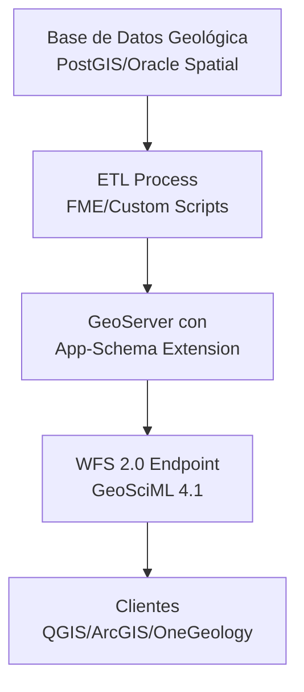

# GeoSciML: Investigación Técnica Avanzada

## Resumen Ejecutivo

**GeoSciML** (Geoscience Markup Language) es un estándar internacional OGC (Open Geospatial Consortium) para el intercambio de información geológica mediante XML/GML. Desarrollado por la **CGI** (Commission for the Management and Application of Geoscience Information) bajo el auspicio de la **IUGS** (International Union of Geological Sciences), GeoSciML es el lenguaje común que permite la interoperabilidad global de datos geológicos.

---

## 1. ¿Qué es GeoSciML?

### 1.1 Definición Técnica

GeoSciML es un **esquema de aplicación GML** (Geography Markup Language) que define:

- **Modelo lógico**: Estructura conceptual de entidades geológicas
- **Reglas de codificación XML**: Sintaxis estandarizada para representar datos
- **Vocabularios controlados**: Diccionarios internacionales de términos geológicos

### 1.2 Versiones y Evolución

| Versión | Año | Hitos Principales |
|---------|-----|-------------------|
| 2.0 | 2008 | Primera versión ampliamente adoptada |
| 3.0 | 2011 | Alineación con INSPIRE |
| 3.2 | 2013 | Mejoras en boreholes y estructuras |
| **4.1** | 2017 | **Estándar oficial OGC** |

**Versión actual**: GeoSciML 4.1 (OGC 16-008)

### 1.3 Tres Niveles de Complejidad

GeoSciML ofrece tres modelos para diferentes necesidades:

1. **GeoSciML-Lite** (Simple Feature)
   - Para aplicaciones de mapeo básico
   - Compatible con WMS/WFS simples
   - Geometrías 2D estándar

2. **GeoSciML-Basic** (INSPIRE-aligned)
   - Cumple con directiva INSPIRE europea
   - Balance entre simplicidad y riqueza semántica
   - Recomendado para servicios geológicos nacionales

3. **GeoSciML-Extended** (Complex Feature)
   - Escenarios avanzados (bases de datos relacionales complejas)
   - Soporte completo para relaciones geológicas
   - Usado en investigación científica

---

## 2. ¿Qué Hace GeoSciML?

### 2.1 Entidades Geológicas Soportadas

#### A. Unidades Geológicas (`gsml:GeologicUnit`)
Describe formaciones, miembros, estratos:
```xml
<gsml:GeologicUnit gml:id="formation_abanico">
  <gml:name>Formación Abanico</gml:name>
  <gsml:geologicUnitType>formation</gsml:geologicUnitType>
  <gsml:composition>
    <gsml:CompositionPart>
      <gsml:lithology xlink:href="http://resource.geosciml.org/classifier/cgi/lithology/andesite"/>
      <gsml:proportion>70</gsml:proportion>
    </gsml:CompositionPart>
  </gsml:composition>
  <gsml:geologicHistory>
    <gsml:GeologicEvent>
      <gsml:eventAge>
        <gsml:numericAge>15.5</gsml:numericAge>
        <gsml:ageUnit>Ma</gsml:ageUnit>
      </gsml:eventAge>
      <gsml:eventProcess xlink:href="http://resource.geosciml.org/classifier/cgi/eventprocess/volcanism"/>
    </gsml:GeologicEvent>
  </gsml:geologicHistory>
</gsml:GeologicUnit>
```

#### B. Estructuras Geológicas
- **Fallas** (`gsml:ShearDisplacementStructure`)
- **Pliegues** (`gsml:Fold`)
- **Foliaciones** (`gsml:Foliation`)
- **Contactos** (`gsml:Contact`)

#### C. Perforaciones (`gsml:Borehole`)
```xml
<gsml:Borehole gml:id="borehole_001">
  <gsml:collarLocation>
    <gml:Point srsName="EPSG:32719">
      <gml:pos>350000 6200000 1200</gml:pos>
    </gml:Point>
  </gsml:collarLocation>
  <gsml:totalDepth uom="m">500</gsml:totalDepth>
  <gsml:logElement>
    <gsml:BoreholeInterval>
      <gsml:fromDepth uom="m">0</gsml:fromDepth>
      <gsml:toDepth uom="m">50</gsml:toDepth>
      <gsml:lithology xlink:href="http://resource.geosciml.org/classifier/cgi/lithology/granite"/>
    </gsml:BoreholeInterval>
  </gsml:logElement>
</gsml:Borehole>
```

#### D. Observaciones de Campo
- Afloramientos (`gsml:MappedFeature`)
- Mediciones estructurales
- Muestras de roca

### 2.2 Vocabularios Controlados CGI

La CGI mantiene vocabularios SKOS (Simple Knowledge Organization System) para:

| Vocabulario | Conceptos | URL Base |
|-------------|-----------|----------|
| **Lithology** | 265 tipos de rocas | `http://resource.geosciml.org/classifier/cgi/lithology/` |
| **Stratigraphic Rank** | 30 rangos estratigráficos | `.../cgi/stratigraphicrank/` |
| **Event Process** | 50 procesos geológicos | `.../cgi/eventprocess/` |
| **Geologic Age** | ICS Time Scale | `.../cgi/geologicage/` |
| **Borehole Drilling Method** | 30 métodos de perforación | `.../cgi/boreholedrillingmethod/` |

**Ejemplo de uso**:
```python
# En lugar de texto libre "granito", usar URI semántica:
lithology_uri = "http://resource.geosciml.org/classifier/cgi/lithology/granite"
```

---

## 3. Implementaciones Reales

### 3.1 OneGeology Portal

**OneGeology** es el portal global de mapas geológicos que integra datos de **120+ países** usando GeoSciML.

**Características**:
- Servicios WFS que exponen GeoSciML 4.1
- Consultas por edad, litología, país
- Ejemplo de URL WFS:
  ```
  https://ogc.bgs.ac.uk/digmap625k_gsml_3/wfs?
    service=WFS&
    version=2.0.0&
    request=GetFeature&
    typeName=gsml:MappedFeature&
    filter=<ogc:Filter>...</ogc:Filter>
  ```

**Acreditación "5 estrellas"**: Servicios que cumplen completamente con GeoSciML reciben máxima calificación en OneGeology.

### 3.2 INSPIRE (Europa)

La **Directiva INSPIRE** (Infrastructure for Spatial Information in the European Community) adoptó GeoSciML como base para el tema "Geology".

**Impacto**:
- Todos los servicios geológicos de la UE deben publicar datos compatibles con INSPIRE
- GeoSciML-Basic es el perfil recomendado
- Proyecto **OneGeology-Europe** creó el primer mapa geológico armonizado de Europa (1:1M)

**EGDI (European Geological Data Infrastructure)**:
- Portal centralizado de datos geológicos europeos
- Integra servicios de 30+ países
- URL: https://www.europe-geology.eu/

### 3.3 Servicios Geológicos Nacionales

Organizaciones que publican GeoSciML WFS:

| País | Organización | Cobertura |
|------|--------------|-----------|
| 🇺🇸 USA | USGS | Nacional 1:500k |
| 🇬🇧 UK | BGS (British Geological Survey) | 1:625k |
| 🇦🇺 Australia | Geoscience Australia | Nacional 1:1M |
| 🇳🇿 New Zealand | GNS Science | Nacional 1:250k |
| 🇧🇷 Brazil | CPRM | 1:1M Bedrock |
| 🇫🇷 France | BRGM | INSPIRE-compliant |

---

## 4. Arquitectura Técnica

### 4.1 Stack Tecnológico Típico


```mermaid
graph TD
    A[Base de Datos Geológica<br/>PostGIS/Oracle Spatial] --> B[ETL Process<br/>FME/Custom Scripts]
    B --> C[GeoServer con<br/>App-Schema Extension]
    C --> D[WFS 2.0 Endpoint<br/>GeoSciML 4.1]
    D --> E[Clientes<br/>QGIS/ArcGIS/OneGeology]
```

**Componentes clave**:
1. **Base de datos espacial**: PostGIS, Oracle Spatial
2. **ETL**: Feature Manipulation Engine (FME), scripts Python
3. **Servidor WFS**: GeoServer (más común), MapServer, deegree
4. **Extensión**: GeoServer App-Schema para Complex Features

### 4.2 Ejemplo de Configuración GeoServer

**Mapping File** (app-schema):
```xml
<AttributeMapping>
  <targetAttribute>gsml:GeologicUnit/gml:name</targetAttribute>
  <sourceExpression>
    <OCQL>unit_name</OCQL>
  </sourceExpression>
</AttributeMapping>
<AttributeMapping>
  <targetAttribute>gsml:GeologicUnit/gsml:composition/gsml:CompositionPart/gsml:lithology</targetAttribute>
  <sourceExpression>
    <OCQL>strConcat('http://resource.geosciml.org/classifier/cgi/lithology/', lithology_code)</OCQL>
  </sourceExpression>
  <ClientProperty>
    <name>xlink:href</name>
    <value>$OCQL</value>
  </ClientProperty>
</AttributeMapping>
```

---

## 5. Implementación en Python

### 5.1 Librería Recomendada: `lxml`

**Ventajas de lxml**:
- Alto rendimiento (wrapper de libxml2 en C)
- Soporte completo de namespaces XML
- XPath 1.0 y XSLT
- Validación contra XSD schemas

**Instalación**:
```bash
uv pip install lxml
```

### 5.2 Ejemplo de Generación GeoSciML

```python
from lxml import etree

# Definir namespaces
NSMAP = {
    'gsml': 'http://www.opengis.net/gsml/4.1/GeoSciML-Core',
    'gml': 'http://www.opengis.net/gml/3.2',
    'xlink': 'http://www.w3.org/1999/xlink',
}

# Crear elemento raíz
root = etree.Element(
    f"{{{NSMAP['gsml']}}}GSML",
    nsmap=NSMAP
)

# Crear GeologicUnit
unit = etree.SubElement(root, f"{{{NSMAP['gsml']}}}GeologicUnit")
unit.set(f"{{{NSMAP['gml']}}}id", "unit_001")

# Nombre
name = etree.SubElement(unit, f"{{{NSMAP['gml']}}}name")
name.text = "Granito de la Cordillera"

# Composición con vocabulario CGI
comp = etree.SubElement(unit, f"{{{NSMAP['gsml']}}}composition")
part = etree.SubElement(comp, f"{{{NSMAP['gsml']}}}CompositionPart")
litho = etree.SubElement(part, f"{{{NSMAP['gsml']}}}lithology")
litho.set(
    f"{{{NSMAP['xlink']}}}href",
    "http://resource.geosciml.org/classifier/cgi/lithology/granite"
)

# Escribir XML
tree = etree.ElementTree(root)
tree.write(
    'output.xml',
    pretty_print=True,
    xml_declaration=True,
    encoding='UTF-8'
)
```

### 5.3 Parsing de GeoSciML

```python
from lxml import etree

# Parsear documento
tree = etree.parse('geosciml_input.xml')
root = tree.getroot()

# Definir namespaces para XPath
ns = {
    'gsml': 'http://www.opengis.net/gsml/4.1/GeoSciML-Core',
    'gml': 'http://www.opengis.net/gml/3.2',
}

# Extraer todas las unidades geológicas
units = root.xpath('//gsml:GeologicUnit', namespaces=ns)

for unit in units:
    unit_id = unit.get(f"{{{ns['gml']}}}id")
    name = unit.xpath('.//gml:name/text()', namespaces=ns)[0]

    # Extraer litología (URI del vocabulario)
    litho_href = unit.xpath(
        './/gsml:lithology/@xlink:href',
        namespaces={**ns, 'xlink': 'http://www.w3.org/1999/xlink'}
    )

    print(f"Unit: {name} ({unit_id})")
    print(f"  Lithology: {litho_href[0] if litho_href else 'N/A'}")
```

---

## 6. Validación y Calidad

### 6.1 Validación contra XSD Schema

```python
from lxml import etree

# Cargar schema XSD
schema_doc = etree.parse('http://schemas.opengis.net/gsml/4.1/geosciml.xsd')
schema = etree.XMLSchema(schema_doc)

# Validar documento
doc = etree.parse('my_geosciml.xml')
is_valid = schema.validate(doc)

if not is_valid:
    print("Errores de validación:")
    for error in schema.error_log:
        print(f"  Línea {error.line}: {error.message}")
```

### 6.2 Herramientas de Validación Online

- **OGC CITE Tests**: https://cite.opengeospatial.org/
- **GeoServer WFS Validator**: Incluido en GeoServer
- **Oxygen XML Editor**: Validación interactiva con sugerencias

---

## 7. Casos de Uso para SecInterp

### 7.1 Exportación de Secciones Geológicas

**Escenario**: Exportar las unidades geológicas interpretadas en una sección transversal.

**Mapeo**:
| Dato SecInterp | Elemento GeoSciML |
|----------------|-------------------|
| Segmento geológico | `gsml:GeologicUnit` |
| Litología (texto) | `gsml:composition/gsml:lithology` (URI) |
| Geometría 2D | `gsml:shape/gml:LineString` |
| Edad interpretada | `gsml:geologicHistory/gsml:GeologicEvent` |

**Beneficio**: Las secciones pueden integrarse con mapas geológicos nacionales en OneGeology.

### 7.2 Importación desde WFS

**Escenario**: Cargar unidades geológicas de un servicio WFS nacional para contexto regional.

**Flujo**:
1. Consultar WFS con filtro espacial (bounding box de la sección)
2. Parsear respuesta GeoSciML
3. Convertir a features QGIS
4. Proyectar a la sección 2D

### 7.3 Enriquecimiento Semántico

**Escenario**: Asociar interpretaciones locales con vocabularios internacionales.

**Ejemplo**:
```python
# Mapeo local → CGI
local_to_cgi = {
    "granito": "http://resource.geosciml.org/classifier/cgi/lithology/granite",
    "andesita": "http://resource.geosciml.org/classifier/cgi/lithology/andesite",
    "lutita": "http://resource.geosciml.org/classifier/cgi/lithology/mudstone",
}

# Al exportar, usar URI en lugar de texto
lithology_uri = local_to_cgi.get(user_lithology, None)
```

---

## 8. Desafíos y Consideraciones

### 8.1 Complejidad del Estándar

**Desafío**: GeoSciML-Extended es muy complejo (100+ clases UML).

**Solución**: Comenzar con GeoSciML-Lite para casos de uso básicos.

### 8.2 Curva de Aprendizaje

**Desafío**: Requiere conocimiento de:
- XML/GML
- Namespaces
- XPath
- Vocabularios SKOS

**Solución**: Usar plantillas y ejemplos de OneGeology como punto de partida.

### 8.3 Rendimiento

**Desafío**: XML es verboso, archivos grandes pueden ser lentos.

**Solución**:
- Usar streaming parsers para archivos grandes
- Considerar GeoPackage con metadatos GeoSciML como alternativa

---

## 9. Recursos y Referencias

### 9.1 Documentación Oficial

- **Especificación OGC**: http://www.opengis.net/doc/IS/geosciml/4.1
- **Sitio GeoSciML**: http://www.geosciml.org/
- **Schemas XSD**: http://schemas.opengis.net/gsml/4.1/
- **Vocabularios CGI**: http://resource.geosciml.org/

### 9.2 Guías Prácticas

- **OneGeology Cookbook 5**: Servir GeoSciML WFS con GeoServer
- **INSPIRE Geology Guidelines**: Implementación europea
- **GeoSciML Encoding Cookbook**: Mejores prácticas

### 9.3 Comunidad

- **CGI Mailing List**: cgi@lists.iugs.org
- **GitHub**: https://github.com/CGI-IUGS/geosciml
- **Slack**: OneGeology workspace

### 9.4 Software

- **GeoServer**: https://geoserver.org/ (servidor WFS)
- **QGIS**: Soporte nativo para WFS Complex Features
- **FME**: ETL comercial con soporte GeoSciML
- **lxml**: https://lxml.de/ (Python XML)

---

## 10. Conclusiones

### 10.1 Ventajas de Adoptar GeoSciML

✅ **Interoperabilidad global**: Datos compatibles con 120+ países
✅ **Semántica rica**: Vocabularios controlados evitan ambigüedad
✅ **Estándar OGC**: Garantía de soporte a largo plazo
✅ **Integración INSPIRE**: Acceso a infraestructura europea
✅ **Visibilidad**: Publicación en OneGeology portal

### 10.2 Recomendación para SecInterp

**Fase 1 (v2.3.0)**: Implementar exportación básica GeoSciML-Lite
- Enfoque en `GeologicUnit` para segmentos geológicos
- Mapeo simple de litologías a vocabulario CGI
- Validación contra XSD

**Fase 2 (v2.4.0)**: Añadir estructuras y perforaciones
- `ShearDisplacementStructure` para fallas
- `Borehole` para sondajes

**Fase 3 (v2.5.0)**: Importación y servicios WFS
- Consumir datos de servicios nacionales
- Publicar secciones como WFS (con GeoServer)

---

*Documento creado: 2025-12-22*
*Autor: Investigación técnica para proyecto SecInterp*
*Versión: 1.0*
