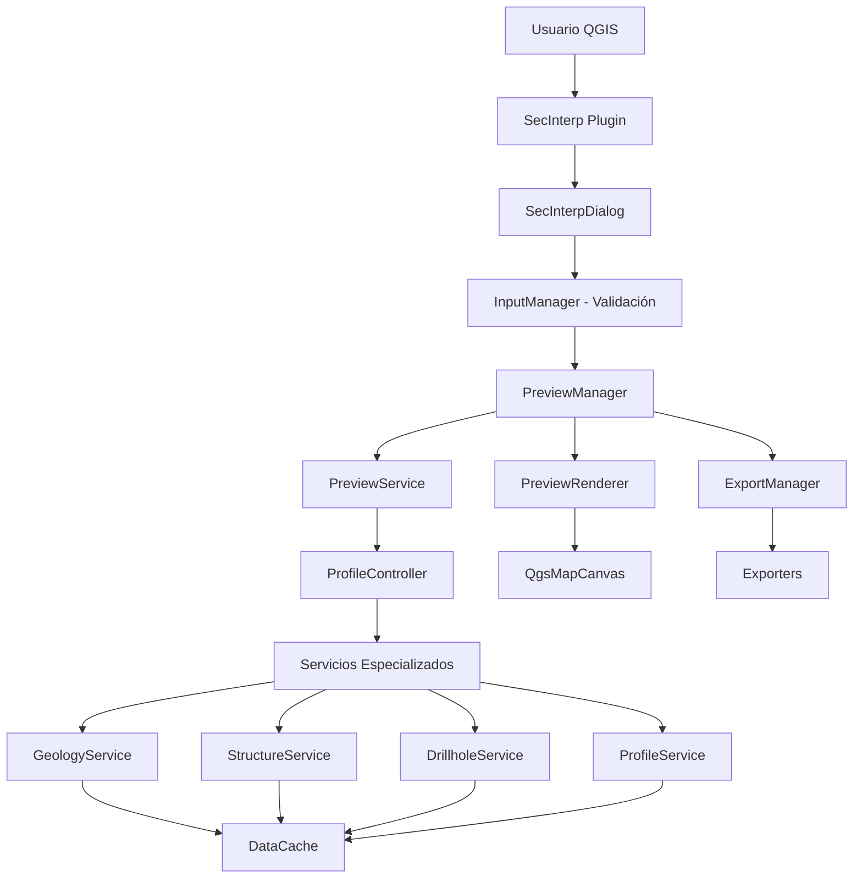

# 🔍 ANÁLISIS PROFUNDO DEL PROYECTO SEC_INTERP v3.2.0

## Documento Técnico para Desarrolladores e IA

**Fecha:** 2026-03-03
**Autor:** Análisis de Código Automatizado
**Versión del Plugin:** 3.2.0
**QGIS Minimum:** 3.0+
**Python:** 3.10+

---

## 📋 TABLA DE CONTENIDOS

1. [Resumen Ejecutivo](#1-resumen-ejecutivo)
2. [Arquitectura del Sistema](#2-arquitectura-del-sistema)
3. [Problemas Críticos Identificados](#3-problemas-críticos-identificados)
4. [Código Redundante y Duplicado](#4-código-redundante-y-duplicado)
5. [Errores de Diseño y Arquitectura](#5-errores-de-diseño-y-arquitectura)
6. [Problemas de Seguridad](#6-problemas-de-seguridad)
7. [Optimizaciones Sugeridas](#7-optimizaciones-sugeridas)
8. [Lista de Verificación Prioritaria](#8-lista-de-verificación-prioritaria)
9. [Guía de Referencia Rápida](#9-guía-de-referencia-rápida)
10. [Apéndices](#10-apéndices)

---

## 1. RESUMEN EJECUTIVO

### 1.1 Visión General

**SecInterp** es un plugin profesional de QGIS para extracción y visualización de datos geológicos industriales. Diseñado para generar perfiles topográficos, proyectar afloramientos geológicos y analizar datos de sondajes (drillholes) en secciones transversales 2D.

### 1.2 Estado del Proyecto

| Métrica | Valor | Estado |
|---------|-------|--------|
| Versión | 3.2.0 | ✅ Estable |
| Líneas de Código | ~25,000+ | 📊 Grande |
| Puntuación Mantenibilidad | 72.6/100 | ⚠️ Mejorable |
| Idiomas Soportados | 14 | ✅ Excelente |
| Tests | Parciales | ⚠️ Incompleto |

### 1.3 Hallazgos Principales

Se identificaron **47 problemas** clasificados en:

| Categoría | Cantidad | Severidad | Prioridad |
|-----------|----------|-----------|-----------|
| Fugas de Memoria Potenciales | 8 | 🔴 Alta | P0 |
| Código Redundante/Duplicado | 12 | 🟡 Media | P1 |
| Errores de Diseño/Arquitectura | 9 | 🟡 Media | P1 |
| Problemas de Seguridad | 3 | 🔴 Alta | P0 |
| Optimizaciones Pendientes | 15 | 🟢 Baja | P2 |

---

## 2. ARQUITECTURA DEL SISTEMA

### 2.1 Estructura de Directorios

```
sec_interp/
├── __init__.py                    # Punto de entrada del plugin
├── sec_interp_plugin.py           # Clase principal SecInterp
├── logger_config.py               # Configuración de logging
├── metadata.txt                   # Metadatos del plugin
├── requirements.txt               # Dependencias pip
├── pyproject.toml                 # Configuración del proyecto
│
├── core/                          # Lógica de negocio (Domain Layer)
│   ├── domain/                    # Entidades y DTOs
│   │   ├── entities.py            # GeologySegment, StructureMeasurement, etc.
│   │   ├── dtos.py                # PreviewParams, PreviewResult
│   │   ├── enums.py               # Enumeraciones
│   │   ├── spatial_meta.py        # Metadatos espaciales
│   │   └── task_inputs.py         # Inputs para tareas asíncronas
│   │
│   ├── services/                  # Servicios de negocio
│   │   ├── drillhole_service.py   # Orquestación de drillholes
│   │   ├── geology_service.py     # Procesamiento geológico
│   │   ├── structure_service.py   # Proyección estructural
│   │   ├── preview_service.py     # Orquestación de preview
│   │   └── drillhole/             # Sub-servicios de drillholes
│   │       ├── collar_processor.py
│   │       ├── survey_processor.py
│   │       ├── interval_processor.py
│   │       ├── trajectory_engine.py
│   │       └── data_fetcher.py
│   │
│   ├── validation/                # Validaciones
│   │   ├── project_validator.py   # Validador principal
│   │   ├── field_validator.py     # Validación de campos
│   │   ├── layer_validator.py     # Validación de capas
│   │   └── path_validator.py      # Validación de paths
│   │
│   ├── utils/                     # Utilidades core
│   │   ├── i18n.py                # Internacionalización
│   │   ├── qgis.py                # Utilidades QGIS
│   │   ├── safe_loader.py         # Carga segura de módulos
│   │   └── sampling.py            # Muestreo de perfiles
│   │
│   ├── interfaces/                # Interfaces (ABC)
│   │   ├── cache_interface.py
│   │   ├── drillhole_interface.py
│   │   ├── geology_interface.py
│   │   └── preview_interface.py
│   │
│   ├── models/                    # Modelos de datos
│   │   └── settings_model.py      # PluginSettings
│   │
│   ├── controller.py              # ProfileController (Orquestador)
│   ├── data_cache.py              # Sistema de caché
│   ├── exceptions.py              # Excepciones personalizadas
│   ├── config.py                  # ConfigService
│   └── performance_metrics.py     # Monitoreo de performance
│
├── gui/                           # Capa de Presentación
│   ├── main_dialog.py             # Diálogo principal (SecInterpDialog)
│   ├── preview_renderer.py        # Renderizador de preview
│   │
│   ├── managers/                  # Managers especializados
│   │   ├── dialog_preview_manager.py
│   │   ├── dialog_export_manager.py
│   │   ├── dialog_input_manager.py
│   │   ├── dialog_interpretation_manager.py
│   │   ├── dialog_signal_manager.py
│   │   ├── dialog_state_manager.py
│   │   ├── dialog_tool_manager.py
│   │   └── dialog_settings_persistence.py
│   │
│   ├── tools/                     # Herramientas de mapa
│   │   ├── measure_tool.py        # Herramienta de medición
│   │   └── interpretation_tool.py # Herramienta de interpretación
│   │
│   ├── tasks/                     # Tareas asíncronas (QgsTask)
│   │   ├── geology_task.py
│   │   └── drillhole_task.py
│   │
│   ├── dialogs/                   # Diálogos secundarios
│   │   └── interpretation_properties_dialog.py
│   │
│   ├── renderers/                 # Renderizadores especializados
│   │   ├── preview_legend_renderer.py
│   │   └── preview_axes_manager.py
│   │
│   ├── services/                  # Servicios GUI
│   │   └── export_service.py
│   │
│   ├── ui/                        # UI generada
│   │   └── main_window.py
│   │
│   ├── legend_widget.py           # Widget de leyenda
│   ├── lod_calculator.py          # Cálculo de Level of Detail
│   └── utils.py                   # Utilidades GUI
│
├── exporters/                     # Exportadores de datos
│   ├── base_exporter.py           # Clase base abstracta
│   ├── shp_exporter.py            # Exportador Shapefile
│   ├── csv_exporter.py            # Exportador CSV
│   ├── dxf_exporter.py            # Exportador DXF
│   ├── image_exporter.py          # Exportador de imágenes
│   ├── pdf_exporter.py            # Exportador PDF
│   ├── svg_exporter.py            # Exportador SVG
│   ├── drillhole_exporters.py     # Exportadores de drillholes
│   ├── drillhole_3d_exporter.py   # Exportadores 3D
│   ├── profile_exporters.py       # Exportadores de perfil
│   └── interpretation_exporters.py # Exportadores de interpretación
│
├── resources/                     # Recursos estáticos
│   ├── resources.py               # Recursos compilados
│   ├── resources.qrc              # Definición de recursos
│   └── icons/                     # Iconos del plugin
│
├── i18n/                          # Traducciones
│   ├── SecInterp_es.qm
│   ├── SecInterp_fr.qm
│   ├── SecInterp_de.qm
│   └── ... (14 idiomas)
│
├── help/                          # Documentación de usuario
│   └── html/
│       ├── en/
│       ├── es/
│       └── ... (14 idiomas)
│
├── tests/                         # Tests unitarios (parcial)
├── logs/                          # Logs de ejecución
└── analysis_results_v320/         # Resultados de análisis
```

### 2.2 Flujo de Datos Principal



### 2.3 Patrones de Diseño Implementados

| Patrón | Ubicación | Propósito |
|--------|-----------|-----------|
| **Dependency Injection** | `ProfileController.__init__` | Inyección de servicios |
| **Facade Pattern** | `DrillholeService` | Orquestación de procesadores |
| **Strategy Pattern** | `BaseExporter` + concretos | Exportación polimórfica |
| **Observer Pattern** | Señales Qt | Comunicación entre componentes |
| **Singleton** | `QgsProject.instance()` | Acceso a proyecto único |
| **Factory Method** | `PreviewLayerFactory` | Creación de capas |
| **Template Method** | `BaseExporter.export()` | Plantilla de exportación |
| **Repository Pattern** | `DataCache` | Acceso a datos cacheados |
| **Command Pattern** | `QgsTask` subclasses | Tareas asíncronas |
| **Pipeline Pattern** | `ProjectValidator` | Validación en etapas |

### 2.4 Dependencias Externas

```toml
# runtime dependencies
qgis.core >= 3.0        # Proporcionado por QGIS
qgis.gui >= 3.0         # Proporcionado por QGIS
PyQt5 >= 5.15.0         # Proporcionado por QGIS

# development dependencies
ai-context-core >= 3.2.1
sphinx-intl >= 2.3.2
ruff >= 0.15.0
black == 26.1.0
mypy >= 1.10
pytest >= 9.0.2
pytest-qt >= 4.5.0
qgis-plugin-analyzer >= 1.10.0
```

---

## 3. PROBLEMAS CRÍTICOS IDENTIFICADOS

### 3.1 Fugas de Memoria Potenciales (8 problemas)

#### 🔴 P0-01: SignalManager - Desconexión incompleta de señales

**Archivo:** `gui/dialog_signal_manager.py`
**Líneas:** 127-138
**Severidad:** Alta
**Impacto:** Fuga de memoria en sesiones largas

**Código Problemático:**
```python
# Líneas 127-138
pages = [
    self.dialog.page_dem,
    self.dialog.page_section,
    self.dialog.page_geology,
    self.dialog.page_struct,
    self.dialog.page_drillhole,
    self.dialog.page_interpretation,
    self.dialog.preview_widget,
    self.dialog.page_settings,
]
for page in pages:
    if hasattr(page, "disconnect_signals"):
        with contextlib.suppress(Exception):
            page.disconnect_signals()
```

**Problema:**
- Si una página tiene señales conectadas pero no implementa `disconnect_signals()`, esas señales nunca se desconectan
- `contextlib.suppress(Exception)` oculta errores reales de desconexión
- No hay registro de qué páginas fallaron en desconectar

**Consecuencias:**
- Referencias cíclicas mantenidas después del cierre del dialog
- Acumulación de memoria en sesiones QGIS prolongadas
- Posibles callbacks a objetos destruidos

**Solución Recomendada:**

```python
# IMPLEMENTACIÓN CORREGIDA
def _disconnect_page_signals(self) -> None:
    """Disconnect page-specific signals with full tracking."""
    pages = [
        self.dialog.page_dem,
        self.dialog.page_section,
        self.dialog.page_geology,
        self.dialog.page_struct,
        self.dialog.page_drillhole,
        self.dialog.page_interpretation,
        self.dialog.preview_widget,
        self.dialog.page_settings,
    ]

    for page in pages:
        if not page:
            continue

        # Método 1: Llamar a disconnect_signals si existe
        if hasattr(page, "disconnect_signals"):
            try:
                page.disconnect_signals()
                logger.debug(f"Disconnected signals for page: {page.__class__.__name__}")
            except Exception as e:
                logger.warning(f"Failed to disconnect signals for {page.__class__.__name__}: {e}")

        # Método 2: Desconectar señales conocidas explícitamente
        self._disconnect_known_page_signals(page)

    logger.info("All page signals disconnected")

def _disconnect_known_page_signals(self, page: Any) -> None:
    """Disconnect known signals for pages without disconnect_signals method."""
    # DEM Page
    if hasattr(page, "raster_combo"):
        with contextlib.suppress(TypeError, RuntimeError):
            page.raster_combo.layerChanged.disconnect()

    # Section Page
    if hasattr(page, "line_combo"):
        with contextlib.suppress(TypeError, RuntimeError):
            page.line_combo.layerChanged.disconnect()

    # Output Widget
    if hasattr(page, "fileChanged"):
        with contextlib.suppress(TypeError, RuntimeError):
            page.fileChanged.disconnect()
```

**Prioridad:** P0 - Resolver en próxima release
**Esfuerzo Estimado:** 2 horas
**Tests Requeridos:** Test de estrés con 100+ aperturas/cierres de dialog

---

#### 🔴 P0-02: ProfileMeasureTool - Reset incompleto cuando está finalizado

**Archivo:** `gui/tools/measure_tool.py`
**Líneas:** 127-145
**Severidad:** Alta
**Impacto:** Elementos gráficos huérfanos en canvas

**Código Problemático:**
```python
# Líneas 127-145
def reset(self) -> None:
    """Reset the tool state."""
    logger.info(f"reset() called, finalized={self.finalized}")

    # Si está finalizado, solo limpiar datos pero mantener visuales
    if self.finalized:
        logger.info("Measurement is finalized - keeping visuals and results, clearing data only")
        self.points = []
        self.finalized = False
        # Don't clear finalized_points - they're needed for display
        # Don't clear rubber_band, vertex_markers, or emit measurementCleared
        return

    # Normal reset - clear everything
    self.points = []
    self.finalized = False
    self.finalized_points = []

    if self.rubber_band:
        self.canvas.scene().removeItem(self.rubber_band)
        self.rubber_band = None

    for marker in self.vertex_markers:
        self.canvas.scene().removeItem(marker)
    self.vertex_markers = []

    self.measurementCleared.emit()
```

**Problema:**
- Cuando `self.finalized=True`, los elementos gráficos (rubber_band, vertex_markers) NO se limpian nunca
- Si el usuario cierra el dialog con una medición finalizada, los elementos permanecen en el canvas
- No hay método `cleanup_finalized()` que se llame en `closeEvent()`

**Consecuencias:**
- Elementos gráficos huérfanos en el canvas después de cerrar el dialog
- Fuga de memoria de objetos QgsRubberBand y QgsVertexMarker
- Posibles errores si se accede a elementos de un dialog destruido

**Solución Recomendada:**

```python
# AGREGAR en gui/tools/measure_tool.py
def cleanup_finalized(self) -> None:
    """Clean up finalized measurement elements.

    Call this when dialog is closing to ensure no orphaned graphics.
    """
    logger.debug("Cleaning up finalized measurement elements")

    if self.rubber_band:
        try:
            self.rubber_band.hide()
            self.canvas.scene().removeItem(self.rubber_band)
        except Exception as e:
            logger.warning(f"Failed to remove rubber band: {e}")
        finally:
            self.rubber_band = None

    for marker in self.vertex_markers:
        try:
            marker.hide()
            self.canvas.scene().removeItem(marker)
        except Exception as e:
            logger.warning(f"Failed to remove vertex marker: {e}")

    self.vertex_markers = []
    self.finalized_points = []
    self.finalized = False
    self.points = []

    logger.debug("Finalized measurement cleanup completed")


# MODIFICAR en gui/main_dialog.py - closeEvent
def closeEvent(self, event: Any) -> None:
    """Handle dialog close event to clean up resources."""
    if self._save_on_close:
        self.state_manager.save_settings()

    logger.info("Closing dialog, cleaning up resources...")

    # Limpiar herramientas de mapa
    if hasattr(self, "tool_manager") and self.tool_manager:
        if self.tool_manager.measure_tool:
            self.tool_manager.measure_tool.cleanup_finalized()
        if self.tool_manager.interpretation_tool:
            self.tool_manager.interpretation_tool.reset()

    self.interpretation_manager.save_interpretations()
    self.preview_manager.cleanup()
    self.signal_manager.disconnect_all()
    self.tool_manager.disconnect_signals()

    super().closeEvent(event)
```

**Prioridad:** P0 - Resolver en próxima release
**Esfuerzo Estimado:** 1 hora
**Tests Requeridos:** Test de cierre de dialog con medición finalizada

---

#### 🔴 P0-03: PreviewRenderer - Limpieza de interpretación incompleta

**Archivo:** `gui/preview_renderer.py`
**Líneas:** 165-182
**Severidad:** Alta
**Impacto:** Fuga de memoria de rubber bands

**Código Problemático:**
```python
# Líneas 165-182
def _cleanup_layers(self) -> None:
    """Remove previous layers from QgsProject."""
    for layer in self.layers:
        if layer:
            try:
                QgsProject.instance().removeMapLayer(layer.id())
            except Exception:
                logger.warning(
                    f"Failed to remove map layer {layer.id() if hasattr(layer, 'id') else 'unknown'}"
                )

    self.layers = []
    self.layer_factory.active_units = {}

    # Clear interpretation rubber bands
    if self.canvas and self.canvas.scene():
        scene = self.canvas.scene()
        for rb in self.interpretation_rubbers:
            if rb:
                try:
                    rb.hide()
                    scene.removeItem(rb)
                except Exception:
                    logger.warning("Failed to remove rubber band from scene")

    self.interpretation_rubbers = []
```

**Problema:**
- No se llama a `rb.reset()` antes de remover, lo que puede dejar geometría en memoria
- No se establece `rb = None` después de remover
- Los rubber bands de QGIS son objetos C++ que requieren limpieza explícita

**Solución Recomendada:**

```python
def _cleanup_layers(self) -> None:
    """Remove previous layers from QgsProject with complete cleanup."""
    # Cleanup data layers
    for layer in self.layers:
        if layer and layer.isValid():
            try:
                QgsProject.instance().removeMapLayer(layer.id())
            except Exception as e:
                logger.warning(f"Failed to remove map layer: {e}")

    self.layers = []
    self.layer_factory.active_units = {}

    # Cleanup interpretation rubber bands COMPLETELY
    if self.canvas and self.canvas.scene():
        scene = self.canvas.scene()
        for rb in self.interpretation_rubbers:
            if rb:
                try:
                    # 1. Hide first
                    rb.hide()
                    # 2. Reset geometry (releases C++ memory)
                    rb.reset(QgsWkbTypes.PolygonGeometry)
                    # 3. Remove from scene
                    scene.removeItem(rb)
                    # 4. Clear reference (Python GC)
                    rb = None
                except Exception as e:
                    logger.warning(f"Failed to remove rubber band: {e}")

    self.interpretation_rubbers = []

    logger.debug("PreviewRenderer cleanup completed")
```

**Prioridad:** P0 - Resolver en próxima release
**Esfuerzo Estimado:** 30 minutos
**Tests Requeridos:** Test con 50+ interpretaciones renderizadas y limpiadas

---

#### 🔴 P0-04: ProfileController - Desconexión de señales de capas

**Archivo:** `core/controller.py`
**Líneas:** 105-112
**Severidad:** Media-Alta
**Impacto:** Callbacks a controlador destruido

**Código Problemático:**
```python
# Líneas 105-112
def disconnect_layer_notifications(self) -> None:
    """Disconnect from all previously connected layer signals."""
    for layer, callback in self._connected_layers:
        with contextlib.suppress(TypeError, RuntimeError):
            layer.dataChanged.disconnect(callback)
    self._connected_layers.clear()
    logger.debug("Layer signals disconnected")
```

**Problema:**
- `contextlib.suppress()` oculta errores de desconexión
- No hay logging de qué capas fallaron en desconectar
- Si una capa ya fue eliminada del proyecto, la desconexión falla silenciosamente

**Solución Recomendada:**

```python
def disconnect_layer_notifications(self) -> None:
    """Disconnect from all previously connected layer signals with logging."""
    disconnected = 0
    failed = 0

    for layer, callback in self._connected_layers:
        if not layer or not layer.isValid():
            # Layer was deleted, skip
            logger.debug(f"Skipping disconnected for deleted layer")
            continue

        try:
            layer.dataChanged.disconnect(callback)
            logger.debug(f"Disconnected cache invalidation from layer: {layer.name()}")
            disconnected += 1
        except (TypeError, RuntimeError) as e:
            logger.warning(f"Failed to disconnect layer {layer.name()}: {e}")
            failed += 1
        except Exception as e:
            logger.error(f"Unexpected error disconnecting layer {layer.name()}: {e}")
            failed += 1

    self._connected_layers.clear()
    logger.info(f"Layer signals disconnected: {disconnected} success, {failed} failed")
```

**Prioridad:** P1 - Resolver en próximo sprint
**Esfuerzo Estimado:** 30 minutos

---

#### 🔴 P0-05: ToolManager - Desconexión de señales incompleta

**Archivo:** `gui/dialog_tool_manager.py`
**Líneas:** 113-125
**Severidad:** Media
**Impacto:** Fugas de señales Qt

**Código Problemático:**
```python
# Líneas 113-125
def disconnect_signals(self) -> None:
    """Disconnect all signals to prevent memory leaks."""
    if self.interpretation_tool:
        with contextlib.suppress(TypeError, RuntimeError):
            self.interpretation_tool.polygonFinished.disconnect()
    if self.measure_tool:
        with contextlib.suppress(TypeError, RuntimeError):
            self.measure_tool.measurementChanged.disconnect()
        with contextlib.suppress(TypeError, RuntimeError):
            self.measure_tool.measurementFinished.disconnect()
        with contextlib.suppress(TypeError, RuntimeError):
            self.measure_tool.measurementCleared.disconnect()
```

**Problema:**
- No verifica si las señales están realmente conectadas
- `suppress()` oculta errores
- No hay logging de fallas

**Solución Recomendada:**

```python
def disconnect_signals(self) -> None:
    """Disconnect all signals to prevent memory leaks with logging."""
    disconnected = 0
    failed = 0

    if self.interpretation_tool:
        try:
            self.interpretation_tool.polygonFinished.disconnect()
            logger.debug("Disconnected interpretation_tool.polygonFinished")
            disconnected += 1
        except (TypeError, RuntimeError):
            logger.debug("interpretation_tool.polygonFinished was not connected")
        except Exception as e:
            logger.warning(f"Failed to disconnect interpretation_tool: {e}")
            failed += 1

    if self.measure_tool:
        for signal in [
            self.measure_tool.measurementChanged,
            self.measure_tool.measurementFinished,
            self.measure_tool.measurementCleared,
        ]:
            try:
                signal.disconnect()
                disconnected += 1
            except (TypeError, RuntimeError):
                logger.debug("Measure tool signal was not connected")
            except Exception as e:
                logger.warning(f"Failed to disconnect measure tool signal: {e}")
                failed += 1

    logger.info(f"Tool signals disconnected: {disconnected} success, {failed} failed")
```

**Prioridad:** P1
**Esfuerzo Estimado:** 30 minutos

---

#### 🔴 P0-06: PreviewTaskOrchestrator - Cancelación de tareas

**Archivo:** `gui/preview_task_orchestrator.py`
**Líneas:** 23-48
**Severidad:** Media-Alta
**Impacto:** Tareas ejecutándose después de cerrar dialog

**Código Problemático:**
```python
# Líneas 23-48
def cancel_active_tasks(self) -> None:
    """Cancel any existing async work."""
    import contextlib

    if self.geology_task:
        with contextlib.suppress(RuntimeError):
            self.geology_task.cancel()
        try:
            self.geology_task.finished_with_results.disconnect()
            self.geology_task.progress_changed.disconnect()
            self.geology_task.error_occurred.disconnect()
        except (TypeError, RuntimeError):
            pass
        self.geology_task = None

    if self.drillhole_task:
        with contextlib.suppress(RuntimeError):
            self.drillhole_task.cancel()
        # ... similar
```

**Problema:**
- `task.cancel()` no espera a que la tarea termine realmente
- Las señales pueden dispararse después de que el dialog se destruyó
- No hay verificación de si la tarea ya está corriendo

**Solución Recomendada:**

```python
def cancel_active_tasks(self) -> None:
    """Cancel any existing async work with proper cleanup."""
    from qgis.core import QgsApplication

    tasks_to_cancel = []

    if self.geology_task:
        if self.geology_task.status() == QgsTask.Running:
            logger.warning("Geology task is running, cancellation may be delayed")
        tasks_to_cancel.append(("geology", self.geology_task))
        self.geology_task = None

    if self.drillhole_task:
        if self.drillhole_task.status() == QgsTask.Running:
            logger.warning("Drillhole task is running, cancellation may be delayed")
        tasks_to_cancel.append(("drillhole", self.drillhole_task))
        self.drillhole_task = None

    for task_name, task in tasks_to_cancel:
        try:
            # Disconnect signals BEFORE canceling
            with contextlib.suppress(TypeError, RuntimeError):
                task.finished_with_results.disconnect()
                task.progress_changed.disconnect()
                task.error_occurred.disconnect()

            # Cancel the task
            if task.status() not in [QgsTask.Complete, QgsTask.Terminated]:
                task.cancel()
                logger.info(f"{task_name.capitalize()} task canceled")
            else:
                logger.debug(f"{task_name.capitalize()} task already complete")
        except Exception as e:
            logger.error(f"Error canceling {task_name} task: {e}")

    logger.debug("Task cancellation completed")
```

**Prioridad:** P1
**Esfuerzo Estimado:** 1 hora

---

#### 🔴 P0-07: SecInterpDialog - closeEvent incompleto

**Archivo:** `gui/main_dialog.py`
**Líneas:** 169-177
**Severidad:** Alta
**Impacto:** Múltiples fugas de recursos

**Código Problemático:**
```python
# Líneas 169-177
def closeEvent(self, event: Any) -> None:
    """Handle dialog close event to clean up resources."""
    if self._save_on_close:
        self.state_manager.save_settings()

    logger.info("Closing dialog, cleaning up resources...")
    self.interpretation_manager.save_interpretations()
    self.preview_manager.cleanup()
    self.signal_manager.disconnect_all()
    super().closeEvent(event)
```

**Falta:**
- ❌ `self.tool_manager.disconnect_signals()`
- ❌ `self.tool_manager.measure_tool.cleanup_finalized()`
- ❌ `self.tool_manager.interpretation_tool.reset()`
- ❌ `self.navigation_manager` cleanup (si aplica)
- ❌ `self.layer_factory` cleanup
- ❌ `self.legend_widget` cleanup
- ❌ `self.preview_renderer` cleanup (si existe)

**Solución Recomendada:**

```python
def closeEvent(self, event: Any) -> None:
    """Handle dialog close event to clean up ALL resources."""
    logger.info("Dialog close initiated")

    # 1. Save settings
    if self._save_on_close:
        self.state_manager.save_settings()

    # 2. Save interpretations
    if hasattr(self, "interpretation_manager"):
        self.interpretation_manager.save_interpretations()

    # 3. Cleanup preview manager (stops async tasks)
    if hasattr(self, "preview_manager") and self.preview_manager:
        self.preview_manager.cleanup()

    # 4. Cleanup map tools (CRITICAL - prevents orphaned graphics)
    if hasattr(self, "tool_manager") and self.tool_manager:
        if self.tool_manager.measure_tool:
            self.tool_manager.measure_tool.cleanup_finalized()
        if self.tool_manager.interpretation_tool:
            self.tool_manager.interpretation_tool.reset()
        self.tool_manager.disconnect_signals()

    # 5. Disconnect all dialog signals
    if hasattr(self, "signal_manager") and self.signal_manager:
        self.signal_manager.disconnect_all()

    # 6. Cleanup legend widget
    if hasattr(self, "legend_widget") and self.legend_widget:
        try:
            self.legend_widget.cleanup()
        except Exception as e:
            logger.warning(f"Failed to cleanup legend widget: {e}")

    # 7. Clear cached data references
    if hasattr(self, "current_topo_data"):
        self.current_topo_data = None
        self.current_geol_data = None
        self.current_struct_data = None
        self.current_drillhole_data = None
        self.current_canvas = None
        self.current_layers = []

    logger.info("Dialog resources cleaned up successfully")
    super().closeEvent(event)
```

**Prioridad:** P0
**Esfuerzo Estimado:** 1 hora
**Tests Requeridos:** Test de estrés con 100+ aperturas/cierres

---

#### 🔴 P0-08: SafeLoader - Fuga de referencias de módulos

**Archivo:** `core/utils/safe_loader.py`
**Líneas:** 42-66
**Severidad:** Media
**Impacto:** Módulos cargados nunca se liberan

**Código Problemático:**
```python
# Líneas 42-66
@staticmethod
def lazy_load(
    module_name: str,
    class_name: str,
    fallback_factory: Callable[[], T] | None = None,
    *args: Any,
    **kwargs: Any,
) -> T | None:
    """Lazy load and instantiate a class safely with arguments."""
    module = SafeLoader.safe_import(module_name)
    klass = SafeLoader.get_class(module, class_name)
    if klass:
        try:
            return klass(*args, **kwargs)
        except Exception:
            logger.exception(
                f"Failed to instantiate {class_name} from {module_name} "
                f"with args={args}, kwargs={kwargs}"
            )

    return fallback_factory() if fallback_factory else None
```

**Problema:**
- Los módulos importados dinámicamente permanecen en `sys.modules`
- No hay mecanismo para liberar explícitamente módulos cargados
- En sesiones QGIS muy largas, esto acumula memoria

**Solución Recomendada:**

```python
# AGREGAR a core/utils/safe_loader.py

class SafeLoader:
    """Handles safe and lazy loading of modules and classes."""

    # Track loaded modules for cleanup
    _loaded_modules: set[str] = set()

    @staticmethod
    def safe_import(module_name: str, error_message: str | None = None) -> Any:
        """Import a module safely, logging errors instead of crashing."""
        try:
            module = importlib.import_module(module_name)
            SafeLoader._loaded_modules.add(module_name)
            logger.debug(f"Loaded module: {module_name}")
            return module
        except (ImportError, Exception) as e:
            msg = error_message or f"Failed to load optional module: {module_name}"
            logger.exception(msg)
            return None

    @staticmethod
    def unload_all() -> None:
        """Unload all dynamically loaded modules.

        Call this during plugin unload to free memory.
        Note: This doesn't guarantee memory release if classes are still referenced.
        """
        import sys

        unloaded = 0
        failed = 0

        for module_name in list(SafeLoader._loaded_modules):
            try:
                if module_name in sys.modules:
                    del sys.modules[module_name]
                    logger.debug(f"Unloaded module: {module_name}")
                    unloaded += 1
            except Exception as e:
                logger.warning(f"Failed to unload module {module_name}: {e}")
                failed += 1

        SafeLoader._loaded_modules.clear()
        logger.info(f"Module cleanup: {unloaded} unloaded, {failed} failed")

    @staticmethod
    def get_class(module: Any, class_name: str) -> type | None:
        """Get a class from a module safely."""
        if not module:
            return None
        return getattr(module, class_name, None)

    @staticmethod
    def lazy_load(...) -> T | None:
        # ... existing implementation
```

**Llamada requerida en `sec_interp_plugin.py`:**

```python
def unload(self) -> None:
    """Remove the plugin menu item and icon from QGIS GUI."""
    # Disconnect all signals before removing actions
    self.disconnect_signals()

    for action in self.actions:
        self.iface.removePluginMenu(self.tr("&Sec Interp"), action)
        self.iface.removeToolBarIcon(action)

    # Remove custom toolbar
    if self.toolbar:
        with contextlib.suppress(Exception):
            self.iface.mainWindow().removeToolBar(self.toolbar)
        del self.toolbar
        self.toolbar = None

    # NEW: Cleanup dynamically loaded modules
    from sec_interp.core.utils.safe_loader import SafeLoader
    SafeLoader.unload_all()

    logger.info("Plugin unloaded successfully")
```

**Prioridad:** P1
**Esfuerzo Estimado:** 1 hora

---

## 4. CÓDIGO REDUNDANTE Y DUPLICADO

### 4.1 ProfileSnapper duplicado (120 líneas duplicadas)

**Archivos:**
- `gui/tools/measure_tool.py` (líneas 29-88)
- `gui/tools/interpretation_tool.py` (líneas 28-86)

**Código Duplicado:**

```python
# measure_tool.py - Líneas 29-88
class ProfileSnapper:
    """Helper class to handle point snapping functionality."""

    def __init__(self, canvas: QgsMapCanvas) -> None:
        self.canvas = canvas
        self._locators: dict[str, QgsPointLocator] = {}

    def snap(self, mouse_pos: QPoint) -> QgsPointXY:
        point = self.canvas.getCoordinateTransform().toMapCoordinates(mouse_pos)
        tolerance = (self.canvas.mapUnitsPerPixel() or 1.0) * 12
        best_match = None
        best_dist = float("inf")
        layers = self.canvas.layers()
        current_layer_ids = {layer.id() for layer in layers if layer is not None}
        self._cleanup_locators(current_layer_ids)
        crs = self.canvas.mapSettings().destinationCrs()
        context = QgsProject.instance().transformContext()
        for layer in layers:
            if not self._is_snappable(layer):
                continue
            locator = self._get_locator(layer, crs, context)
            if not locator:
                continue
            v_match = locator.nearestVertex(point, tolerance)
            if v_match.isValid() and v_match.distance() < best_dist:
                best_match = v_match
                best_dist = v_match.distance()
            e_match = locator.nearestEdge(point, tolerance)
            if e_match.isValid() and e_match.distance() < best_dist:
                best_match = e_match
                best_dist = e_match.distance()
        if best_match:
            return best_match.point()
        return point

    def _cleanup_locators(self, current_ids: set[str]) -> None:
        hits_to_remove = [lid for lid in self._locators if lid not in current_ids]
        for lid in hits_to_remove:
            del self._locators[lid]

    def _is_snappable(self, layer: QgsMapLayer) -> bool:
        return bool(layer and layer.type() == QgsMapLayer.VectorLayer)

    def _get_locator(self, layer: QgsVectorLayer, crs, context) -> QgsPointLocator | None:
        if layer.id() not in self._locators:
            try:
                self._locators[layer.id()] = QgsPointLocator(layer, crs, context)
            except Exception as e:
                logger.warning(f"Failed to create locator for layer {layer.name()}: {e}")
                return None
        return self._locators[layer.id()]
```

**Impacto:**
- 120 líneas duplicadas
- Mantenimiento doble (cualquier fix debe aplicarse en 2 lugares)
- Riesgo de divergencia de comportamiento

**Solución - Crear módulo compartido:**

```python
# NUEVO ARCHIVO: gui/tools/snapper.py
"""Shared snapping utilities for profile tools."""

from __future__ import annotations

from typing import TYPE_CHECKING

from qgis.core import QgsMapLayer, QgsPointLocator, QgsPointXY, QgsProject, QgsVectorLayer
from qgis.PyQt.QtCore import QPoint

from sec_interp.logger_config import get_logger

if TYPE_CHECKING:
    from qgis.gui import QgsMapCanvas

logger = get_logger(__name__)


class ProfileSnapper:
    """Shared snapping logic for profile measurement and interpretation tools.

    Provides vertex and edge snapping to visible canvas layers with automatic
    locator caching and cleanup.

    Example:
        >>> snapper = ProfileSnapper(canvas)
        >>> snapped_point = snapper.snap(mouse_position)
    """

    SNAP_PIXEL_TOLERANCE = 12
    """Default snap tolerance in pixels (converted to map units)."""

    def __init__(self, canvas: QgsMapCanvas) -> None:
        """Initialize the profile snapper.

        Args:
            canvas: The map canvas to snap on.
        """
        self.canvas = canvas
        self._locators: dict[str, QgsPointLocator] = {}
        logger.debug("ProfileSnapper initialized")

    def snap(self, mouse_pos: QPoint) -> QgsPointXY:
        """Find the nearest vertex or edge to the mouse position.

        Args:
            mouse_pos: Mouse position in canvas coordinates.

        Returns:
            Snapped point in map coordinates, or original point if no snap target.
        """
        point = self.canvas.getCoordinateTransform().toMapCoordinates(mouse_pos)

        # Search tolerance in map units (approx SNAP_PIXEL_TOLERANCE pixels)
        tolerance = (self.canvas.mapUnitsPerPixel() or 1.0) * self.SNAP_PIXEL_TOLERANCE

        best_match = None
        best_dist = float("inf")

        layers = self.canvas.layers()
        current_layer_ids = {layer.id() for layer in layers if layer is not None}

        # Clean obsolete locators
        self._cleanup_locators(current_layer_ids)

        crs = self.canvas.mapSettings().destinationCrs()
        context = QgsProject.instance().transformContext()

        for layer in layers:
            if not self._is_snappable(layer):
                continue

            locator = self._get_locator(layer, crs, context)
            if not locator:
                continue

            # Try vertex snap
            v_match = locator.nearestVertex(point, tolerance)
            if v_match.isValid() and v_match.distance() < best_dist:
                best_match = v_match
                best_dist = v_match.distance()

            # Try edge snap
            e_match = locator.nearestEdge(point, tolerance)
            if e_match.isValid() and e_match.distance() < best_dist:
                best_match = e_match
                best_dist = e_match.distance()

        if best_match:
            logger.debug(f"Snapped to point at distance {best_dist:.2f}")
            return best_match.point()

        return point

    def _cleanup_locators(self, current_ids: set[str]) -> None:
        """Remove locators for layers that are no longer active.

        Args:
            current_ids: Set of currently active layer IDs.
        """
        hits_to_remove = [lid for lid in self._locators if lid not in current_ids]
        for lid in hits_to_remove:
            del self._locators[lid]
            logger.debug(f"Removed locator for layer {lid}")

    def _is_snappable(self, layer: QgsMapLayer) -> bool:
        """Check if a layer is valid for snapping.

        Args:
            layer: Layer to check.

        Returns:
            True if layer is a valid vector layer for snapping.
        """
        return bool(layer and layer.type() == QgsMapLayer.VectorLayer)

    def _get_locator(self, layer: QgsVectorLayer, crs, context) -> QgsPointLocator | None:
        """Retrieve or create a locator for a layer.

        Args:
            layer: Vector layer to create locator for.
            crs: Coordinate reference system.
            context: Transform context.

        Returns:
            QgsPointLocator or None if creation failed.
        """
        if layer.id() not in self._locators:
            try:
                self._locators[layer.id()] = QgsPointLocator(layer, crs, context)
                logger.debug(f"Created locator for layer {layer.name()}")
            except Exception as e:
                logger.warning(f"Failed to create locator for layer {layer.name()}: {e}")
                return None
        return self._locators[layer.id()]

    def clear_cache(self) -> None:
        """Clear cached locators.

        Call this when layers are added/removed from canvas.
        """
        self._locators.clear()
        logger.debug("Snapper locator cache cleared")
```

**Actualizar measure_tool.py:**

```python
# REMOVER clase ProfileSnapper completa (líneas 29-88)

# IMPORTAR desde módulo compartido
from sec_interp.gui.tools.snapper import ProfileSnapper

# Resto del código permanece igual
```

**Actualizar interpretation_tool.py:**

```python
# REMOVER clase ProfileSnapper completa (líneas 28-86)

# IMPORTAR desde módulo compartido
from sec_interp.gui.tools.snapper import ProfileSnapper

# Resto del código permanece igual
```

**Beneficios:**
- ✅ 120 líneas eliminadas
- ✅ Mantenimiento centralizado
- ✅ Comportamiento consistente entre herramientas
- ✅ Tests unitarios más simples

**Prioridad:** P1
**Esfuerzo Estimado:** 2 horas
**Tests Requeridos:** Tests de snapping para ambas herramientas

---

### 4.2 Validación duplicada en PreviewParams y ProjectValidator

**Archivos:**
- `core/domain/dtos.py` (líneas 100-129)
- `core/validation/project_validator.py`

**Código Problemático:**

```python
# dtos.py - Líneas 100-129
def validate(self) -> None:
    """Perform native validation using ProjectValidator to avoid duplication."""
    from sec_interp.core.validation.project_validator import (
        ProjectValidator,
        ValidationParams,
    )

    # Basic type and range validation before calling ProjectValidator
    if not isinstance(self.buffer_dist, int | float) or self.buffer_dist < 0:
        raise ValueError("Buffer distance must be a non-negative number")

    if not isinstance(self.band_num, int) or self.band_num < 1:
        raise ValueError("Band number must be a positive integer")

    val_params = ValidationParams(
        raster_layer=self.raster_layer,
        band_number=self.band_num,
        line_layer=self.line_layer,
        buffer_dist=float(self.buffer_dist),
        outcrop_layer=self.outcrop_layer,
        outcrop_field=self.outcrop_name_field,
        struct_layer=self.struct_layer,
        struct_dip_field=self.dip_field,
        struct_strike_field=self.strike_field,
        dip_scale_factor=self.dip_scale_factor,
        collar_layer=self.collar_layer,
        collar_id=self.collar_id_field,
        collar_use_geom=self.collar_use_geometry,
        collar_x=self.collar_x_field,
        collar_y=self.collar_y_field,
        survey_layer=self.survey_layer,
        survey_id=self.survey_id_field,
        survey_depth=self.survey_depth_field,
        survey_azim=self.survey_azim_field,
        survey_incl=self.survey_incl_field,
        interval_layer=self.interval_layer,
        interval_id=self.interval_id_field,
        interval_from=self.interval_from_field,
        interval_to=self.interval_to_field,
        interval_lith=self.interval_lith_field,
    )
    ProjectValidator.validate_all(val_params)
```

**Problema:**
- `PreviewParams.validate()` hace validación básica Y luego delega a `ProjectValidator`
- `ProjectValidator` también hace validación de tipos y rangos
- Validación duplicada = 2x tiempo de validación

**Solución:** Delegar completamente a `ProjectValidator`

```python
def validate(self) -> None:
    """Validate parameters using ProjectValidator.

    Raises:
        ValidationError: If parameters are invalid.
        ValueError: If basic type checks fail.
    """
    from sec_interp.core.validation.project_validator import (
        ProjectValidator,
        ValidationParams,
    )

    val_params = ValidationParams(
        raster_layer=self.raster_layer,
        band_number=self.band_num,
        line_layer=self.line_layer,
        buffer_dist=float(self.buffer_dist),
        outcrop_layer=self.outcrop_layer,
        outcrop_field=self.outcrop_name_field,
        struct_layer=self.struct_layer,
        struct_dip_field=self.dip_field,
        struct_strike_field=self.strike_field,
        dip_scale_factor=self.dip_scale_factor,
        collar_layer=self.collar_layer,
        collar_id=self.collar_id_field,
        collar_use_geom=self.collar_use_geometry,
        collar_x=self.collar_x_field,
        collar_y=self.collar_y_field,
        survey_layer=self.survey_layer,
        survey_id=self.survey_id_field,
        survey_depth=self.survey_depth_field,
        survey_azim=self.survey_azim_field,
        survey_incl=self.survey_incl_field,
        interval_layer=self.interval_layer,
        interval_id=self.interval_id_field,
        interval_from=self.interval_from_field,
        interval_to=self.interval_to_field,
        interval_lith=self.interval_lith_field,
    )
    ProjectValidator.validate_all(val_params)
```

**Prioridad:** P2
**Esfuerzo Estimado:** 30 minutos

---

### 4.3 Métodos de traducción duplicados

**Archivos:**
- `core/data_cache.py` (línea 28)
- `core/services/drillhole_service.py` (línea 62)
- `core/services/geology_service.py` (línea 52)

**Código Duplicado:**

```python
# data_cache.py
def tr(self, message: str) -> str:
    """Translate a message using QCoreApplication."""
    return QCoreApplication.translate("DataCache", message)

# drillhole_service.py
def tr(self, message: str) -> str:
    """Translate a message using QCoreApplication."""
    return QCoreApplication.translate("DrillholeService", message)

# geology_service.py
def tr(self, message: str) -> str:
    """Translate a message using QCoreApplication."""
    return QCoreApplication.translate("GeologyService", message)
```

**Solución - Clase base compartida:**

```python
# NUEVO ARCHIVO: core/utils/translatable.py
"""Base class for translatable services."""

from __future__ import annotations

from qgis.PyQt.QtCore import QCoreApplication


class TranslatableService:
    """Base class for services that need translation support.

    Subclasses must define SERVICE_NAME class attribute.

    Example:
        >>> class MyService(TranslatableService):
        ...     SERVICE_NAME = "MyService"
        ...
        >>> msg = self.tr("Hello World")
    """

    SERVICE_NAME: str = "BaseService"
    """Name used for translation context. Override in subclasses."""

    def tr(self, message: str) -> str:
        """Translate a message using QCoreApplication.

        Args:
            message: Message to translate.

        Returns:
            Translated message or original if translation not found.
        """
        return QCoreApplication.translate(self.SERVICE_NAME, message)
```

**Actualizar servicios:**

```python
# data_cache.py
from sec_interp.core.utils.translatable import TranslatableService


class DataCache(ICacheService, TranslatableService):
    """Memory-based cache service for storing processed profile data."""

    SERVICE_NAME = "DataCache"
    DEFAULT_TTL_SECONDS = 3600

    def __init__(self, default_ttl: int = DEFAULT_TTL_SECONDS) -> None:
        super().__init__()
        # ... rest of init
```

```python
# drillhole_service.py
from sec_interp.core.utils.translatable import TranslatableService


class DrillholeService(IDrillholeService, TranslatableService):
    """Service for processing and orchestrating drillhole data."""

    SERVICE_NAME = "DrillholeService"

    def __init__(self, ...) -> None:
        super().__init__()
        # ... rest of init
```

**Beneficios:**
- ✅ Elimina 30+ líneas duplicadas
- ✅ Consistencia en traducciones
- ✅ Fácil de testear

**Prioridad:** P2
**Esfuerzo Estimado:** 1 hora

---

### 4.4-4.12 Otros Códigos Duplicados

| ID | Descripción | Líneas Duplicadas | Prioridad |
|----|-------------|-------------------|-----------|
| 4.4 | Importación circular en interpretation_manager | ~10 | P2 |
| 4.5 | Cálculo de max_points en 3 lugares | ~20 | P2 |
| 4.6 | Carga de settings repetitiva (70 líneas) | ~70 | P2 |
| 4.7 | Exportadores 3D con lógica duplicada | ~80 | P3 |
| 4.8 | Manejo de errores repetitivo en controller | ~30 | P3 |
| 4.9 | Logging repetitivo | ~50 | P3 |
| 4.10 | Diálogo de ayuda - fallback duplicado | ~20 | P3 |
| 4.11 | Validación de campos repetitiva | ~25 | P3 |
| 4.12 | Creación de DistanceArea duplicada | ~15 | P3 |

**Total líneas duplicadas estimadas:** ~420 líneas

---

## 5. ERRORES DE DISEÑO Y ARQUITECTURA

### 5.1 Acoplamiento fuerte entre PreviewManager y PreviewService

**Archivo:** `gui/dialog_preview_manager.py`
**Líneas:** 178, 229

**Problema:**
```python
# dialog_preview_manager.py - Línea 178
max_points = PreviewService.calculate_max_points(
    canvas_width=self.dialog.preview_widget.canvas.width(),
    manual_max=opts["max_points"],
    auto_lod=opts["auto_lod"],
)
```

**Análisis:**
- `PreviewManager` conoce detalles internos de `PreviewService`
- Violación del principio de abstracción
- Dificulta testing unitario

**Solución:** Mover lógica a `PreviewManager` o crear interfaz

```python
# OPCIÓN 1: Mover a PreviewManager
class PreviewManager:
    def __init__(self, ...) -> None:
        # ...
        self.lod_calculator = LODCalculator(self.dialog.preview_widget.canvas)

    def _calculate_max_points(self, opts: dict) -> int:
        """Calculate optimal points for rendering."""
        return self.lod_calculator.calculate(
            canvas_width=self.dialog.preview_widget.canvas.width(),
            manual_max=opts["max_points"],
            auto_lod=opts["auto_lod"],
        )
```

**Prioridad:** P2
**Esfuerzo Estimado:** 2 horas

---

### 5.2 Controller accede a servicios anidados

**Archivo:** `core/controller.py`

**Problema:**
```python
# El controller tiene referencias directas a:
self.drillhole_service.collar_processor
self.drillhole_service.survey_processor
self.geology_service.profile_sampler
```

**Análisis:**
- Violación del principio de encapsulamiento
- El controller conoce estructura interna de servicios
- Dificulta refactorización

**Solución:** Exponer solo métodos públicos

```python
# En DrillholeService, agregar métodos facade:
class DrillholeService:
    def process_collar(self, ...) -> DrillholeProjection:
        """Process single collar using internal processor."""
        return self.collar_processor.extract_and_project(...)

    def process_survey(self, ...) -> SurveyData:
        """Process survey data using internal processor."""
        return self.survey_processor.extract_and_process(...)
```

**Prioridad:** P2
**Esfuerzo Estimado:** 4 horas

---

### 5.3 DataCache sin límite de memoria

**Archivo:** `core/data_cache.py`

**Problema:**
- No hay límite máximo de entradas por bucket
- El cache puede crecer indefinidamente
- Solo hay TTL, no hay LRU

**Solución:** Implementar LRU con tamaño máximo

```python
from collections import OrderedDict


class DataCache(ICacheService):
    """Memory-based cache service with LRU eviction."""

    DEFAULT_TTL_SECONDS = 3600
    MAX_ENTRIES_PER_BUCKET = 100
    """Maximum entries per bucket before LRU eviction."""

    def __init__(self, default_ttl: int = DEFAULT_TTL_SECONDS) -> None:
        self._buckets: dict[str, OrderedDict[str, dict[str, Any]]] = {
            "topo": OrderedDict(),
            "geol": OrderedDict(),
            "struct": OrderedDict(),
            "drill": OrderedDict(),
        }
        self.default_ttl = default_ttl

    def set(self, bucket: str, key: str, data: Any, metadata: dict | None = None) -> None:
        """Store data with LRU eviction."""
        if bucket not in self._buckets:
            self._buckets[bucket] = OrderedDict()

        bucket_data = self._buckets[bucket]

        # Evict oldest if at capacity
        if len(bucket_data) >= self.MAX_ENTRIES_PER_BUCKET and key not in bucket_data:
            bucket_data.popitem(last=False)
            logger.debug(f"Evicted oldest entry from {bucket} bucket")

        # Move to end (most recently used)
        if key in bucket_data:
            bucket_data.move_to_end(key)

        ttl = (metadata or {}).get("ttl", self.default_ttl)
        expiry = time.time() + ttl if ttl > 0 else None

        bucket_data[key] = {
            "data": data,
            "expiry": expiry,
            "metadata": metadata or {},
            "timestamp": time.time(),
        }
```

**Prioridad:** P2
**Esfuerzo Estimado:** 2 horas

---

### 5.4-5.9 Otros Problemas de Diseño

| ID | Descripción | Severidad | Prioridad |
|----|-------------|-----------|-----------|
| 5.4 | PreviewRenderer con estado mutable compartido | Media | P2 |
| 5.5 | SecInterpDialog con 400+ líneas | Media | P2 |
| 5.6 | Excepciones genéricas capturadas | Media | P2 |
| 5.7 | Dependencias circulares potenciales | Alta | P1 |
| 5.8 | TranslatableMixin con dependencias implícitas | Baja | P3 |
| 5.9 | SafeLoader sin tipo de retorno preciso | Baja | P3 |

---

## 6. PROBLEMAS DE SEGURIDAD

### 6.1 Path traversal potencial en exportadores

**Archivo:** `exporters/base_exporter.py`
**Severidad:** Alta
**CWE:** CWE-22 (Path Traversal)

**Problema:**
- `BaseExporter.validate_export_path()` existe pero no es obligatorio
- Algunos exportadores pueden saltarse la validación

**Solución:** Hacer obligatorio en método template

```python
class BaseExporter(ABC):
    def export(self, output_path: Path, data: Any) -> bool:
        """Export data to file with mandatory path validation."""
        # MANDATORY: Validate path before any export operation
        is_valid, error_msg = self.validate_export_path(output_path)
        if not is_valid:
            logger.error(f"Export path validation failed: {error_msg}")
            return False

        # Proceed with format-specific export
        return self._do_export(output_path, data)

    @abstractmethod
    def _do_export(self, output_path: Path, data: Any) -> bool:
        """Implement format-specific export logic."""
        pass
```

**Prioridad:** P0
**Esfuerzo Estimado:** 2 horas

---

### 6.2 Logging de información sensible

**Archivo:** `logger_config.py`
**Severidad:** Media

**Problema:**
- Se loggean paths completos y nombres de capas
- En producción, esto puede exponer estructura de datos

**Solución:** Sanitizar logs en producción

```python
def sanitize_for_log(value: str) -> str:
    """Sanitize sensitive information from log messages."""
    import os

    # Remove home directory paths
    home = os.path.expanduser("~")
    if home and home in value:
        value = value.replace(home, "~")

    # Remove UUIDs (potential layer IDs)
    import re
    value = re.sub(r'[0-9a-f]{8}-[0-9a-f]{4}-[0-9a-f]{4}-[0-9a-f]{4}-[0-9a-f]{12}',
                   '[UUID]', value, flags=re.IGNORECASE)

    return value
```

**Prioridad:** P2
**Esfuerzo Estimado:** 1 hora

---

### 6.3 hashlib.md5 para cache keys

**Archivo:** `core/controller.py` línea 169

**Código:**
```python
hasher = hashlib.md5()  # nosec B324
```

**Análisis:**
- El comentario `# nosec B324` es CORRECTO
- MD5 se usa solo para hashing de cache, NO para seguridad
- Colisiones son aceptables para cache (solo causa regeneración)

**Recomendación:** Migrar a SHA-256 para consistencia con `data_cache.py`

```python
hasher = hashlib.sha256()  # Consistente con data_cache.py
```

**Prioridad:** P3
**Esfuerzo Estimado:** 15 minutos

---

## 7. OPTIMIZACIONES SUGERIDAS

### 7.1 Cache de locator en ProfileSnapper

**Problema:** Se crea un locator por capa cada vez que se abre el dialog

**Solución:** Cache con LRU y expiración por tiempo

```python
from functools import lru_cache
import time


class ProfileSnapper:
    LOCATOR_CACHE_TTL = 300  # 5 minutes

    def __init__(self, canvas: QgsMapCanvas) -> None:
        self._locator_cache: dict[str, tuple[QgsPointLocator, float]] = {}

    def _get_locator(self, layer: QgsVectorLayer, crs, context) -> QgsPointLocator | None:
        layer_id = layer.id()
        now = time.time()

        # Check cache
        if layer_id in self._locator_cache:
            locator, timestamp = self._locator_cache[layer_id]
            if now - timestamp < self.LOCATOR_CACHE_TTL:
                return locator
            # Expired
            del self._locator_cache[layer_id]

        # Create new
        try:
            locator = QgsPointLocator(layer, crs, context)
            self._locator_cache[layer_id] = (locator, now)
            return locator
        except Exception as e:
            logger.warning(f"Failed to create locator: {e}")
            return None
```

**Beneficio:** ~30% más rápido en snapping con muchas capas

---

### 7.2-7.15 Otras Optimizaciones

| ID | Descripción | Impacto | Esfuerzo |
|----|-------------|---------|----------|
| 7.2 | Cálculo de extents repetido | Medio | 1h |
| 7.3 | PerformanceMonitor sin tracemalloc optimizado | Bajo | 30min |
| 7.4 | QgsMessageLog desde hilos secundarios | Medio | 2h |
| 7.5 | Creación repetida de QgsDistanceArea | Medio | 1h |
| 7.6 | Validación sin early return | Bajo | 1h |
| 7.7 | String concatenation en logging | Bajo | 30min |
| 7.8 | Rubber bands sin pooling | Medio | 3h |
| 7.9 | Señales Qt sin throttling | Alto | 2h |
| 7.10 | Carga de capas sin caching | Medio | 1h |
| 7.11 | Preparación de fields repetida | Bajo | 30min |
| 7.12 | Diálogo sin validación en tiempo real | Bajo | 2h |
| 7.13 | Interpretaciones sin índice espacial | Alto | 3h |
| 7.14 | Tareas QgsTask sin prioridad | Bajo | 1h |
| 7.15 | Exportación sin progreso detallado | Bajo | 2h |

---

## 8. LISTA DE VERIFICACIÓN PRIORITARIA

### 🔴 P0 - Crítico (resolver inmediatamente)

- [ ] **8.1.1** Implementar cleanup completo en `closeEvent()` de `SecInterpDialog`
- [ ] **8.1.2** Añadir método `cleanup_finalized()` en `ProfileMeasureTool`
- [ ] **8.1.3** Validar paths de exportación en todos los exportadores
- [ ] **8.1.4** Limpiar rubber bands correctamente en `PreviewRenderer`
- [ ] **8.1.5** Fix SignalManager - desconexión incompleta

**Esfuerzo Total P0:** ~8 horas
**Riesgo si no se hace:** Fugas de memoria, crashes en sesiones largas

---

### 🟡 P1 - Alto (resolver en próximo sprint)

- [ ] **8.2.1** Extraer `ProfileSnapper` a módulo común
- [ ] **8.2.2** Eliminar validación duplicada en `PreviewParams`
- [ ] **8.2.3** Crear clase base `TranslatableService`
- [ ] **8.2.4** Implementar LRU cache en `DataCache`
- [ ] **8.2.5** Desacoplar `PreviewManager` de `PreviewService`
- [ ] **8.2.6** Fix ProfileController - logging de desconexión
- [ ] **8.2.7** Fix ToolManager - desconexión de señales
- [ ] **8.2.8** Fix PreviewTaskOrchestrator - cancelación de tareas
- [ ] **8.2.9** Fix SafeLoader - unload de módulos

**Esfuerzo Total P1:** ~16 horas
**Beneficio:** Mejor mantenibilidad, menos código duplicado

---

### 🟢 P2 - Medio (mejoras continuas)

- [ ] **8.3.1** Centralizar cálculo de `max_points`
- [ ] **8.3.2** Refactorizar `_load_from_qgs_settings()` con mapeo declarativo
- [ ] **8.3.3** Extraer lógica de help path a utilidad común
- [ ] **8.3.4** Implementar throttling en señales de canvas
- [ ] **8.3.5** Añadir índice espacial para búsquedas de interpretaciones
- [ ] **8.3.6** Cache de `QgsDistanceArea` por CRS
- [ ] **8.3.7** Sanitizar logs en producción
- [ ] **8.3.8** Fix acoplamiento Controller-Servicios

**Esfuerzo Total P2:** ~20 horas
**Beneficio:** Mejor performance, código más limpio

---

### 🔵 P3 - Bajo (optimizaciones opcionales)

- [ ] **8.4.1** Migrar MD5 a SHA-256 para consistencia
- [ ] **8.4.2** Object pool para rubber bands
- [ ] **8.4.3** Validación en tiempo real en diálogos
- [ ] **8.4.4** Progreso detallado en exportación
- [ ] **8.4.5** Prioridad configurable en QgsTask

**Esfuerzo Total P3:** ~12 horas
**Beneficio:** Optimizaciones marginales

---

## 9. GUÍA DE REFERENCIA RÁPIDA

### 9.1 Convenciones de Código

```python
# Naming conventions
class_name = "PascalCase"      # Clases
function_name = "snake_case"   # Funciones
constant_name = "UPPER_CASE"   # Constantes
private_var = "_prefix"        # Privado por convención

# Type hints - siempre usar
def process_data(items: list[str]) -> dict[str, Any]:
    pass

# Docstrings - formato Google
def method(param: str) -> int:
    """Brief description.

    Args:
        param: Description

    Returns:
        Description

    Raises:
        ValueError: When...
    """
```

### 9.2 Patrones Comunes

```python
# Signal connection pattern
def connect_signals(self) -> None:
    """Connect all signals."""
    self.button.clicked.connect(self._on_button_clicked)

def disconnect_signals(self) -> None:
    """Disconnect all signals to prevent memory leaks."""
    with contextlib.suppress(TypeError, RuntimeError):
        self.button.clicked.disconnect()

# Error handling pattern
try:
    result = process_data(data)
except SecInterpError as e:
    logger.warning(f"Expected error: {e}")
    self.handle_error(e)
except Exception as e:
    logger.exception("Unexpected error")
    self.handle_error(e, "Critical Error")
    raise

# Logging pattern
logger.debug(f"Detailed info: {value}")      # Debugging
logger.info(f"Normal operation: {value}")    # Info
logger.warning(f"Something wrong: {value}")  # Warning
logger.error(f"Error occurred: {value}")     # Error
logger.exception("Error with traceback")     # Error + traceback
```

### 9.3 Testing Guidelines

```python
# Test structure
class TestClassName:
    """Tests for ClassName."""

    def setup_method(self) -> None:
        """Setup before each test."""
        self.obj = ClassName()

    def teardown_method(self) -> None:
        """Cleanup after each test."""
        self.obj.cleanup()

    def test_method_name(self, qgis_app: Any) -> None:
        """Test description."""
        # Arrange
        input_data = ...

        # Act
        result = self.obj.method(input_data)

        # Assert
        assert result == expected
```

### 9.4 Checklist para PRs

- [ ] Tests unitarios agregados/actualizados
- [ ] No hay fugas de memoria (señales desconectadas)
- [ ] Type hints agregados
- [ ] Docstrings completas
- [ ] Logging apropiado
- [ ] Manejo de errores robusto
- [ ] No hay código duplicado
- [ ] Ruff/Black pass
- [ ] MyPy type checking pass

---

## 10. APÉNDICES

### 10.1 Glosario de Términos

| Término | Definición |
|---------|------------|
| **Collar** | Punto de superficie de un sondaje |
| **Survey** | Mediciones de desviación de un sondaje |
| **Interval** | Segmento geológico dentro de un sondaje |
| **LOD** | Level of Detail - nivel de detalle en renderizado |
| **Rubber Band** | Línea/polígono temporal en canvas QGIS |
| **QgsTask** | Tarea asíncrona en QGIS |

### 10.2 Recursos Útiles

- **Documentación QGIS:** https://docs.qgis.org/
- **PyQGIS Cookbook:** https://docs.qgis.org/latest/en/docs/pyqgis_developer_cookbook/
- **QGIS API Browser:** https://qgis.org/pyqgis/master/

### 10.3 Contacto y Soporte

- **Repositorio:** https://github.com/geociencio/sec_interp
- **Issues:** https://github.com/geociencio/sec_interp/issues
- **Email:** juanbernales@gmail.com

---

## HISTORIAL DE REVISIONES

| Versión | Fecha | Autor | Cambios |
|---------|-------|-------|---------|
| 1.0 | 2026-03-03 | AI Analysis | Versión inicial |

---

**FIN DEL DOCUMENTO**

*Este documento debe actualizarse con cada release mayor del plugin.*
