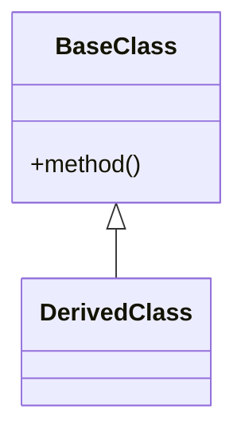
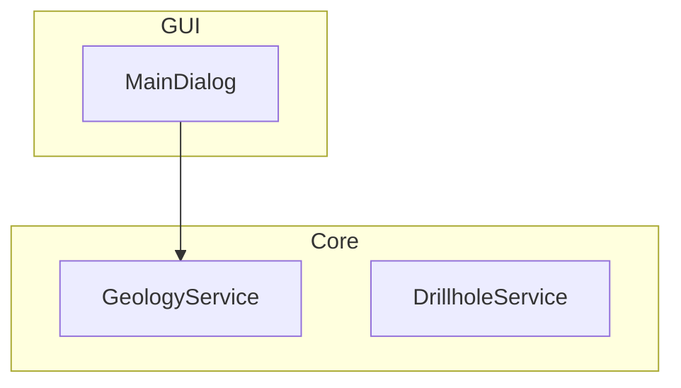

# Análisis de Fallos en Ai-Context-Core

Tras inspeccionar el código fuente instalado de `ai-context-core` (v2.0), he identificado por qué las secciones **ENTRY POINTS** y **DETECTED PATTERNS** no se están actualizando correctamente.

## 🔍 Diagnóstico

### 1. Detección de Entry Points (Puntos de Entrada)
**Problema**: La lógica actual es extremadamente restrictiva y genérica para scripts de Python simples, ignorando por completo la estructura de plugins de QGIS.

*   **Código Responsable**: `analyzer/engine.py` línea 167 y `analyzer/ast_utils.py` líneas 133-157.
*   **Lógica Actual**:
    ```python
    # engine.py
    entry_points = [m["path"] for m in modules_data if m.get("has_main")]

    # ast_utils.py
    def has_main_guard(tree: ast.AST) -> bool:
        # Solo busca: if __name__ == "__main__":
    ```
*   **Causa**: Los plugins de QGIS no usan `if __name__ == "__main__"`. Sus puntos de entrada son:
    *   La función `classFactory(iface)` en `__init__.py`.
    *   La clase principal del plugin (referenciada en `classFactory`).
    *   Métodos como `initGui()` y `unload()`.

### 2. Detección de Patrones de Diseño
**Problema**: La funcionalidad no está implementada. Es un "stub" (marcador de posición) en el código.

*   **Código Responsable**: `analyzer/engine.py` línea 208.
*   **Evidencia**:
    ```python
    "patterns": {},  # TODO: Extract design patterns detection
    ```
*   **Impacto**: El generador de reportes (`reporting.py`) recibe un diccionario vacío y por defecto escribe "No clear design patterns detected."

---

## 💡 Recomendaciones para el Equipo de Desarrollo

### Recomendación 1: Mejorar la Detección de Entry Points
Modificar `analyzer/ast_utils.py` para detectar convenciones de QGIS y frameworks comunes.

**Propuesta de código (`is_entry_point`):**
```python
def is_entry_point(tree: ast.AST) -> bool:
    """Detects likely entry points beyond just __main__ guards."""
    for node in ast.walk(tree):
        # 1. Standard Main Guard
        if is_main_guard(node):
            return True

        # 2. QGIS entry point
        if isinstance(node, ast.FunctionDef) and node.name == "classFactory":
            return True

        # 3. CLI frameworks (Click/Typer)
        if isinstance(node, ast.FunctionDef) and any(
            is_cli_decorator(d) for d in node.decorator_list
        ):
            return True
    return False
```

### Recomendación 2: Implementar Detección de Patrones de Diseño
Crear un nuevo módulo `analyzer/patterns.py` que analice la estructura AST buscando firmas clásicas.

#### Patrones Detectables por AST

| Patrón | Heurística de Detección | Confianza |
|:-------|:------------------------|:----------|
| **Singleton** | Clase con `_instance` + `__new__` sobrecargado | Alta (90%) |
| **Factory** | Función que retorna diferentes tipos según parámetros | Media (70%) |
| **Observer** | Uso de `pyqtSignal` o callbacks en `__init__` | Alta (85%) |
| **Strategy** | Clase base abstracta + múltiples implementaciones | Media (75%) |
| **Decorator** | Funciones que retornan funciones envolventes | Alta (80%) |

#### Ejemplo de Implementación (Singleton)

```python
# analyzer/patterns.py
import ast
from typing import Dict, Any

def detect_singleton(tree: ast.AST, module_path: str) -> Dict[str, Any]:
    """Detecta patrón Singleton mediante análisis AST."""
    for node in ast.walk(tree):
        if isinstance(node, ast.ClassDef):
            has_instance = any(
                isinstance(n, ast.Assign)
                and any(t.id == '_instance' for t in n.targets if isinstance(t, ast.Name))
                for n in node.body
            )
            has_new = any(
                isinstance(n, ast.FunctionDef) and n.name == '__new__'
                for n in node.body
            )
            if has_instance and has_new:
                return {
                    "detected": True,
                    "confidence": 0.9,
                    "class": node.name,
                    "module": module_path
                }
    return {"detected": False}

def detect_factory(tree: ast.AST, module_path: str) -> Dict[str, Any]:
    """Detecta patrón Factory (funciones que retornan tipos variados)."""
    for node in ast.walk(tree):
        if isinstance(node, ast.FunctionDef):
            # Buscar múltiples returns con diferentes constructores
            returns = [n for n in ast.walk(node) if isinstance(n, ast.Return)]
            if len(returns) >= 2:
                return_types = set()
                for ret in returns:
                    if isinstance(ret.value, ast.Call) and isinstance(ret.value.func, ast.Name):
                        return_types.add(ret.value.func.id)

                if len(return_types) >= 2:
                    return {
                        "detected": True,
                        "confidence": 0.7,
                        "function": node.name,
                        "types": list(return_types),
                        "module": module_path
                    }
    return {"detected": False}

def detect_observer_pattern(tree: ast.AST, module_path: str) -> Dict[str, Any]:
    """Detecta patrón Observer (PyQt signals o callbacks)."""
    signal_count = 0
    for node in ast.walk(tree):
        if isinstance(node, ast.Assign):
            if isinstance(node.value, ast.Call):
                if isinstance(node.value.func, ast.Name) and node.value.func.id == 'pyqtSignal':
                    signal_count += 1

    if signal_count >= 2:
        return {
            "detected": True,
            "confidence": 0.85,
            "signals_count": signal_count,
            "module": module_path
        }
    return {"detected": False}
```

#### Integración en engine.py

```python
# En analyzer/engine.py, método _aggregate_results()
from . import patterns

# Analizar patrones en todos los módulos
pattern_results = {
    "singleton": {"detected": False},
    "factory": {"detected": False},
    "observer": {"detected": False},
}

for module in modules_data:
    tree = ast.parse(module.get("content", ""))
    path = module["path"]

    # Detectar cada patrón
    singleton = patterns.detect_singleton(tree, path)
    if singleton["detected"]:
        pattern_results["singleton"] = singleton

    factory = patterns.detect_factory(tree, path)
    if factory["detected"]:
        pattern_results["factory"] = factory

    observer = patterns.detect_observer_pattern(tree, path)
    if observer["detected"]:
        pattern_results["observer"] = observer

return {
    # ...
    "patterns": pattern_results,  # Ya no es {}
}
```

#### Valor Agregado

1. **Para AI_CONTEXT.md**: Información arquitectónica rica para LLMs
2. **Para desarrolladores**: Documentación automática de decisiones de diseño
3. **Para code reviews**: Identificación de anti-patrones
4. **Para QGIS plugins**: Detección de patrones específicos (Observer con signals)

#### Esfuerzo Estimado

- **Implementación básica**: 4-6 horas
- **Testing y refinamiento**: 2-3 horas
- **Documentación**: 1 hora
- **Total**: ~8 horas de desarrollo

### Recomendación 3: Configuración Explícita
Permitir que el archivo local `.ai-context/config.yaml` defina entry points manualmente para casos no detectables.

```yaml
# propuesto para config.yaml
entry_points:
  - sec_interp/sec_interp_plugin.py
  - sec_interp/core/services/geology_service.py
```

### Resumen
| Campo | Estado Actual | Causa Raíz | Solución |
| :--- | :--- | :--- | :--- |
| **ENTRY POINTS** | Incompleto | Solo detecta `if __name__ == "__main__"` | Ampliar heurística en `ast_utils.py` |
| **PATTERNS** | Vacío | Funcionalidad marcada como `TODO` | Implementar lógica de análisis AST estructural |

---

## 🚀 Roadmap de Mejoras Adicionales

### Mejora 4: Análisis de Dependencias Mejorado
**Problema**: Solo detecta imports, no analiza calidad de dependencias.

**Implementación**:
- Detectar dependencias circulares entre módulos usando grafos dirigidos
- Calcular métricas de acoplamiento (Coupling Between Objects)
- Identificar imports no utilizados mediante análisis de referencias
- Comparar versiones con PyPI para detectar obsolescencia

**Esfuerzo**: 6-8 horas | **Prioridad**: 🔥 Alta

---

### Mejora 5: Detección de Anti-Patrones
**Complemento a la detección de patrones**.

**Anti-patrones detectables**:
- **God Object**: Clases con >20 métodos públicos
- **Spaghetti Code**: Funciones con CC >25 sin descomposición
- **Magic Numbers**: Constantes hardcodeadas (detectar `ast.Constant` sin asignación)
- **Dead Code**: Funciones/clases nunca importadas en el proyecto

**Implementación**: Crear `analyzer/antipatterns.py` similar a `patterns.py`

**Esfuerzo**: 4-5 horas | **Prioridad**: 🔥 Alta

---

### Mejora 6: Análisis de Seguridad Básico
**Ampliar la sección "security" existente**.

**Detecciones**:
```python
# Detectar código peligroso
dangerous_calls = ['eval', 'exec', 'pickle.loads', 'os.system', '__import__']

for node in ast.walk(tree):
    if isinstance(node, ast.Call):
        if isinstance(node.func, ast.Name) and node.func.id in dangerous_calls:
            # Reportar issue de seguridad
```

**Otras verificaciones**:
- SQL queries sin parametrización (detectar f-strings con "SELECT")
- Manejo de excepciones genéricas (`except:` sin tipo)
- Uso de `assert` en código de producción

**Esfuerzo**: 3-4 horas | **Prioridad**: ⚡ Media

---

### Mejora 7: Métricas de Mantenibilidad Avanzadas

**Nuevas métricas**:

1. **Índice de Mantenibilidad (MI)**:
   ```
   MI = 171 - 5.2*ln(HV) - 0.23*CC - 16.2*ln(LOC)
   Donde: HV = Halstead Volume, CC = Cyclomatic Complexity, LOC = Lines of Code
   ```

2. **Deuda Técnica en Horas**:
   - CC alto: 0.5h por punto sobre umbral
   - Sin docstrings: 0.25h por función
   - Sin type hints: 0.15h por función

3. **Tendencia de Calidad**: Comparar con `.ai-context/metrics_history.json`

**Esfuerzo**: 5-6 horas | **Prioridad**: ⚡ Media

---

### Mejora 8: Generación de Diagramas Arquitectónicos

**Nuevos diagramas Mermaid**:

1. **Diagrama de Clases**:


2. **Diagrama de Componentes** (agrupación por paquetes):


3. **Heatmap de Complejidad** (usando colores en Mermaid)

**Esfuerzo**: 8-10 horas | **Prioridad**: 🟢 Baja

---

### Mejora 9: Integración con Git

**Análisis basado en historial**:

```python
import subprocess

def analyze_git_hotspots(project_path):
    # Archivos con más commits (probablemente problemáticos)
    result = subprocess.run(
        ['git', 'log', '--format=format:', '--name-only', '--since=6.months'],
        capture_output=True, cwd=project_path
    )
    file_changes = Counter(result.stdout.decode().split('\n'))
    return sorted(file_changes.items(), key=lambda x: x[1], reverse=True)[:10]
```

**Métricas adicionales**:
- **Churn Rate**: Frecuencia de cambios por archivo
- **Ownership**: Autores principales por módulo
- **Cambios recientes**: Destacar en AI_CONTEXT.md

**Esfuerzo**: 6-7 horas | **Prioridad**: ⚡ Media

---

### Mejora 10: Soporte Multi-Framework

**Frameworks a soportar**:

| Framework | Entry Point | Detección |
|:----------|:------------|:----------|
| **Django** | `settings.py`, `urls.py` | Buscar `INSTALLED_APPS`, `urlpatterns` |
| **Flask** | `@app.route` | Detectar decorador en funciones |
| **FastAPI** | `@app.get/post` | Detectar decorador en funciones |
| **Click** | `@click.command` | Detectar decorador en funciones |

**Implementación en `ast_utils.py`**:
```python
def detect_framework_entry_points(tree: ast.AST) -> List[str]:
    entry_points = []
    for node in ast.walk(tree):
        if isinstance(node, ast.FunctionDef):
            for decorator in node.decorator_list:
                # Flask/FastAPI
                if isinstance(decorator, ast.Call):
                    if hasattr(decorator.func, 'attr') and decorator.func.attr in ['route', 'get', 'post']:
                        entry_points.append(f"{node.name} (HTTP endpoint)")
                # Click
                elif isinstance(decorator, ast.Attribute) and decorator.attr == 'command':
                    entry_points.append(f"{node.name} (CLI command)")
    return entry_points
```

**Esfuerzo**: 5-6 horas | **Prioridad**: 🔥 Alta

---

### Mejora 11: Exportación en Múltiples Formatos

**Nuevos formatos**:

1. **HTML Interactivo**: Con Chart.js para métricas
2. **PDF**: Usando `weasyprint` o `reportlab`
3. **SARIF**: Estándar para análisis estático (integración con VSCode)
4. **Badge SVG**: Para README
   ```svg
   <svg><text>Quality: 85/100</text></svg>
   ```

**Esfuerzo**: 6-8 horas | **Prioridad**: 🟢 Baja

---

### Mejora 12: Análisis Incremental (Cache Inteligente)

**Problema**: Re-analiza todo el proyecto cada vez (lento en proyectos grandes).

**Solución**:
```python
import hashlib
from pathlib import Path

def get_file_hash(file_path: Path) -> str:
    return hashlib.md5(file_path.read_bytes()).hexdigest()

def analyze_with_cache(files: List[Path], cache_dir: Path):
    results = []
    for file in files:
        cache_file = cache_dir / f"{file.stem}.json"
        current_hash = get_file_hash(file)

        if cache_file.exists():
            cached = json.loads(cache_file.read_text())
            if cached.get('hash') == current_hash:
                results.append(cached['analysis'])
                continue

        # Re-analizar solo si cambió
        analysis = analyze_module(file)
        cache_file.write_text(json.dumps({'hash': current_hash, 'analysis': analysis}))
        results.append(analysis)
    return results
```

**Beneficio**: Análisis 10x más rápido en proyectos grandes

**Esfuerzo**: 8-10 horas | **Prioridad**: ⚡ Media

---

### Mejora 13: Recomendaciones Accionables con IA

**Integración con LLMs** (funcionalidad avanzada):

```python
from .context.manager import AIContextManager

def generate_ai_recommendations(issues: List[Dict]) -> List[str]:
    context_mgr = AIContextManager(project_path)

    recommendations = []
    for issue in issues[:5]:  # Top 5 issues
        prompt = f"""
        Issue: {issue['description']}
        File: {issue['file']}

        Suggest a specific refactoring to fix this issue.
        """
        suggestion = context_mgr.create_optimized_prompt(prompt, ai_model="deepseek-coder")
        recommendations.append(suggestion)

    return recommendations
```

**Casos de uso**:
- Sugerir refactorizaciones específicas para reducir CC
- Generar docstrings automáticos
- Proponer nombres de variables más descriptivos

**Esfuerzo**: 12-15 horas | **Prioridad**: 🚀 Futuro

---

## 📊 Matriz de Priorización

| # | Mejora | Impacto | Esfuerzo | Prioridad | Horas |
|:--|:-------|:--------|:---------|:----------|:------|
| 1 | Entry Points (QGIS) | Alto | Medio | 🔥 Alta | 4-6 |
| 2 | Patrones de Diseño | Alto | Medio | 🔥 Alta | 8 |
| 3 | Config Explícita | Medio | Bajo | ⚡ Media | 2 |
| 4 | Dependencias Mejoradas | Alto | Medio | 🔥 Alta | 6-8 |
| 5 | Anti-Patrones | Alto | Bajo | 🔥 Alta | 4-5 |
| 6 | Seguridad Básica | Medio | Bajo | ⚡ Media | 3-4 |
| 7 | Métricas Avanzadas | Medio | Medio | ⚡ Media | 5-6 |
| 8 | Diagramas | Bajo | Alto | 🟢 Baja | 8-10 |
| 9 | Git Integration | Medio | Medio | ⚡ Media | 6-7 |
| 10 | Multi-Framework | Alto | Medio | 🔥 Alta | 5-6 |
| 11 | Múltiples Formatos | Bajo | Medio | 🟢 Baja | 6-8 |
| 12 | Cache Incremental | Alto | Alto | ⚡ Media | 8-10 |
| 13 | IA Accionable | Muy Alto | Muy Alto | 🚀 Futuro | 12-15 |

**Total Estimado (Prioridad Alta)**: ~33-39 horas
**Total Estimado (Todas las mejoras)**: ~77-95 horas

---

## 🎯 Recomendación de Implementación

### Fase 1 (Sprint 1-2 semanas)
- ✅ Mejora 1: Entry Points QGIS
- ✅ Mejora 5: Anti-Patrones
- ✅ Mejora 6: Seguridad Básica

### Fase 2 (Sprint 2-3 semanas)
- ✅ Mejora 2: Patrones de Diseño
- ✅ Mejora 4: Dependencias Mejoradas
- ✅ Mejora 10: Multi-Framework

### Fase 3 (Sprint 1-2 semanas)
- ✅ Mejora 7: Métricas Avanzadas
- ✅ Mejora 9: Git Integration
- ✅ Mejora 3: Config Explícita

### Fase 4 (Futuro)
- 🔮 Mejora 12: Cache Incremental
- 🔮 Mejora 8: Diagramas
- 🔮 Mejora 11: Múltiples Formatos
- 🔮 Mejora 13: IA Accionable
