# SecInterp - Arquitectura Detallada del Proyecto

> **Documentación Técnica Completa del Plugin QGIS SecInterp**  
> Versión 2.2 | Última actualización: 2025-12-21

---

## 📑 Tabla de Contenidos

1. [Visión General](#visión-general)
2. [Arquitectura del Sistema](#arquitectura-del-sistema)
3. [Capa GUI - Interfaz de Usuario](#capa-gui---interfaz-de-usuario)
4. [Capa Core - Lógica de Negocio](#capa-core---lógica-de-negocio)
5. [Capa Exporters - Exportación de Datos](#capa-exporters---exportación-de-datos)
6. [Flujos de Datos Principales](#flujos-de-datos-principales)
7. [Patrones de Diseño](#patrones-de-diseño)
8. [Dependencias Externas](#dependencias-externas)
9. [Optimizaciones de Rendimiento](#optimizaciones-de-rendimiento)
10. [Métricas del Proyecto](#métricas-del-proyecto)

---

## 🎯 Visión General

**SecInterp** (Section Interpreter) es un plugin de QGIS diseñado para la extracción y visualización de datos geológicos en secciones transversales. El plugin permite a los geólogos generar perfiles topográficos, proyectar afloramientos geológicos y analizar datos estructurales en una vista 2D unificada.

### Características Principales

- ✅ **Sistema de Preview Interactivo** con renderizado en tiempo real
- ✅ **Procesamiento Paralelo** para intersecciones geológicas complejas
- ✅ **LOD Adaptativo** (Level of Detail) basado en zoom
- ✅ **Herramientas de Medición** con snapping automático
- ✅ **Soporte de Sondajes** (drillholes) con proyección 3D→2D
- ✅ **Exportación Multi-formato** (SHP, CSV, PDF, SVG, PNG)

---

## 🏗️ Arquitectura del Sistema

### Diagrama de Arquitectura Completo

```mermaid
graph TB
    %% ========== ENTRY POINT ==========
    QGIS[QGIS Application]
    INIT[__init__.py<br/>Entry Point]
    PLUGIN[sec_interp_plugin.py<br/>SecInterp Class<br/>Raíz del Plugin]
    
    %% ========== GUI LAYER ==========
    subgraph GUI["🖥️ GUI Layer - Interfaz de Usuario"]
        direction TB
        
        MAIN[main_dialog.py<br/>SecInterpDialog<br/>~340 líneas]
        
        subgraph MANAGERS["Managers"]
            SIGNALS_MGR[main_dialog_signals.py<br/>SignalManager]
            DATA_MGR[main_dialog_data.py<br/>DataAggregator]
            PREVIEW_MGR[main_dialog_preview.py<br/>PreviewManager]
            EXPORT_MGR[main_dialog_export.py<br/>ExportManager]
            VALIDATION_MGR[main_dialog_validation.py<br/>DialogValidator]
            CONFIG_MGR[main_dialog_config.py<br/>DialogDefaults]
        end
        
        RENDERER[preview_renderer.py<br/>PreviewRenderer<br/>1190 líneas<br/>20 métodos]
        LEGEND[legend_widget.py<br/>LegendWidget<br/>1.6k líneas]
        
        subgraph TOOLS["🛠️ Tools"]
            MEASURE[measure_tool.py<br/>ProfileMeasureTool<br/>Snapping + Medición]
        end
        
        subgraph UI_WIDGETS["📦 UI Components"]
            UI_MAIN[main_window.py<br/>SecInterpMainWindow]
            UI_PAGES[Page Classes:<br/>DemPage, SectionPage,<br/>GeologyPage, StructPage,<br/>DrillholePage]
            UI_PREVIEW[PreviewWidget]
            UI_OUTPUT[OutputWidget]
        end
    end
    
    %% ========== CORE LAYER ==========
    subgraph CORE["⚙️ Core Layer - Lógica de Negocio"]
        direction TB
        
        CONTROLLER[controller.py<br/>ProfileController<br/>192 líneas]
        
        subgraph SERVICES["🔧 Services"]
            PROFILE_SVC[profile_service.py<br/>ProfileService<br/>2.8k líneas]
            GEOLOGY_SVC[geology_service.py<br/>GeologyService<br/>244 líneas<br/>8 métodos]
            STRUCTURE_SVC[structure_service.py<br/>StructureService<br/>216 líneas<br/>7 métodos]
            DRILLHOLE_SVC[drillhole_service.py<br/>DrillholeService<br/>319 líneas<br/>4 métodos]
            PARALLEL_GEO[parallel_geology.py<br/>ParallelGeologyService<br/>QThread Worker]
        end
        
        ALGORITHMS[core/algorithms.py<br/>Lógica Pura de Negocio<br/>~20 líneas]
        
        subgraph VALIDATION_PKG["🛡️ Validation Package"]
            VALIDATION_INIT[core/validation/__init__.py<br/>Fachada]
            FIELD_VAL[core/validation/field_validator.py<br/>Campos e Inputs]
            LAYER_VAL[core/validation/layer_validator.py<br/>Capas QGIS]
            PATH_VAL[core/validation/path_validator.py<br/>Rutas de Archivo]
            PROJ_VAL[core/validation/project_validator.py<br/>Orquestador]
        end
        CACHE[data_cache.py<br/>DataCache<br/>7.8k líneas]
        METRICS[performance_metrics.py<br/>PerformanceMetrics<br/>7.8k líneas]
        TYPES[types.py<br/>Definiciones de Tipos<br/>1.8k líneas]
        
        subgraph UTILS["🔨 Utilities"]
            GEOM_UTILS[geometry.py<br/>345 líneas<br/>Operaciones geométricas]
            DRILL_UTILS[drillhole.py<br/>7.2k líneas<br/>Desurvey + Proyección]
            GEOLOGY_UTILS[geology.py<br/>1.4k líneas]
            SPATIAL_UTILS[spatial.py<br/>3.2k líneas]
            SAMPLING_UTILS[sampling.py<br/>3.7k líneas]
            PARSING_UTILS[parsing.py<br/>2.7k líneas]
            RENDERING_UTILS[rendering.py<br/>2.9k líneas]
            IO_UTILS[io.py<br/>2.6k líneas]
        end
    end
    
    %% ========== EXPORTERS LAYER ==========
    subgraph EXPORTERS["📤 Exporters Layer - Exportación"]
        direction TB
        
        ORCHESTRATOR[orchestrator.py<br/>DataExportOrchestrator<br/>148 líneas]
        BASE_EXP[base_exporter.py<br/>BaseExporter<br/>Clase Abstracta]
        
        subgraph EXPORT_FORMATS["Export Formats"]
            SHP_EXP[shp_exporter.py<br/>ShapefileExporter<br/>3.3k líneas]
            CSV_EXP[csv_exporter.py<br/>CSVExporter<br/>1.3k líneas]
            PDF_EXP[pdf_exporter.py<br/>PDFExporter<br/>2.5k líneas]
            SVG_EXP[svg_exporter.py<br/>SVGExporter<br/>2.3k líneas]
            IMG_EXP[image_exporter.py<br/>ImageExporter<br/>2.1k líneas]
            PROFILE_EXP[profile_exporters.py<br/>ProfileLineShpExporter<br/>GeologyShpExporter<br/>StructureShpExporter<br/>AxesShpExporter<br/>8.3k líneas]
            DRILL_EXP[drillhole_exporters.py<br/>DrillholeTraceShpExporter<br/>DrillholeIntervalShpExporter<br/>4.2k líneas]
        end
    end
    
    %% ========== EXTERNAL DEPENDENCIES ==========
    subgraph EXTERNAL["🌐 External Dependencies"]
        QGIS_CORE[qgis.core<br/>QgsVectorLayer<br/>QgsRasterLayer<br/>QgsGeometry<br/>QgsProcessing<br/>QgsSpatialIndex]
        QGIS_GUI[qgis.gui<br/>QgsMapCanvas<br/>QgsMapTool<br/>QgsMapLayer]
        PYQT5[PyQt5<br/>QtWidgets<br/>QtCore<br/>QtGui<br/>Signals/Slots]
    end
    
    %% ========== CONNECTIONS ==========
    QGIS -->|loads| INIT
    INIT -->|delegates| PLUGIN
    PLUGIN -->|initializes| MAIN
    
    MAIN -->|delegates signals| SIGNALS_MGR
    MAIN -->|uses data from| DATA_MGR
    MAIN -->|manages| PREVIEW_MGR
    MAIN -->|manages| EXPORT_MGR
    MAIN -->|manages| VALIDATION_MGR
    MAIN -->|manages| CONFIG_MGR
    MAIN -->|manages| CACHE_HANDLER
    MAIN -->|uses| UI_MAIN
    
    PREVIEW_MGR -->|renders with| RENDERER
    PREVIEW_MGR -->|updates| LEGEND
    PREVIEW_MGR -->|activates| MEASURE
    PREVIEW_MGR -->|requests data| CONTROLLER
    
    EXPORT_MGR -->|delegates to| ORCHESTRATOR
    VALIDATION_MGR -->|validates with| PROJ_VAL
    
    CONTROLLER -->|orchestrates| PROFILE_SVC
    CONTROLLER -->|orchestrates| GEOLOGY_SVC
    CONTROLLER -->|orchestrates| STRUCTURE_SVC
    CONTROLLER -->|orchestrates| DRILLHOLE_SVC
    CONTROLLER -->|uses| CACHE
    CONTROLLER -->|tracks with| METRICS
    
    GEOLOGY_SVC -->|offloads to| PARALLEL_GEO
    GEOLOGY_SVC -->|uses| ALGORITHMS
    STRUCTURE_SVC -->|uses| ALGORITHMS
    DRILLHOLE_SVC -->|uses| DRILL_UTILS
    PROFILE_SVC -->|uses| SAMPLING_UTILS
    
    ALGORITHMS -->|uses| GEOM_UTILS
    ALGORITHMS -->|uses| SPATIAL_UTILS
    
    ORCHESTRATOR -->|delegates to| SHP_EXP
    ORCHESTRATOR -->|delegates to| CSV_EXP
    ORCHESTRATOR -->|delegates to| PROFILE_EXP
    ORCHESTRATOR -->|delegates to| DRILL_EXP
    
    RENDERER -->|uses| QGIS_GUI
    CONTROLLER -->|uses| QGIS_CORE
    MAIN -->|uses| PYQT5
    
    classDef entryPoint fill:#ff6b6b,stroke:#c92a2a,stroke-width:3px,color:#fff
    classDef guiLayer fill:#4ecdc4,stroke:#0a9396,stroke-width:2px,color:#000
    classDef coreLayer fill:#95e1d3,stroke:#38a169,stroke-width:2px,color:#000
    classDef exportLayer fill:#ffd93d,stroke:#f59e0b,stroke-width:2px,color:#000
    classDef externalLayer fill:#a8dadc,stroke:#457b9d,stroke-width:2px,color:#000
    
    class QGIS,PLUGIN entryPoint
    class MAIN,PREVIEW_MGR,EXPORT_MGR,VALIDATION_MGR,CONFIG_MGR,RENDERER,LEGEND,MEASURE guiLayer
    class CONTROLLER,ALGORITHMS,PROJ_VAL,CACHE,METRICS,TYPES coreLayer
    class PROFILE_SVC,GEOLOGY_SVC,STRUCTURE_SVC,DRILLHOLE_SVC,PARALLEL_GEO coreLayer
    class ORCHESTRATOR,BASE_EXP,SHP_EXP,CSV_EXP,PDF_EXP,SVG_EXP,IMG_EXP,PROFILE_EXP,DRILL_EXP exportLayer
    class QGIS_CORE,QGIS_GUI,PYQT5 externalLayer
```

---

## 🧩 Visualizar diagramas Mermaid en VS Code

Puedes previsualizar diagramas Mermaid en VS Code con la extensión **Mermaid Editor** (instalada). Pasos rápidos:

1. Abre este archivo `docs/sec_interp_detailed_architecture.md`.
2. Coloca el cursor dentro de un bloque ```mermaid``` y abre la paleta de comandos (Ctrl+Shift+P) → "Open Mermaid Editor" o "Preview Mermaid".
3. Alternativamente, usa la vista previa de Markdown (Ctrl+Shift+V) si tienes `Markdown Preview Mermaid Support` (ya instalada).

Ejemplo rápido (edita este bloque y guarda para ver la previsualización):

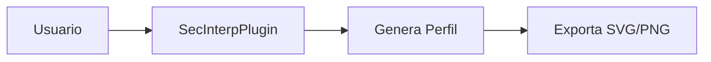

---

## 🖥️ Capa GUI - Interfaz de Usuario

### 1. SecInterpDialog (main_dialog.py)

**Clase Principal**: `SecInterpDialog`  
**Hereda de**: `SecInterpMainWindow`  
**Líneas de código**: ~340 (Reducido de 1,057)  
**Responsabilidad**: Diálogo principal simplificado que coordina componentes mediante Managers

#### Componentes Clave

```python
class SecInterpDialog(SecInterpMainWindow):
    """Dialog for the SecInterp QGIS plugin."""
    
    def __init__(self, iface=None, plugin_instance=None, parent=None):
        # Managers de Lógica
        self.signal_manager = DialogSignalManager(self)
        self.data_aggregator = DialogDataAggregator(self)
        
        # Managers de Operaciones
        self.validator = DialogValidator(self)
        self.preview_manager = PreviewManager(self)
        self.export_manager = ExportManager(self)
        self.status_manager = DialogStatusManager(self)
        self.settings_manager = DialogSettingsManager(self)
        
        # Widgets
        self.legend_widget = LegendWidget(self.preview_widget.canvas)
        self.pan_tool = QgsMapToolPan(self.preview_widget.canvas)
        self.measure_tool = ProfileMeasureTool(self.preview_widget.canvas)
```

#### Métodos Principales

| Método | Descripción | Ubicación |
|--------|-------------|-----------|
| `_init_managers()` | Inicializa managers dedicados | `main_dialog.py` |
| `get_selected_values()` | Facade para el DataAggregator | `main_dialog.py` |
| `get_all_values()` | Agregación real de datos de páginas | `main_dialog_data.py` |
| `connect_all()` | Conexión masiva de señales | `main_dialog_signals.py` |
| `preview_profile_handler()` | Delegado a PreviewManager | `main_dialog.py` |
| `export_preview()` | Delegado a ExportManager | `main_dialog.py` |
| `update_button_state()` | Delegado a StatusManager | `main_dialog.py` |

#### Señales y Slots

```python
# Conexiones de botones
self.preview_widget.btn_preview.clicked.connect(self.preview_profile_handler)
self.preview_widget.btn_export.clicked.connect(self.export_preview)
self.preview_widget.btn_measure.toggled.connect(self.toggle_measure_tool)

# Conexiones de checkboxes
self.preview_widget.chk_topo.stateChanged.connect(self.update_preview_from_checkboxes)
self.preview_widget.chk_geol.stateChanged.connect(self.update_preview_from_checkboxes)
self.preview_widget.chk_struct.stateChanged.connect(self.update_preview_from_checkboxes)
self.preview_widget.chk_drillholes.stateChanged.connect(self.update_preview_from_checkboxes)

# Conexiones de capas
self.page_dem.raster_combo.layerChanged.connect(self.update_button_state)
self.page_section.line_combo.layerChanged.connect(self.update_button_state)
```

---

### 2. PreviewManager (main_dialog_preview.py)

**Clase**: `PreviewManager`  
**Líneas de código**: ~31,000  
**Responsabilidad**: Gestiona la generación y actualización del preview

#### Métodos Principales

```python
class PreviewManager:
    def generate_preview(self) -> Tuple[bool, str]:
        """Genera preview con validación y manejo de errores."""
        
    def update_from_checkboxes(self):
        """Actualiza preview cuando cambian opciones de visualización."""
        
    def _get_validated_inputs(self) -> Optional[Dict]:
        """Obtiene y valida inputs del diálogo."""
        
    def _process_data(self, inputs: Dict) -> Tuple:
        """Procesa datos usando el controller."""
```

---

### 3. PreviewRenderer (preview_renderer.py)

**Clase**: `PreviewRenderer`  
**Líneas de código**: 1,190  
**Métodos**: 20  
**Responsabilidad**: Renderiza el canvas de preview usando PyQGIS nativo

#### Arquitectura del Renderer

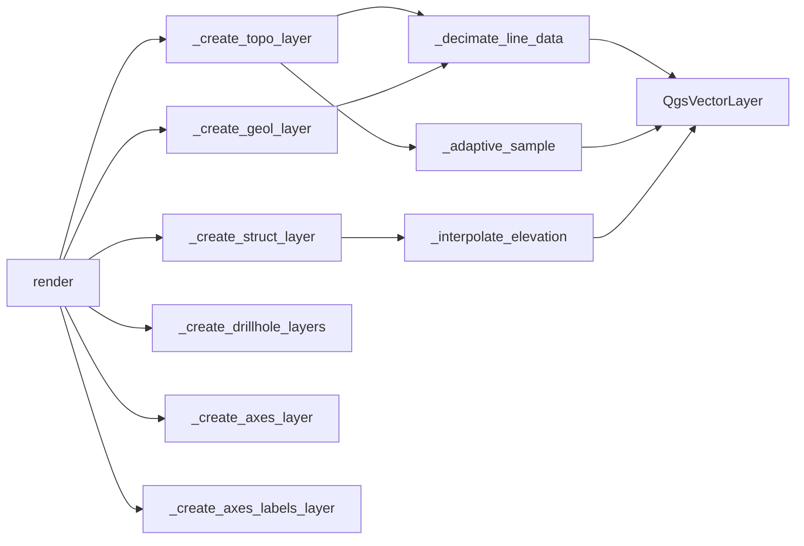

#### Métodos de Optimización LOD

| Método | Propósito | Algoritmo |
|--------|-----------|-----------|
| `_decimate_line_data()` | Simplificación de líneas | Douglas-Peucker |
| `_calculate_curvature()` | Cálculo de curvatura local | Ángulo entre segmentos |
| `_adaptive_sample()` | Muestreo adaptativo | Basado en curvatura |

#### Ejemplo de Uso

```python
renderer = PreviewRenderer(canvas)

canvas, layers = renderer.render(
    topo_data=[(0, 100), (10, 105), ...],
    geol_data=[GeologySegment(...), ...],
    struct_data=[StructureMeasurement(...), ...],
    vert_exag=2.0,
    dip_line_length=50.0,
    max_points=1000,
    preserve_extent=False
)
```

---

### 4. ProfileMeasureTool (measure_tool.py)

**Clase**: `ProfileMeasureTool`  
**Hereda de**: `QgsMapTool`  
**Responsabilidad**: Herramienta de medición con snapping

#### Características

- ✅ **Snapping a vértices** de capas visibles
- ✅ **Cálculo de distancia** Euclidiana
- ✅ **Cálculo de pendiente** (slope en grados)
- ✅ **Visualización en tiempo real** con rubber band

#### Señales

```python
measurementChanged = pyqtSignal(float, float, float, float)  # dx, dy, dist, slope
measurementCleared = pyqtSignal()
```

---

## ⚙️ Capa Core - Lógica de Negocio

### 1. ProfileController (controller.py)

**Clase**: `ProfileController`  
**Líneas de código**: 192  
**Responsabilidad**: Orquesta los servicios de generación de datos

#### Arquitectura

```python
class ProfileController:
    def __init__(self):
        self.profile_service = ProfileService()
        self.geology_service = GeologyService()
        self.structure_service = StructureService()
        self.drillhole_service = DrillholeService()
        self.data_cache = DataCache()
```

#### Método Principal

```python
def generate_profile_data(self, values: Dict[str, Any]) -> Tuple[List, Any, Any, Any, List[str]]:
    """Método unificado para generar todos los componentes del perfil.
    
    Returns:
        tuple: (profile_data, geol_data, struct_data, drillhole_data, messages)
    """
    # 1. Topografía
    profile_data = self.profile_service.generate_topographic_profile(...)
    
    # 2. Geología (si existe capa)
    if outcrop_layer:
        geol_data = self.geology_service.generate_geological_profile(...)
    
    # 3. Estructuras (si existe capa)
    if structural_layer:
        struct_data = self.structure_service.project_structures(...)
    
    # 4. Sondajes (si existe capa)
    if collar_layer:
        collars = self.drillhole_service.project_collars(...)
        drillhole_data = self.drillhole_service.process_intervals(...)
    
    return profile_data, geol_data, struct_data, drillhole_data, messages
```

---

### 2. GeologyService (geology_service.py)

**Clase**: `GeologyService`  
**Líneas de código**: 244  
**Métodos**: 8  
**Responsabilidad**: Genera perfiles geológicos intersectando polígonos

#### Flujo de Procesamiento

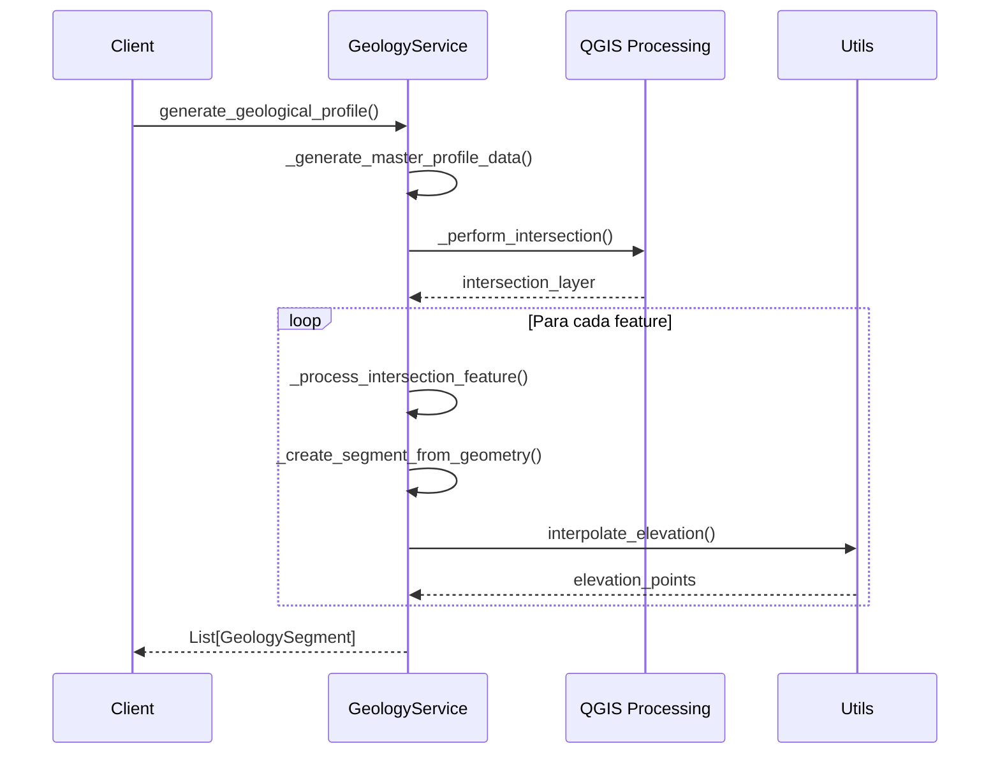

#### Métodos Clave

| Método | Descripción |
|--------|-------------|
| `generate_geological_profile()` | Método principal que orquesta el proceso |
| `_generate_master_profile_data()` | Genera grid de puntos y elevaciones |
| `_perform_intersection()` | Ejecuta algoritmo de intersección QGIS |
| `_process_intersection_feature()` | Procesa cada feature de intersección |
| `_create_segment_from_geometry()` | Crea GeologySegment desde geometría |

#### Tipo de Retorno

```python
@dataclass
class GeologySegment:
    unit_name: str
    points: List[Tuple[float, float]]  # (distance, elevation)
    geometry: QgsGeometry
    attributes: Dict[str, Any]
```

---

### 3. StructureService (structure_service.py)

**Clase**: `StructureService`  
**Líneas de código**: 216  
**Métodos**: 7  
**Responsabilidad**: Proyecta mediciones estructurales (dip/strike)

#### Algoritmo de Proyección

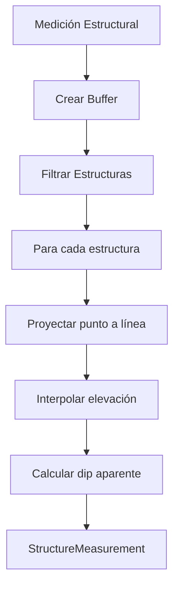

#### Cálculo de Dip Aparente

La fórmula utilizada es:

```
apparent_dip = arctan(tan(true_dip) × |cos(strike - section_azimuth)|)
```

Implementado en `utils.calculate_apparent_dip()`.

#### Tipo de Retorno

```python
@dataclass
class StructureMeasurement:
    distance: float
    elevation: float
    apparent_dip: float
    original_dip: float
    original_strike: float
    attributes: Dict[str, Any]
```

---

### 4. DrillholeService (drillhole_service.py)

**Clase**: `DrillholeService`  
**Líneas de código**: 319  
**Métodos**: 4  
**Responsabilidad**: Procesa y proyecta datos de sondajes

#### Flujo de Procesamiento

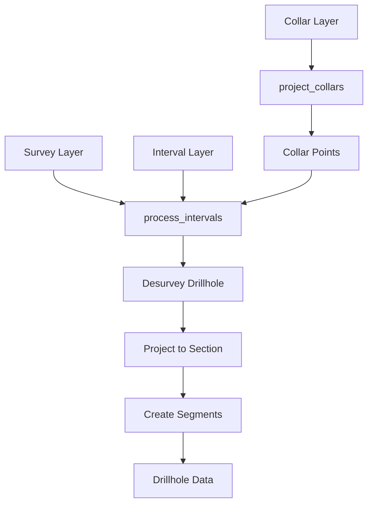

#### Métodos Principales

**1. project_collars()**

Proyecta puntos de collar a la línea de sección.

```python
def project_collars(
    self,
    collar_layer: QgsVectorLayer,
    line_geom: QgsGeometry,
    line_start: QgsPointXY,
    distance_area: QgsDistanceArea,
    buffer_width: float,
    collar_id_field: str,
    use_geometry: bool,
    collar_x_field: str,
    collar_y_field: str,
    collar_z_field: str,
    collar_depth_field: str,
    dem_layer: Optional[QgsRasterLayer],
) -> List[Dict]:
    """Retorna lista de diccionarios con collar_id, distance, elevation, depth."""
```

**2. process_intervals()**

Procesa intervalos y genera trazas 2D.

```python
def process_intervals(
    self,
    collar_points: List[Dict],
    collar_layer: QgsVectorLayer,
    survey_layer: QgsVectorLayer,
    interval_layer: QgsVectorLayer,
    # ... más parámetros
) -> Tuple[List[GeologySegment], List[Dict]]:
    """Retorna (geology_segments, drillhole_traces)."""
```

---

### 5. Utilities (core/utils/)

#### geometry.py (345 líneas)

**Operaciones Geométricas con QGIS Core API**

| Función | Descripción |
|---------|-------------|
| `create_memory_layer()` | Crea capa temporal en memoria |
| `extract_all_vertices()` | Extrae vértices de geometría (multipart-safe) |
| `get_line_vertices()` | Extrae vértices de línea |
| `run_processing_algorithm()` | Ejecuta algoritmo QGIS con manejo de errores |
| `create_buffer_geometry()` | Crea buffer usando `native:buffer` |
| `filter_features_by_buffer()` | Filtra features con spatial index |
| `densify_line_by_interval()` | Densifica línea con `native:densifygeometriesgivenaninterval` |

#### drillhole.py (7,297 líneas)

**Procesamiento de Sondajes**

| Función | Descripción |
|---------|-------------|
| `desurvey_drillhole()` | Calcula trayectoria 3D desde survey |
| `project_drillhole_to_section()` | Proyecta traza 3D a plano 2D |
| `interpolate_intervals()` | Interpola intervalos en traza |

#### sampling.py (3,783 líneas)

**Muestreo y Interpolación**

| Función | Descripción |
|---------|-------------|
| `interpolate_elevation()` | Interpola elevación en grid |
| `sample_raster_along_line()` | Muestrea raster a lo largo de línea |

---

### 6. DataCache (data_cache.py)

**Clase**: `DataCache`  
**Líneas de código**: 7,883  
**Responsabilidad**: Cache de datos procesados

#### Estrategia de Cache

```python
class DataCache:
    def get_cache_key(self, inputs: Dict) -> str:
        """Genera clave única basada en inputs relevantes."""
        # Considera: capas, bandas, buffer, exageración vertical
        
    def get(self, key: str) -> Optional[Dict]:
        """Recupera datos del cache."""
        
    def set(self, key: str, data: Dict) -> None:
        """Almacena datos en cache."""
        
    def clear(self) -> None:
        """Limpia todo el cache."""
```

---

## 📤 Capa Exporters - Exportación de Datos

### 1. DataExportOrchestrator (orchestrator.py)

**Clase**: `DataExportOrchestrator`  
**Líneas de código**: 148  
**Responsabilidad**: Coordina exportaciones a múltiples formatos

#### Método Principal

```python
def export_data(
    self, 
    output_folder: Path, 
    values: Dict[str, Any], 
    profile_data: List[Tuple],
    geol_data: Optional[List[Any]], 
    struct_data: Optional[List[Any]],
    drillhole_data: Optional[List[Any]] = None
) -> List[str]:
    """Exporta datos generados a CSV y Shapefile usando lazy imports."""
    
    # Lazy import de exportadores
    from sec_interp.exporters import (
        AxesShpExporter,
        CSVExporter,
        GeologyShpExporter,
        ProfileLineShpExporter,
        StructureShpExporter,
        DrillholeTraceShpExporter,
        DrillholeIntervalShpExporter,
    )
    
    # Exportar topografía
    csv_exporter.export(output_folder / "topo_profile.csv", ...)
    ProfileLineShpExporter({}).export(output_folder / "profile_line.shp", ...)
    
    # Exportar geología
    if geol_data:
        csv_exporter.export(output_folder / "geol_profile.csv", ...)
        GeologyShpExporter({}).export(output_folder / "geol_profile.shp", ...)
    
    # Exportar estructuras
    if struct_data:
        csv_exporter.export(output_folder / "structural_profile.csv", ...)
        StructureShpExporter({}).export(output_folder / "structural_profile.shp", ...)
    
    # Exportar sondajes
    if drillhole_data:
        DrillholeTraceShpExporter({}).export(output_folder / "drillhole_traces.shp", ...)
        DrillholeIntervalShpExporter({}).export(output_folder / "drillhole_intervals.shp", ...)
    
    return result_msg
```

---

### 2. Jerarquía de Exportadores

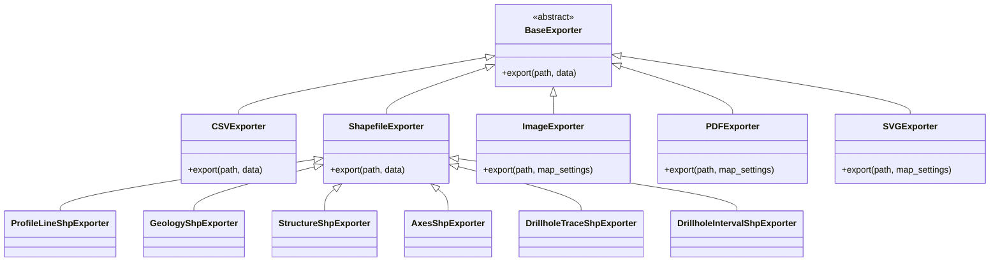

---

## 🔄 Flujos de Datos Principales

### Flujo 1: Generación de Preview

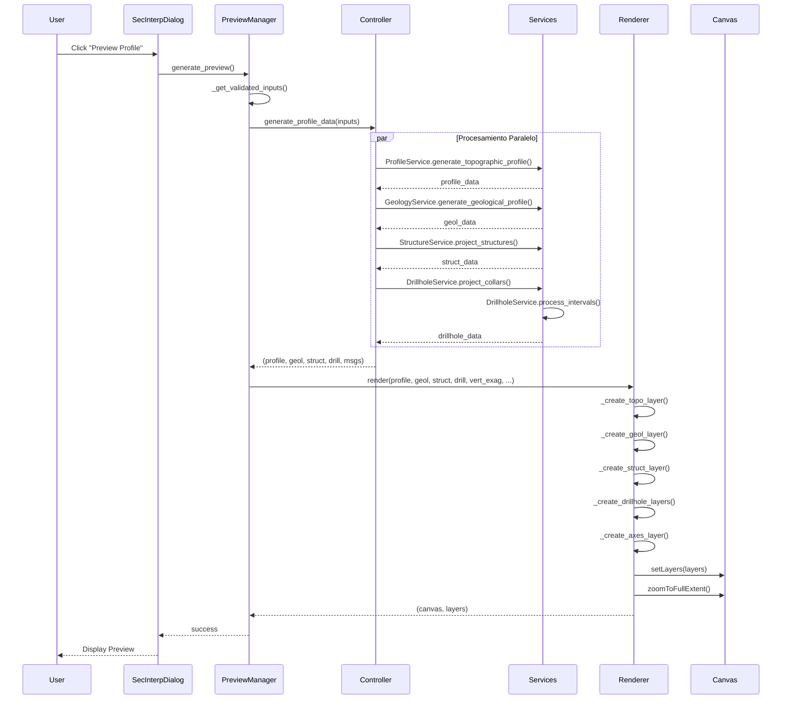

---

### Flujo 2: Exportación de Datos

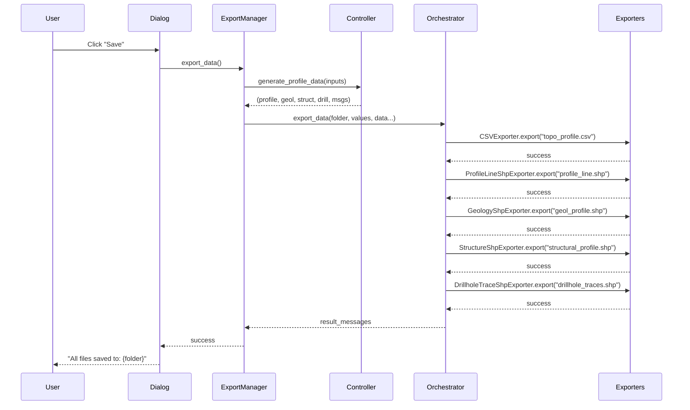

---

### Flujo 3: Procesamiento Geológico Paralelo

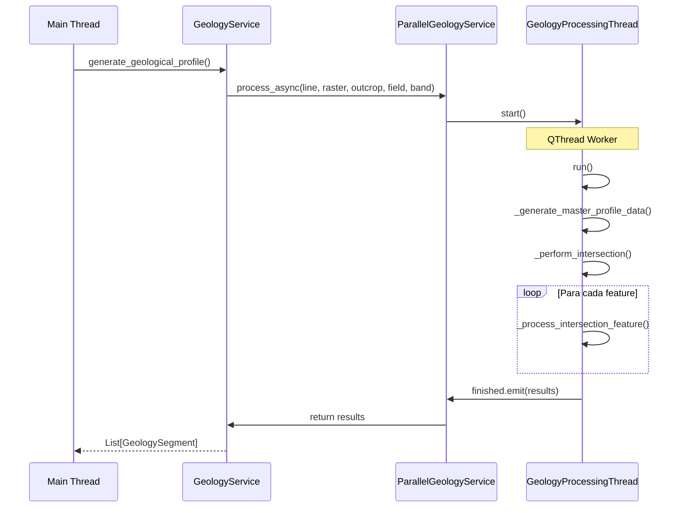

---

## 🎨 Patrones de Diseño

### 1. MVC (Model-View-Controller)

```
Model:      Services + Algorithms + Types
View:       GUI Widgets + Renderer
Controller: ProfileController
```

### 2. Strategy Pattern

Diferentes exportadores implementan la misma interfaz `BaseExporter`:

```python
class BaseExporter(ABC):
    @abstractmethod
    def export(self, path: Path, data: Dict) -> bool:
        pass

class CSVExporter(BaseExporter):
    def export(self, path: Path, data: Dict) -> bool:
        # Implementación específica CSV
        
class ShapefileExporter(BaseExporter):
    def export(self, path: Path, data: Dict) -> bool:
        # Implementación específica Shapefile
```

### 3. Observer Pattern

PyQt5 Signals/Slots para comunicación entre componentes:

```python
# Señal
measurementChanged = pyqtSignal(float, float, float, float)

# Slot
def update_measurement_display(self, dx, dy, dist, slope):
    msg = f"Distance: {dist:.2f} m..."
    self.results_text.setHtml(msg)

# Conexión
self.measure_tool.measurementChanged.connect(self.update_measurement_display)
```

### 4. Facade Pattern

`ProfileController` actúa como fachada para los servicios:

```python
class ProfileController:
    def generate_profile_data(self, values):
        # Orquesta múltiples servicios
        profile = self.profile_service.generate_topographic_profile(...)
        geol = self.geology_service.generate_geological_profile(...)
        struct = self.structure_service.project_structures(...)
        drill = self.drillhole_service.process_intervals(...)
        return profile, geol, struct, drill, msgs
```

### 5. Factory Pattern

Factory de exportadores:

```python
def get_exporter(ext: str, settings: Dict) -> BaseExporter:
    exporters = {
        '.png': ImageExporter,
        '.jpg': ImageExporter,
        '.pdf': PDFExporter,
        '.svg': SVGExporter,
    }
    exporter_class = exporters.get(ext)
    return exporter_class(settings)
```

### 6. Singleton Pattern (Implícito)

`DataCache` se instancia una sola vez en el controller.

### 7. Template Method Pattern

`BaseExporter` define el template, subclases implementan detalles:

```python
class BaseExporter(ABC):
    def export(self, path, data):
        self._validate(data)
        self._prepare(data)
        self._write(path, data)
        self._finalize()
    
    @abstractmethod
    def _write(self, path, data):
        pass
```

---

## 🌐 Dependencias Externas

### QGIS Core API

```python
from qgis.core import (
    QgsVectorLayer,        # Capas vectoriales
    QgsRasterLayer,        # Capas raster
    QgsGeometry,           # Operaciones geométricas
    QgsProcessing,         # Algoritmos de procesamiento
    QgsSpatialIndex,       # Índices espaciales
    QgsCoordinateTransform,# Transformaciones de coordenadas
    QgsDistanceArea,       # Cálculos de distancia
    QgsProject,            # Proyecto QGIS
    QgsFeature,            # Features
    QgsField,              # Campos
    QgsWkbTypes,           # Tipos de geometría
)
```

**Uso principal**: Todas las operaciones geométricas, procesamiento espacial, y manejo de capas.

### QGIS GUI API

```python
from qgis.gui import (
    QgsMapCanvas,          # Canvas de mapa
    QgsMapTool,            # Herramientas de mapa
    QgsMapLayer,           # Capas de mapa
    QgsMapLayerComboBox,   # ComboBox de capas
    QgsFileWidget,         # Widget de archivo
)
```

**Uso principal**: Interfaz de usuario, herramientas interactivas, widgets especializados.

### PyQt5

```python
from PyQt5.QtCore import (
    Qt,                    # Constantes Qt
    QVariant,              # Tipos de datos
    pyqtSignal,            # Señales
    pyqtSlot,              # Slots
)

from PyQt5.QtWidgets import (
    QDialog,               # Diálogos
    QWidget,               # Widgets base
    QPushButton,           # Botones
    QCheckBox,             # Checkboxes
    QSpinBox,              # Spin boxes
    QComboBox,             # Combo boxes
    QLabel,                # Etiquetas
    QGroupBox,             # Group boxes
    QVBoxLayout,           # Layouts verticales
    QHBoxLayout,           # Layouts horizontales
)

from PyQt5.QtGui import (
    QColor,                # Colores
    QFont,                 # Fuentes
    QPen,                  # Plumas de dibujo
    QBrush,                # Brochas de relleno
)
```

**Uso principal**: Framework de UI completo, signals/slots, layouts, widgets.

---

## ⚡ Optimizaciones de Rendimiento

### 1. Level of Detail (LOD) Adaptativo

**Implementado en**: `PreviewRenderer`

```python
def _decimate_line_data(self, data, tolerance=None, max_points=1000):
    """Simplifica líneas usando Douglas-Peucker."""
    if len(data) <= max_points:
        return data
    
    # Calcular tolerancia automática
    if tolerance is None:
        x_range = max(p[0] for p in data) - min(p[0] for p in data)
        tolerance = x_range / (max_points * 2)
    
    # Aplicar Douglas-Peucker
    simplified = self._douglas_peucker(data, tolerance)
    return simplified
```

**Beneficio**: Reduce puntos de 10,000+ a ~1,000 sin pérdida visual significativa.

### 2. Muestreo Adaptativo por Curvatura

```python
def _adaptive_sample(self, data, min_tolerance=0.1, max_tolerance=10.0, max_points=1000):
    """Muestrea más densamente en áreas de alta curvatura."""
    curvatures = self._calculate_curvature(data)
    
    # Normalizar curvaturas
    max_curv = max(curvatures)
    normalized = [c / max_curv for c in curvatures]
    
    # Tolerancia inversamente proporcional a curvatura
    tolerances = [
        max_tolerance - (max_tolerance - min_tolerance) * n
        for n in normalized
    ]
    
    # Aplicar Douglas-Peucker con tolerancia variable
    return self._douglas_peucker_adaptive(data, tolerances)
```

**Beneficio**: Preserva detalles importantes (curvas cerradas) mientras simplifica áreas rectas.

### 3. Procesamiento Paralelo de Geología

**Implementado en**: `ParallelGeologyService`

```python
class ParallelGeologyService(QObject):
    finished = pyqtSignal(list)
    progress = pyqtSignal(int)
    error = pyqtSignal(str)
    
    def process_async(self, line_lyr, raster_lyr, outcrop_lyr, field, band):
        """Procesa geología en thread separado."""
        self.worker = GeologyProcessingThread(...)
        self.worker.finished.connect(self.finished.emit)
        self.worker.start()
```

**Beneficio**: UI permanece responsiva durante procesamiento pesado.

### 4. Cache de Datos Procesados

**Implementado en**: `DataCache`

```python
def get_cache_key(self, inputs: Dict) -> str:
    """Genera clave única basada en inputs relevantes."""
    key_parts = [
        inputs.get("raster_layer"),
        inputs.get("selected_band"),
        inputs.get("crossline_layer"),
        inputs.get("buffer_distance"),
        # NO incluye: vertexag, dip_scale_factor (solo visualización)
    ]
    return hashlib.md5(str(key_parts).encode()).hexdigest()
```

**Beneficio**: Evita re-procesamiento cuando solo cambian parámetros de visualización.

### 5. Spatial Index para Filtrado

**Implementado en**: `geometry.filter_features_by_buffer()`

```python
def filter_features_by_buffer(features_layer, buffer_geometry):
    """Filtra features usando spatial index."""
    # 1. Construir índice espacial
    index = QgsSpatialIndex(features_layer.getFeatures())
    
    # 2. Búsqueda rápida por bounding box
    candidate_ids = index.intersects(buffer_geometry.boundingBox())
    
    # 3. Filtrado preciso solo de candidatos
    filtered = []
    for fid in candidate_ids:
        feature = features_layer.getFeature(fid)
        if feature.geometry().intersects(buffer_geometry):
            filtered.append(feature)
    
    return filtered
```

**Beneficio**: O(log n) en lugar de O(n) para filtrado espacial.

---

## 📊 Métricas del Proyecto

### Estadísticas de Código

| Métrica | Valor |
|---------|-------|
| **Módulos Python** | ~60 archivos |
| **Líneas de Código Total** | ~15,000 LOC |
| **Líneas de Código Core** | ~8,000 LOC |
| **Líneas de Código GUI** | ~5,000 LOC |
| **Líneas de Código Exporters** | ~2,000 LOC |
| **Clases Principales** | 25+ |
| **Funciones/Métodos** | 200+ |

### Distribución por Capa

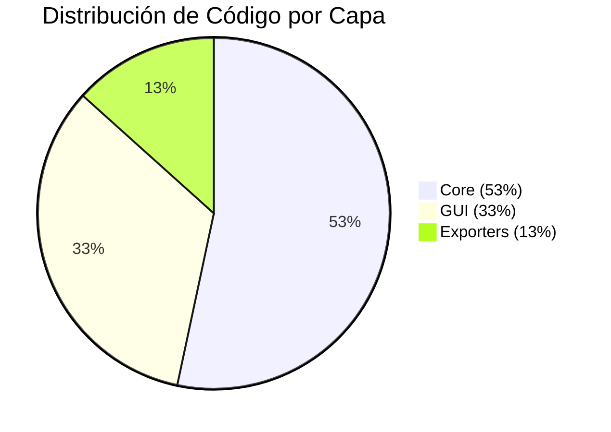

### Complejidad por Módulo

| Módulo | Líneas | Clases | Métodos | Complejidad |
|--------|--------|--------|---------|-------------|
| `sec_interp_plugin.py`| ~600 | 1 | 15 | Media |
| `main_dialog.py` | ~340 | 1 | 12 | Baja/Media |
| `main_dialog_signals.py`| ~200 | 1 | 10 | Media |
| `main_dialog_data.py` | ~150 | 1 | 8 | Media |
| `preview_renderer.py` | 1,190 | 1 | 20 | Alta |
| `controller.py` | 192 | 1 | 4 | Baja |
| `core/validation/` | ~800 | 0 | 25 | Media |
| `geology_service.py` | 244 | 1 | 8 | Media |
| `structure_service.py` | 216 | 1 | 7 | Media |
| `drillhole_service.py` | 319 | 1 | 4 | Media |
| `geometry.py` | 345 | 0 | 10 | Media |
| `orchestrator.py` | 148 | 1 | 1 | Baja |

### Dependencias

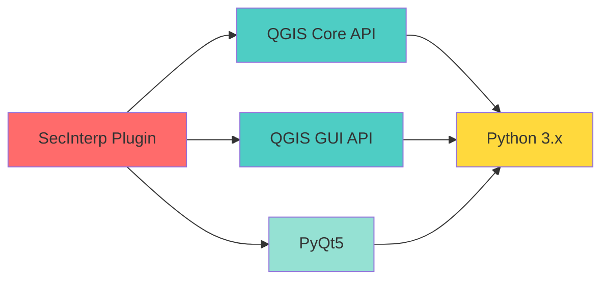

### Cobertura de Funcionalidades

| Funcionalidad | Estado | Cobertura |
|---------------|--------|-----------|
| Perfil Topográfico | ✅ Completo | 100% |
| Proyección Geológica | ✅ Completo | 100% |
| Proyección Estructural | ✅ Completo | 100% |
| Proyección de Sondajes | ✅ Completo | 100% |
| Preview Interactivo | ✅ Completo | 100% |
| Herramientas de Medición | ✅ Completo | 100% |
| Exportación CSV | ✅ Completo | 100% |
| Exportación Shapefile | ✅ Completo | 100% |
| Exportación PDF | ✅ Completo | 100% |
| Exportación SVG | ✅ Completo | 100% |
| Exportación PNG/JPG | ✅ Completo | 100% |
| LOD Adaptativo | ✅ Completo | 100% |
| Procesamiento Paralelo | ✅ Completo | 100% |
| Cache de Datos | ✅ Completo | 100% |

---

## 🔗 Referencias

- [Código Fuente](file:///home/jmbernales/qgispluginsdev/sec_interp)
- [README Principal](file:///home/jmbernales/qgispluginsdev/sec_interp/README.md)
- [Documentación de Usuario](file:///home/jmbernales/qgispluginsdev/sec_interp/docs/USER_GUIDE.md)
- [Grafo de Arquitectura](file:///home/jmbernales/qgispluginsdev/sec_interp/docs/sec_interp_architecture_graph.md)
- [QGIS API Documentation](https://qgis.org/pyqgis/master/)
- [PyQt5 Documentation](https://www.riverbankcomputing.com/static/Docs/PyQt5/)

---

## 📝 Notas Finales

Este documento proporciona una visión detallada de la arquitectura del plugin SecInterp. Para información sobre desarrollo, consulta [README_DEV.md](file:///home/jmbernales/qgispluginsdev/sec_interp/README_DEV.md).

**Última actualización**: 2025-12-21  
**Versión del Plugin**: 2.2  
**Autor**: Juan M. Bernales
