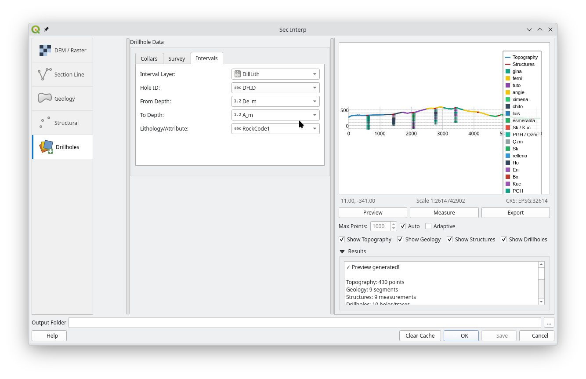
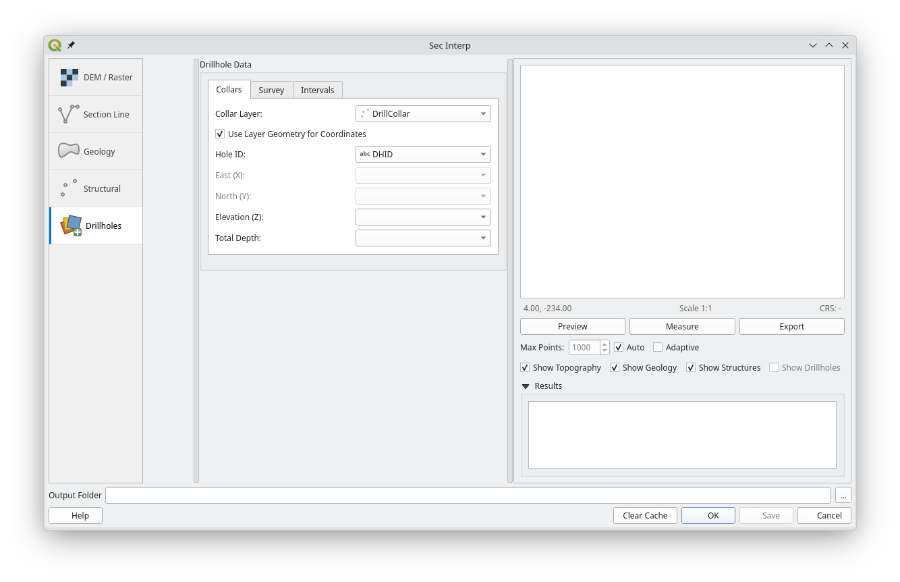
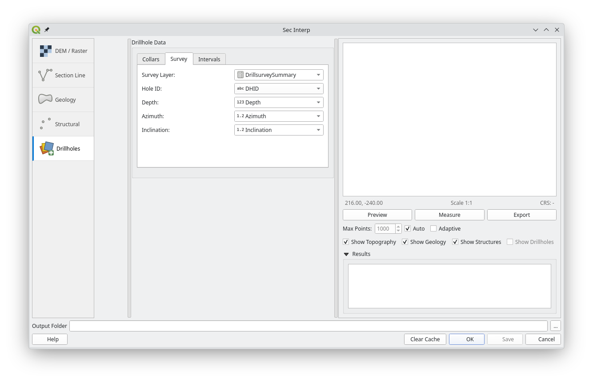

# SecInterp User Guide

## 1. Introduction

Welcome to the SecInterp plugin! This guide will help you get started with creating geological cross-sections from your QGIS layers.

SecInterp allows you to:
- Create a topographic profile from a Digital Elevation Model (DEM).
- Project geological units from a polygon layer onto the profile.
- Project structural measurements (e.g., dip and strike) onto the profile.
- **New**: Project drillhole traces and geological intervals (sondajes) onto the section.
- View an interactive preview with level-of-detail (LOD) optimization.
- **New**: Measure distances and gradients with automatic snapping to vertices.
- Export data to CSV and Shapefile formats, and export the preview to image/vector formats.

## 2. The Main Window

The SecInterp dialog is divided into three main areas:
1.  **Settings Panel (Left)**: Where you select your layers and adjust parameters.
2.  **Preview Panel (Right)**: Where you see the interactive preview of your cross-section.
3.  **Output & Actions (Bottom)**: Where you specify the output folder and execute actions like "Preview", "Save", and "OK".

## 3. Step-by-Step Tutorial: Creating a Basic Profile

This tutorial will guide you through creating a simple topographic profile.

### Step 1: Select Input Layers

1.  **DEM / Raster**: In the "Digital Elevation Model" section, click the "Raster Layer" dropdown and select your DEM layer.
    
2.  **Section Line**: In the "Section Line" section, click the "Cross-section line layer" dropdown and select the line layer that represents your cross-section path.
    

### Step 2: Generate a Preview

1.  Once you have selected both a raster and a line layer, the **"Preview"** button in the bottom right will become enabled.
2.  Click **"Preview"**.
3.  The topographic profile will be generated and displayed in the preview panel. You can pan by clicking and dragging and zoom using the mouse wheel.
    

### Step 3: Add Geological Data (Optional)

1.  Go to the **"Geology"** section in the settings panel.
2.  Select your geological polygon layer in the **"Outcrop layer"** dropdown.
3.  Select the field that contains the geological unit names in the **"Geology field"** dropdown.
4.  Click **"Preview"** again. The geological units will now be drawn on top of your topographic profile.
    

### Step 4: Add Structural Data (Optional)

1.  Go to the **"Structural"** section.
2.  Select your structural point layer in the **"Structural layer"** dropdown.
3.  Select the fields corresponding to **"Dip"** and **"Strike"**.
4.  Adjust the **"Buffer"** distance. Only points within this distance from your section line will be considered.
5.  Click **"Preview"** again. The structural measurements will be projected onto your profile as small lines.
    

### Step 5: Add Drillhole Data (Optional)

1.  Go to the **"Drillholes"** section.
2.  Select your **"Collar layer"** (points) and **"Survey layer"** (or use auto-calculation for vertical holes).
3.  Choose the **"Interval layer"** for geological logging.
4.  Configure the depth and geology fields.
5.  Click **"Preview"**. The drillhole traces and intervals will appear in the section, projected into the 2D plane.
    
    
    

## 4. Understanding the Settings

### DEM / Raster
- **Raster Layer**: Your source DEM.
- **Band**: The raster band to get elevation data from (usually Band 1).
- **Scale**: The map scale you intend for your final output. This helps with some calculations.
- **Vert. Exag.**: Vertical Exaggeration. A value of `2.0` will make the vertical scale twice as large as the horizontal scale, exaggerating topographic features.

### Section Line
- **Cross-section line layer**: The vector line layer defining your profile path.
- **Buffer**: The distance (in layer units) from the line to search for structural data points.

### Drillholes
- **Collar Layer**: Point layer with hole locations.
- **Survey Layer**: Data for hole orientation (Dip/Azimuth).
- **Interval Layer**: Geological or assay data with depth intervals.
- **Max Projection Dist.**: Only holes within this distance from the section line will be shown.

### Preview Controls
- **Max Points**: (Only active if "Auto" is unchecked). Manually sets the level of detail. Lower values are faster but less detailed.
- **Auto**: (Recommended). Automatically adjusts the level of detail as you zoom and pan.
- **Adaptive**: (Recommended). Uses a smarter algorithm to simplify the line, preserving more detail in complex areas.
- **Show Topography/Geology/Structures**: Use these checkboxes to toggle the visibility of different layers in the preview.

### The Measure Tool
- Click the **"Measure"** button in the preview panel to enable it.
- **Snapping**: The tool automatically "snaps" to the nearest vertex or contact of the generated topography and geology, ensuring precise measurements.
- Click and drag on the preview canvas to measure distance and slope. The results are displayed in the results panel.
- Toggle the "Measure" button off to return to the pan tool.

## 5. Exporting Your Work

There are two ways to export:

1.  **Save Profile Data (`Save` button)**:
    - First, select an **"Output Folder"** at the bottom of the window.
    - Click the **"Save"** button.
    - This generates a set of **CSV and Shapefile** files in your output folder containing the raw data for the topography, geology, and structures. This is ideal for use in other software or for further analysis.

2.  **Export Preview Image (`Export` button)**:
    - After generating a preview, click the **"Export"** button located under the preview canvas.
    - This allows you to save the current preview as an image (PNG, JPG) or vector graphic (SVG, PDF). This is ideal for including in reports and presentations.

## 6. Closing the Plugin

- **OK**: Saves all your data (like the `Save` button) and then closes the dialog.
- **Cancel**: Closes the dialog without saving any data.
