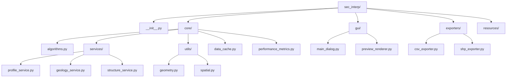
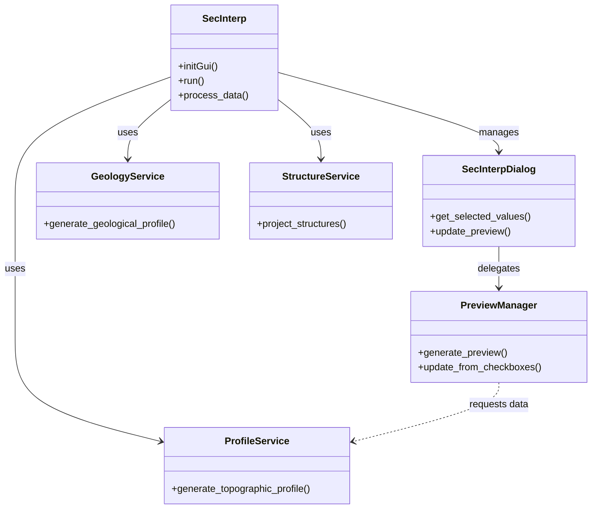
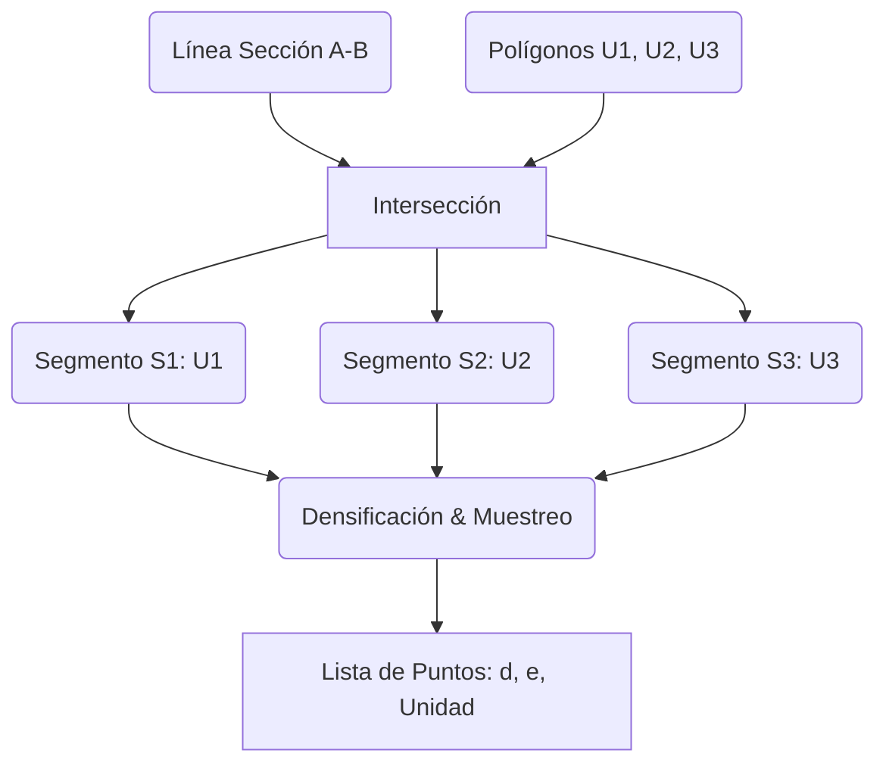
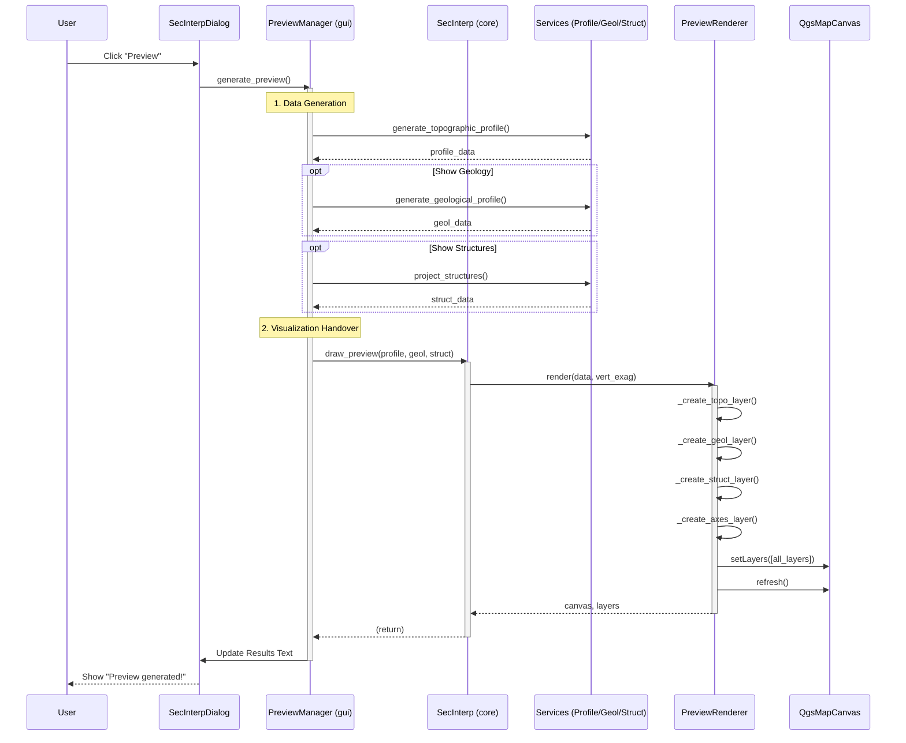
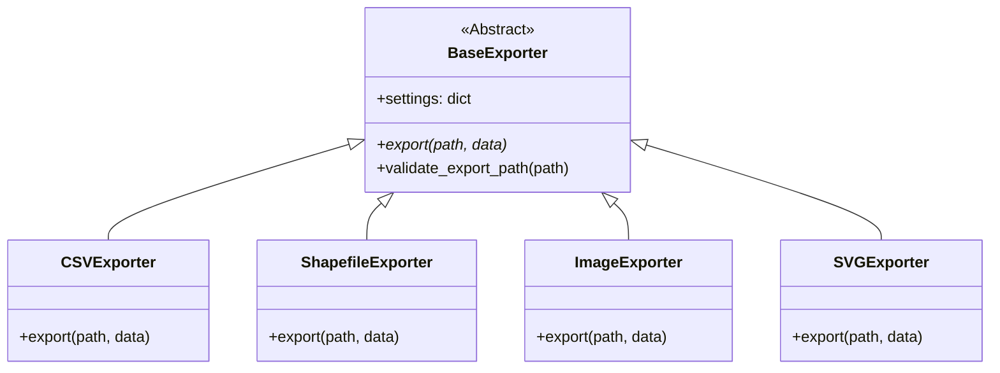
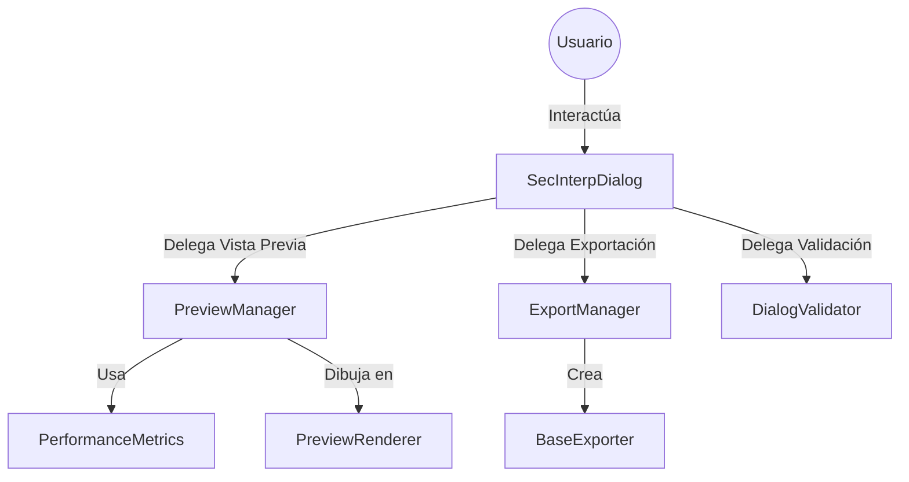

# SecInterp - Documentación Técnica Completa

**Plugin QGIS para Extracción de Datos Geológicos**  
**Versión**: 0.3  
**Autor**: Juan M. Bernales  
**Fecha**: 2025-12-07

---

## 📑 Índice

1. [Introducción](#introducción)
2. [Arquitectura General](#arquitectura-general)
3. [Punto de Entrada](#punto-de-entrada)
4. [Módulos Principales](#módulos-principales)
5. [Servicios](#servicios)
6. [Utilidades](#utilidades)
7. [Fórmulas Matemáticas](#fórmulas-matemáticas)
8. [Flujo de Datos](#flujo-de-datos)
9. [Exportadores](#exportadores)
10. [Interfaz Gráfica](#interfaz-gráfica)

---

## 1. Introducción

### 1.1 Propósito

SecInterp es un plugin de QGIS diseñado para extraer y visualizar datos geológicos a lo largo de secciones transversales. Permite:

- Generar perfiles topográficos desde un DEM
- Extraer contactos geológicos de capas de afloramientos
- Proyectar mediciones estructurales (rumbo/buzamiento)
- Visualizar resultados en un canvas interactivo
- Exportar datos a múltiples formatos (CSV, Shapefile, imágenes)

### 1.2 Tecnologías Utilizadas

- **QGIS**: 3.x (PyQGIS API)
- **Python**: 3.9+
- **Qt**: PyQt5 (interfaz gráfica)
- **Processing**: Algoritmos nativos de QGIS
- **Formatos de salida**: CSV, SHP, PNG, JPG, SVG, PDF

---

## 2. Arquitectura General

### 2.1 Estructura del Proyecto



### 2.2 Patrón de Diseño

El plugin utiliza varios patrones de diseño para mantener el código modular y mantenible.



1. **Service Layer Pattern**: Separación de lógica de negocio en servicios
2. **Strategy Pattern**: Diferentes exportadores para diferentes formatos
3. **Singleton Pattern**: Caché de datos compartido
4. **Observer Pattern**: Actualización de UI basada en eventos
5. **Factory Pattern**: Creación de exportadores según formato

---

## 3. Punto de Entrada

### 3.1 Inicialización del Plugin

**Archivo**: `__init__.py`

```python
def classFactory(iface):
    """Función llamada por QGIS para cargar el plugin.
    
    Args:
        iface (QgsInterface): Interfaz de QGIS
        
    Returns:
        SecInterp: Instancia del plugin
    """
    from .core.algorithms import SecInterp
    return SecInterp(iface)
```

**Flujo de inicialización**:

1. QGIS detecta el plugin en el directorio de plugins
2. Lee `metadata.txt` para obtener información del plugin
3. Llama a `classFactory(iface)` para crear la instancia
4. El plugin se registra en el menú y toolbar de QGIS

### 3.2 Clase Principal: SecInterp

**Archivo**: `core/algorithms.py`

```python
class SecInterp:
    """Implementación principal del plugin SecInterp.
    
    Responsabilidades:
    - Integración con QGIS (menú, toolbar, acciones)
    - Gestión del diálogo principal
    - Orquestación de servicios de procesamiento
    - Manejo de caché de datos
    - Coordinación de exportación
    """
```

#### 3.2.1 Constructor

```python
def __init__(self, iface):
    """Inicializa el plugin.
    
    Pasos:
    1. Guarda referencia a iface
    2. Inicializa traductor i18n
    3. Crea instancias de servicios
    4. Inicializa caché de datos
    5. Crea renderizador de preview
    """
    self.iface = iface
    self.plugin_dir = Path(__file__).parent.parent
    
    # Servicios de procesamiento
    self.profile_service = ProfileService()
    self.geology_service = GeologyService()
    self.structure_service = StructureService()
    
    # Caché y renderizador
    self.data_cache = DataCache()
    self.preview_renderer = PreviewRenderer()
```

#### 3.2.2 Métodos Principales

**`initGui()`**: Crea elementos de UI en QGIS

```python
def initGui(self):
    """Crea menú y toolbar en QGIS."""
    icon_path = str(self.plugin_dir / "icon.png")
    
    self.add_action(
        icon_path,
        text=self.tr("Section Interpretation"),
        callback=self.run,
        parent=self.iface.mainWindow()
    )
```

**`run()`**: Muestra el diálogo principal

```python
def run(self):
    """Ejecuta el plugin mostrando el diálogo."""
    if not hasattr(self, 'dlg') or self.dlg is None:
        self.dlg = SecInterpDialog(self.iface, self)
    
    self.dlg.show()
    result = self.dlg.exec_()
    
    if result == QDialog.Accepted:
        self.process_data()
```

**`process_data()`**: Procesa los datos del perfil

```python
def process_data(self):
    """Orquesta el procesamiento de datos con caché.
    
    Flujo:
    1. Obtiene y valida inputs del diálogo
    2. Genera clave de caché
    3. Verifica si datos están en caché
    4. Si no, genera nuevos datos
    5. Renderiza preview
    6. Actualiza UI con resultados
    """
```

---

## 4. Módulos Principales

### 4.1 Data Cache (`core/data_cache.py`)

Sistema de caché para evitar reprocesamiento innecesario.

```python
class DataCache:
    """Caché en memoria para datos de perfil.
    
    Almacena:
    - Perfiles topográficos
    - Datos geológicos
    - Datos estructurales
    - Metadatos de procesamiento
    """
    
    def __init__(self):
        self._topo_cache: Dict[str, ProfileData] = {}
        self._geol_cache: Dict[str, GeologyData] = {}
        self._struct_cache: Dict[str, StructureData] = {}
        self._metadata: Dict[str, Dict[str, Any]] = {}
```

**Métodos clave**:

```python
def get_cache_key(self, params: Dict[str, Any]) -> str:
    """Genera clave única desde parámetros.
    
    Algoritmo:
    1. Filtra objetos QGIS (usa ID/source en lugar de dirección de memoria)
    2. Ordena parámetros alfabéticamente
    3. Concatena en string
    4. Genera hash MD5
    
    Returns:
        Hash MD5 hexadecimal de 32 caracteres
    """
    key_parts = []
    for k, v in sorted(params.items()):
        if k.endswith('_obj') or k in ['raster_layer', ...]:
            if hasattr(v, 'id'):
                key_parts.append(f"{k}:{v.id()}")
            elif hasattr(v, 'source'):
                key_parts.append(f"{k}:{v.source()}")
        else:
            key_parts.append(f"{k}:{str(v)}")
    
    import hashlib
    return hashlib.md5("".join(key_parts).encode('utf-8')).hexdigest()
```

### 4.2 Performance Metrics (`core/performance_metrics.py`)

Sistema de métricas de rendimiento.

```python
class PerformanceTimer:
    """Context manager para medir tiempos de operación.
    
    Uso:
        with PerformanceTimer("operation_name", collector) as timer:
            # código a medir
            pass
        # timer.duration contiene el tiempo en segundos
    """
    
    def __enter__(self):
        self.start_time = time.perf_counter()
        return self
    
    def __exit__(self, exc_type, exc_val, exc_tb):
        self.duration = time.perf_counter() - self.start_time
        
        if self.collector:
            self.collector.record_metric(self.operation_name, self.duration)
```

**Funciones de formato**:

```python
def format_duration(seconds: float) -> str:
    """Formatea duración en formato legible.
    
    Ejemplos:
        0.0001 s -> "100µs"
        0.5 s -> "500ms"
        2.5 s -> "2.5s"
    """
    if seconds < 0.001:
        return f"{seconds*1000000:.0f}µs"
    if seconds < 1.0:
        return f"{seconds*1000:.0f}ms"
    return f"{seconds:.1f}s"
```

### 4.3 Types (`core/types.py`)

Definiciones de tipos para type hints.

```python
from typing import List, Tuple

# Tipo para perfil topográfico: lista de (distancia, elevación)
ProfileData = List[Tuple[float, float]]

# Tipo para datos geológicos: lista de (distancia, elevación, unidad)
GeologyData = List[Tuple[float, float, str]]

# Tipo para datos estructurales: lista de (distancia, buzamiento_aparente)
StructureData = List[Tuple[float, float]]
```

---

## 5. Servicios

Los servicios encapsulan la lógica de procesamiento de datos geológicos.

### 5.1 ProfileService

**Archivo**: `core/services/profile_service.py`

**Propósito**: Generar perfiles topográficos desde un DEM.

```python
class ProfileService:
    """Servicio para generación de perfiles topográficos."""
    
    def generate_topographic_profile(
        self,
        line_lyr: QgsVectorLayer,
        raster_lyr: QgsRasterLayer,
        band_number: int = 1,
    ) -> ProfileData:
        """Genera perfil topográfico muestreando elevación a lo largo de la línea.
        
        Algoritmo:
        1. Obtiene geometría de la línea de sección
        2. Densifica la línea según resolución del raster
        3. Muestrea elevación en cada vértice
        4. Calcula distancia desde el inicio
        5. Retorna lista de (distancia, elevación)
        
        Args:
            line_lyr: Capa vectorial con línea de sección
            raster_lyr: Capa raster (DEM) para elevación
            band_number: Banda del raster a muestrear
            
        Returns:
            Lista de tuplas (distancia_m, elevación_m)
            
        Raises:
            ValueError: Si la capa no tiene features o geometría inválida
        """
```

**Implementación detallada**:

```python
def generate_topographic_profile(self, line_lyr, raster_lyr, band_number=1):
    # 1. Obtener feature de línea
    line_feat = next(line_lyr.getFeatures(), None)
    if not line_feat:
        raise ValueError("Line layer has no features")
    
    # 2. Validar geometría
    geom = line_feat.geometry()
    if not geom or geom.isNull():
        raise ValueError("Line geometry is not valid")
    
    # 3. Crear objeto de medición de distancias
    da = scu.create_distance_area(line_lyr.crs())
    
    # 4. Muestrear elevación a lo largo de la línea
    # Usa algoritmo nativo de densificación + muestreo de raster
    points = scu.sample_elevation_along_line(
        geom, raster_lyr, band_number, da
    )
    
    # 5. Convertir a tuplas (distancia, elevación)
    values = [(round(p.x(), 1), round(p.y(), 1)) for p in points]
    
    return values
```

**Proceso de muestreo** (en `utils`):

```mermaid
graph LR
    subgraph "1. Línea Original"
    A((A)) --- B((B))
    end
    
    subgraph "2. Densificación"
    A2((A)) -.- x1(x) -.- x2(x) -.- B2((B))
    end
    
    subgraph "3. Muestreo Raster"
    x1 --> |Sample| R1[e1]
    x2 --> |Sample| R2[e2]
    end
    
    subgraph "4. Resultado"
    Res[[(d, e)]]
    end
    
    R1 --> Res
    R2 --> Res
```

### 5.2 GeologyService

**Archivo**: `core/services/geology_service.py`

**Propósito**: Extraer contactos geológicos intersectando línea con polígonos.

```python
class GeologyService:
    """Servicio para generación de perfiles geológicos."""
    
    def generate_geological_profile(
        self,
        line_lyr: QgsVectorLayer,
        raster_lyr: QgsRasterLayer,
        outcrop_lyr: QgsVectorLayer,
        outcrop_name_field: str,
        band_number: int = 1,
    ) -> GeologyData:
        """Genera perfil geológico intersectando línea con afloramientos.
        
        Algoritmo:
        1. Intersecta línea de sección con polígonos de afloramientos
        2. Para cada segmento de intersección:
           a. Densifica según resolución del raster
           b. Muestrea elevación en cada punto
           c. Obtiene nombre de unidad geológica
           d. Calcula distancia desde inicio
        3. Ordena por distancia
        4. Retorna lista de (distancia, elevación, unidad)
        
        Returns:
            Lista de tuplas (distancia_m, elevación_m, nombre_unidad)
        """
```

**Implementación detallada**:

```python
def generate_geological_profile(self, line_lyr, raster_lyr, outcrop_lyr, 
                                outcrop_name_field, band_number=1):
    # 1. Validar inputs
    line_feat = next(line_lyr.getFeatures(), None)
    if not line_feat:
        raise ValueError("Line layer has no features")
    
    line_geom = line_feat.geometry()
    line_start = scu.get_line_start_point(line_geom)
    
    # 2. Intersectar usando algoritmo nativo de QGIS
    result = processing.run(
        "native:intersection",
        {
            "INPUT": line_lyr,
            "OVERLAY": outcrop_lyr,
            "INPUT_FIELDS": [],
            "OVERLAY_FIELDS": [],  # Mantiene TODOS los campos de geología
            "OUTPUT": "memory:",
        }
    )
    
    intersection_layer = result["OUTPUT"]
    
    # 3. Procesar cada segmento de intersección
    values = []
    for feature in intersection_layer.getFeatures():
        geom = feature.geometry()
        
        # Manejar MultiLineString y LineString
        geometries_to_process = []
        if geom.wkbType() in [QgsWkbTypes.LineString, ...]:
            geometries_to_process.append(geom)
        elif geom.wkbType() in [QgsWkbTypes.MultiLineString, ...]:
            for part in geom.asMultiPolyline():
                line_geom = QgsGeometry.fromPolylineXY(part)
                geometries_to_process.append(line_geom)
        
        # 4. Densificar y muestrear cada geometría
        for process_geom in geometries_to_process:
            # Calcular intervalo basado en resolución del raster
            interval = scu.calculate_step_size(process_geom, raster_lyr)
            
            # Densificar usando algoritmo nativo
            densified_geom = scu.densify_line_by_interval(process_geom, interval)
            vertices = scu.get_line_vertices(densified_geom)
            
            # 5. Muestrear cada vértice
            for pt in vertices:
                # Distancia desde inicio de línea
                dist = da.measureLine(line_start, pt)
                
                # Elevación desde raster
                res = raster_lyr.dataProvider().identify(
                    pt, QgsRaster.IdentifyFormatValue
                ).results()
                elev = res.get(band_number, 0.0)
                
                # Nombre de unidad geológica
                unit_name = feature[outcrop_name_field]
                
                values.append((round(dist, 1), round(elev, 1), unit_name))
    
    # 6. Ordenar por distancia
    values.sort(key=lambda x: x[0])
    
    return values
```

**Diagrama de intersección**:



### 5.3 StructureService

**Archivo**: `core/services/structure_service.py`

**Propósito**: Proyectar mediciones estructurales al plano de sección.

```python
class StructureService:
    """Servicio para proyección de mediciones estructurales."""
    
    def project_structures(
        self,
        line_lyr: QgsVectorLayer,
        struct_lyr: QgsVectorLayer,
        buffer_m: int,
        line_az: float,
        dip_field: str,
        strike_field: str,
    ) -> StructureData:
        """Proyecta mediciones estructurales al plano de sección.
        
        Algoritmo:
        1. Crea buffer alrededor de la línea de sección
        2. Filtra estructuras dentro del buffer
        3. Para cada estructura:
           a. Parsea rumbo y buzamiento
           b. Valida rangos (rumbo: 0-360°, buzamiento: 0-90°)
           c. Calcula buzamiento aparente
           d. Calcula distancia a lo largo de la sección
        4. Ordena por distancia
        5. Retorna lista de (distancia, buzamiento_aparente)
        
        Returns:
            Lista de tuplas (distancia_m, buzamiento_aparente_grados)
        """
```

**Implementación detallada**:

```python
def project_structures(self, line_lyr, struct_lyr, buffer_m, line_az, 
                      dip_field, strike_field):
    # 1. Validar línea
    line_feat = next(line_lyr.getFeatures(), None)
    line_geom = line_feat.geometry()
    line_start = scu.get_line_start_point(line_geom)
    
    # 2. Crear buffer usando algoritmo nativo
    buffer_geom = scu.create_buffer_geometry(
        line_geom, line_lyr.crs(), buffer_m, segments=25
    )
    
    # 3. Filtrar features espacialmente (usa índice espacial R-tree)
    filtered_features = scu.filter_features_by_buffer(
        struct_lyr, buffer_geom, line_lyr.crs()
    )
    
    # 4. Procesar cada estructura
    projected_structs = []
    for f in filtered_features:
        struct_geom = f.geometry()
        p = struct_geom.asPoint()
        
        # Distancia a lo largo de la línea
        dist = da.measureLine(line_start, p)
        
        # Parsear rumbo y buzamiento
        strike_raw = f[strike_field]
        dip_raw = f[dip_field]
        
        strike = scu.parse_strike(strike_raw)  # Soporta "N 15° E" o "15"
        dip_angle, _ = scu.parse_dip(dip_raw)  # Soporta "22° SW" o "22"
        
        # Validar rangos
        is_valid, _ = vu.validate_angle_range(strike, "Strike", 0.0, 360.0)
        if not is_valid:
            continue
        
        is_valid, _ = vu.validate_angle_range(dip_angle, "Dip", 0.0, 90.0)
        if not is_valid:
            continue
        
        # Calcular buzamiento aparente
        app_dip = scu.calculate_apparent_dip(strike, dip_angle, line_az)
        
        projected_structs.append((round(dist, 1), round(app_dip, 1)))
    
    # 5. Ordenar por distancia
    projected_structs.sort(key=lambda x: x[0])
    
    return projected_structs
```

---

## 6. Utilidades

### 6.1 Geometry Utils (`core/utils/geometry.py`)

Operaciones geométricas usando algoritmos nativos de QGIS.

**Funciones principales**:

```python
def create_buffer_geometry(geometry, crs, distance, segments=25):
    """Crea buffer usando native:buffer.
    
    Ventajas sobre QgsGeometry.buffer():
    - Mejor manejo de CRS
    - Más robusto con geometrías complejas
    - Usa algoritmo optimizado de GEOS
    """

def filter_features_by_buffer(features_layer, buffer_geometry, buffer_crs):
    """Filtra features usando índice espacial R-tree.
    
    Algoritmo:
    1. Construye índice espacial (R-tree) de features
    2. Busca candidatos usando bounding box (rápido)
    3. Filtra precisamente con intersects() (lento, pero solo candidatos)
    
    Complejidad:
    - Sin índice: O(n) donde n = total features
    - Con índice: O(log n + k) donde k = features en buffer
    """

def densify_line_by_interval(geometry, interval):
    """Densifica línea usando native:densifygeometriesgivenaninterval.
    
    Agrega vértices a intervalos regulares.
    Más preciso que interpolación manual.
    """
```

### 6.2 Spatial Utils (`core/utils/spatial.py`)

Cálculos espaciales básicos.

```python
def calculate_line_azimuth(line_geom):
    """Calcula azimuth de una línea.
    
    Fórmula:
        azimuth = atan2(Δx, Δy) * 180/π
        
    Donde:
        Δx = x2 - x1
        Δy = y2 - y1
        
    Resultado normalizado a 0-360°
    """
    line = line_geom.asPolyline()
    p1, p2 = line[0], line[1]
    
    azimuth = math.degrees(math.atan2(p2.x() - p1.x(), p2.y() - p1.y()))
    
    if azimuth < 0:
        azimuth += 360
    
    return azimuth

def create_distance_area(crs):
    """Crea objeto QgsDistanceArea configurado.
    
    Configura:
    - CRS de origen
    - Elipsoide para cálculos geodésicos
    - Contexto de transformación
    """
    da = QgsDistanceArea()
    da.setSourceCrs(crs, QgsProject.instance().transformContext())
    da.setEllipsoid(crs.ellipsoidAcronym())
    return da
```

---

## 7. Fórmulas Matemáticas

### 7.1 Buzamiento Aparente

**Función**: `calculate_apparent_dip(true_strike, true_dip, line_azimuth)`

**Fórmula**:

```
tan(buzamiento_aparente) = tan(buzamiento_real) × sin(α)
```

Donde:
- `α` = ángulo entre rumbo del plano y azimuth de la sección
- `α = rumbo - azimuth_línea`

**Implementación**:

```python
def calculate_apparent_dip(true_strike, true_dip, line_azimuth):
    """Calcula buzamiento aparente en el plano de sección.
    
    El buzamiento aparente es la inclinación de un plano medida
    en una dirección que NO es perpendicular al rumbo.
    
    Args:
        true_strike: Rumbo verdadero (0-360°)
        true_dip: Buzamiento verdadero (0-90°)
        line_azimuth: Azimuth de la línea de sección (0-360°)
        
    Returns:
        Buzamiento aparente en grados
        
    Ejemplo:
        Plano: rumbo=45°, buzamiento=60°
        Sección: azimuth=90°
        
        α = 45° - 90° = -45°
        tan(app_dip) = tan(60°) × sin(-45°)
        tan(app_dip) = 1.732 × (-0.707)
        tan(app_dip) = -1.225
        app_dip = arctan(-1.225) = -50.8°
    """
    alpha = math.radians(true_strike)
    beta = math.radians(true_dip)
    theta = math.radians(line_azimuth)
    
    app_dip = math.degrees(
        math.atan(math.tan(beta) * math.sin(alpha - theta))
    )
    
    return app_dip
```

**Diagrama explicativo**:

```
Vista en planta:
                N (0°)
                |
                |
    Rumbo ------+------ E (90°)
    (45°)      /|
              / |
             /  | Azimuth sección (90°)
            /   |
           /α   |
          /     |
         
Vista de sección:
         |
         | Buzamiento real (60°)
         |/
        /|
       / |
      /  | Buzamiento aparente (50.8°)
     /   |
    /    |
```

### 7.2 Parseo de Rumbo

**Función**: `parse_strike(value)`

Soporta múltiples formatos:

1. **Numérico**: `"45"`, `"120.5"` → azimuth directo
2. **Cuadrante**: `"N 30° E"`, `"S 15° W"` → conversión a azimuth

**Tabla de conversión de cuadrantes**:

| Notación | Fórmula | Ejemplo | Azimuth |
|----------|---------|---------|---------|
| N α° E | α | N 30° E | 30° |
| N α° W | 360 - α | N 30° W | 330° |
| S α° E | 180 - α | S 30° E | 150° |
| S α° W | 180 + α | S 30° W | 210° |

**Implementación**:

```python
def parse_strike(value):
    # Intentar conversión numérica directa
    try:
        return float(value)
    except (ValueError, TypeError):
        pass
    
    # Parsear notación de cuadrante
    text = str(value).replace("°", "").strip().upper()
    match = re.match(r"([NS])\s*(\d+\.?\d*)\s*([EW])", text)
    
    if not match:
        return None
    
    d1, ang, d2 = match.groups()
    ang = float(ang)
    
    # Aplicar reglas de cuadrante
    if d1 == "N" and d2 == "E":
        strike = ang
    elif d1 == "N" and d2 == "W":
        strike = 360 - ang
    elif d1 == "S" and d2 == "E":
        strike = 180 - ang
    elif d1 == "S" and d2 == "W":
        strike = 180 + ang
    
    return strike % 360
```

### 7.3 Parseo de Buzamiento

**Función**: `parse_dip(value)`

Soporta:

1. **Numérico**: `"22"`, `"45.5"` → buzamiento directo
2. **Con dirección**: `"22° SW"`, `"45 NE"` → buzamiento + dirección

**Implementación**:

```python
def parse_dip(value):
    text = str(value).replace("°", "").strip().upper()
    
    # Caso 1: Solo número
    numeric_only = re.match(r"^(\d+\.?\d*)$", text)
    if numeric_only:
        return float(text), None
    
    # Caso 2: Número + dirección cardinal
    match = re.match(r"(\d+\.?\d*)\s*([NSEW]{1,2})", text)
    if not match:
        return None, None
    
    dip, cardinal = match.groups()
    dip = float(dip)
    
    # Convertir dirección cardinal a azimuth
    dip_dir = cardinal_to_azimuth(cardinal)
    
    return dip, dip_dir
```

**Tabla de direcciones cardinales**:

| Cardinal | Azimuth |
|----------|---------|
| N | 0° |
| NE | 45° |
| E | 90° |
| SE | 135° |
| S | 180° |
| SW | 225° |
| W | 270° |
| NW | 315° |

---

## 8. Flujo de Datos

### 8.1 Generación de Vista Previa

El siguiente diagrama muestra la secuencia de llamadas desde que el usuario solicita la vista previa hasta que se renderiza e el canvas.



---

## 9. Exportadores

El módulo de exportación implementa el patrón **Factory** y **Strategy** para soportar múltiples formatos de salida de manera extensible.

### 9.1 Diseño

*   **Paquete**: `exporters/`
*   **Factory**: `get_exporter(extension, settings)` en `__init__.py`
*   **Base Class**: `BaseExporter` (clase abstracta)



Cada formato de exportación es una clase separada que hereda de `BaseExporter` e implementa el método `export()`.

### 9.2 BaseExporter

Define la interfaz común y validaciones de seguridad:

```python
class BaseExporter(ABC):
    def __init__(self, settings: dict):
        self.settings = settings

    @abstractmethod
    def export(self, output_path: Path, data: Any) -> bool:
        """Exporta datos al archivo especificado."""
        pass

    def validate_export_path(self, output_path):
        """Valida seguridad de la ruta (path traversal prevention)."""
        pass
```

### 9.3 Implementaciones

| Clase | Formatos | Descripción |
|-------|----------|-------------|
| `CSVExporter` | `.csv` | Exporta datos brutos (perfil, geología, estructuras) en archivos separados o combinados. |
| `ShapefileExporter` | `.shp`, `.gpkg` | Genera capas vectoriales espaciales de los resultados proyectados. |
| `ImageExporter` | `.png`, `.jpg` | Exporta la vista previa como imagen rasterizada de alta resolución. |
| `SVGExporter` | `.svg` | Exporta gráficos vectoriales escalables (útil para edición posterior). |
| `PDFExporter` | `.pdf` | Genera reporte en PDF con el gráfico. |

---

## 10. Interfaz Gráfica

La interfaz gráfica está construida con **PyQt5** y diseñada de manera modular para separar la lógica de presentación del manejo de eventos.

### 10.1 Diálogo Principal (`SecInterpDialog`)

**Archivo**: `gui/main_dialog.py`

Es el orquestador principal de la UI. Sus responsabilidades son:
*   Inicializar la interfaz (`Ui_SecInterpDialogBase`).
*   Conectar señales y slots.
*   Coordinar los managers delegados.
*   Gestionar el ciclo de vida de la ventana.

### 10.2 Componentes Modulares

Para evitar una clase "God Object", la lógica compleja se delega a managers especializados en `gui/`:



#### A. PreviewManager (`gui/main_dialog_preview.py`)
Maneja la generación y actualización de la vista previa.
*   Valida requisitos mínimos.
*   Orquesta la obtención de datos de los servicios.
*   Llama al `PreviewRenderer`.
*   Gestiona la caché de vista previa.

#### B. ExportManager (`gui/main_dialog_export.py`)
Encapsula la lógica de exportación.
*   Maneja diálogos de "Guardar como".
*   Instancia el exportador correcto usando `get_exporter`.
*   Ejecuta la exportación y maneja errores.

#### C. DialogValidator (`gui/main_dialog_validation.py`)
Centraliza las reglas de validación de inputs.
*   Valida que las capas y campos seleccionados sean compatibles.
*   Verifica rangos numéricos (buzamientos, distancias).
*   Provee mensajes de error unificados.

#### D. DialogConfig (`gui/main_dialog_config.py`)
Repositorio de constantes y configuraciones por defecto.
*   Colores por defecto.
*   Nombres de settings.
*   Flags de configuración global.

### 10.3 Renderizador (`PreviewRenderer`)

**Archivo**: `gui/preview_renderer.py`

Responsable de dibujar en el canvas de QGIS (`QgsMapCanvas`). No contiene lógica de negocio, solo de dibujo.
*   Implementa `render(topo_data, geol_data, ...)`
*   Crea capas temporales en memoria (`memory:`).
*   Configura simbología y etiquetado.
*   Dibuja ejes y leyendas.

